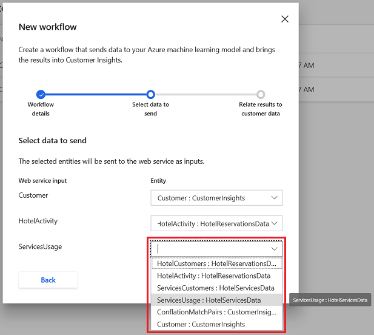

# Intelligence 
The **Intelligence** page shows you workflows that have been created to generate machine learning insights.  Workflows are designed to help you choose the data you want to use, select what will generate the machine learning insight, and map the results back into your Customer Insights data.

> [!div class="mx-imgBorder"] 
> 

## Add a new workflow

1. On the **Intelligence** page, select **New workflow**.

   > [!div class="mx-imgBorder"] 
   > 

2. Give your workflow a recognizable name in the **Display name** field, and then select the web service you've published using Azure Machine Learning services in the **Web service that contains your model** drop-down list.  Learn more about how to [Deploy an Azure Machine Learning Studio web service](https://docs.microsoft.com/azure/machine-learning/studio/publish-a-machine-learning-web-service).

   When you're done, select **Next**.

   > [!div class="mx-imgBorder"] 
   > 

3. For each **Web service input**, select the matching **Entity** from Customer Insights. When you're done, select **Next**.

   > [!div class="mx-imgBorder"] 
   > 

4. Select the matching attribute from the **Customer ID in results** drop-down list that maps to your Customer Insights CustomerId. When you're done, select **Save**.

   > [!div class="mx-imgBorder"] 
   > 

5. You'll see the **Workflow saved** screen, and attributes about your new workflow that will be important to remember.

   > [!div class="mx-imgBorder"] 
   > 

   1. **Workflow name:** This is the recognizable name for your workflow.
   2. **Entity created:** This is the name of the entity where the output from your workflow will be stored. You can find this entity on the **Entities** page.

6. Select **Done** to return to the **Intelligence** page.

## Edit a workflow

1. On the **Intelligence** page, select the vertical ellipses in the **Actions** column next to a workflow you've previously created, and then select **Edit**.

   > [!div class="mx-imgBorder"] 
   > 

2. You can update your workflow's recognizable name in the **Display name** field, but changing the web service is not possible. If you wish to create a new prediction using a different web service, you can refer to the Add a new workflow section for instructions. When you're done, select **Next**.

3. For each **Web service input**, select the matching **Entity** from Customer Insights. When you're done, select **Next**.

4. Select the matching attribute from the **Customer ID in results** drop-down list that maps to your Customer Insights CustomerId. When you're done, select **Save**.

## Running a workflow

1. On the **Intelligence** page, select the vertical ellipses in the **Actions** column next to a workflow you've previously created, and then select **Run**.

   > [!div class="mx-imgBorder"] 
   > 

Your workflow will also automatically run each time you have a scheduled refresh. Learn more about [setting up scheduled refreshes](https://docs.microsoft.com/en-us/dynamics365/ai/customer-insights/pm-settings#schedule-tab).

## Deleting a workflow

1. On the **Intelligence** page, select the vertical ellipses in the **Actions** column next to a workflow you've previously created, and then select **Delete**.

   > [!div class="mx-imgBorder"] 
   > 

Your workflow will be deleted, but the entity that was created when you created the workflow will remain in the **Entities** page.

