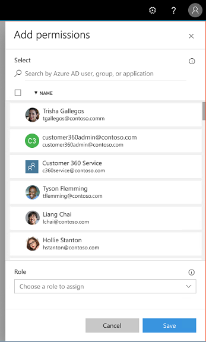

# Administer AI for Customer Insights

[!INCLUDE [cc-beta-prerelease-disclaimer](../includes/cc-beta-prerelease-disclaimer.md)]

> [!IMPORTANT]
> - This feature currently has limited availability.
> - [!INCLUDE[cc_preview_features_definition](../includes/cc-preview-features-definition.md)]  
> - [!INCLUDE[cc_preview_features_expect_changes](../includes/cc-preview-features-expect-changes.md)]  
> - [!INCLUDE[cc_preview_features_no_MS_support](../includes/cc-preview-features-no-ms-support.md)]  

This is where you can set up roles and permissions for using Dynamics 365 AI for Customer Insights across your organization. The main administration page is the **Permissions** page which is accessible via the **Administration tab** as shown below:  

 

Within the **Permissions** page you can view organization members for whom roles and permissions where assigned. Note that while roles are specified under the *Roles* column, permissions are specified under the *Type* column. Lastly, you can sort the results by each of the columns types by clicking on the arrow icon next to the column name as shown below.  

- **Adding Roles and Permissions:** 
    - In terms of roles, it's possible to define organization members as either ***Administrators***, ***Contributors*** or ***Readers***. This definition process is done via the **Adding Permissions** panel that can be accessed via  **Add** at the top of the permissions page:

    

   - When it comes to permissions, those can be defined in the same panel as shown below:
   
(add permissions page with opened "add permissions" panel from the administration part on the app and highlight the permissions field)

- **Viewing current number of users per role:** This can be done via the **Roles** panel that can be accessed via **Roles** at the top of the permissions page:

(add permissions page with opened "roles" panel from the administration part on the app)

- **Filtering Permissions by a Role**: This can be achieved by opening the **Filter** panel through  **Filter** at the top of the permissions page, and choosing whether to filter the permissions by the ***Administrator***, ***Contributor*** or ***Reader*** roles.

Within the panel above, you may want 

(add "filter" page from the administration part on the app)
