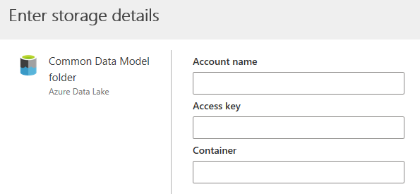
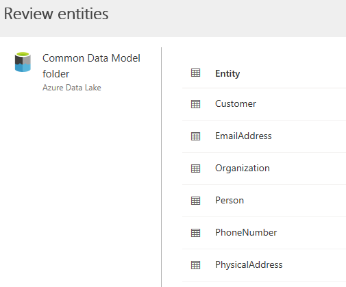

# Connect to a Common Data Model folder using an Azure Data Lake Gen2 account

This article provides information on how to connect a Common Data Model folder     with Dynamics 365 Customer Insights using your Azure Data Lake Storage Gen2 account.

## Important considerations

- Data in your Azure Data Lake needs to follow the Common Data Model standard. Other formats aren't supported at the moment.

- Customer Insights supports Azure Data Lake *Gen2* storage accounts exclusively. You can't use Azure Data Lake Gen1 storage accounts in Customer Insights.

- Data stored in an online service such as Azure Data Lake Storage may be stored in a different location than where data is processed or stored in Dynamics 365 Customer Insights. By importing, or connecting to, data stored in an online service such as Azure Data Lake Storage, you agree that data can be transferred to, and stored with, Dynamics 365 Customer Insights. [Learn more at the Microsoft Trust Center.](https://www.microsoft.com/trust-center)

## Connect to a Common Data Model folder

1. In Customer Insights, go to **Data** > **Data sources**.

2. Select **Add data source**.

3. Select **Connect to a Common Data Model folder** and select **Next**.

4. Enter a **Name** for the data source and select **Next**.

5. Provide the **Account name**, the **Access key**, and the **Container** for your Azure Data Lake storage and select **Next**.
   > [!div class="mx-imgBorder"]
   > 

6. In the **Select a Common Data Model folder** dialog, select the model.json file from the list that you want to use to import the corresponding entities into Customer Insights and select **Next**.
   > [!NOTE]
   > Any model.json file associated with another data source in the instance won't show in the list.

7. You'll get a list of available entities from the selected model.json file. You can review the entities and select **Save**. All of the listed entities will be attached to Customer Insights.
   > [!div class="mx-imgBorder"]
   > 

8. After saving your selections, the **Data sources** page opens and you can see the newly added Common Data Model folder connection as a data source.

> [!NOTE]
> A model.json file can only associate with one data source in the same instance. However, the same model.json file can be used for data sources in multiple instances.

## Edit a Common Data Model folder data source

You can update the access key for the storage account that contains the Common Data Model folder you connected to Customer Insights or change the model.json file. If you want to connect to a different container from your storage account, or change the account name, you need to [create a new data source connection](#connect-to-a-common-data-model-folder).

1. In Customer Insights, go to **Data** > **Data sources**.

2. Next to the data source you'd like to update, select the ellipsis.

3. Select the **Edit** option from the list.

4. Optionally, update the **Access key** and select **Next**.

   

5. Optionally, choose a different model.json file with a different set of entities from the container.

   > [!IMPORTANT]
   > If there are dependencies on the existing model.json file and the set of entities, you'll see an error message and can't select a different model.json file. Remove those dependencies before changing the model.json file or create a new data source with the model.json file that you want to use to avoid removing the dependencies.
