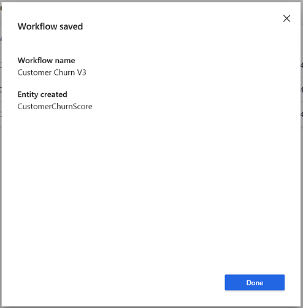

---
title: "Custom Models | Microsoft Docs"
description: "Work with custom models from Azure Machine Learning in Dynamics 365 Customer Insights."
ms.date: 12/02/2019
ms.reviewer: 
ms.service: dynamics-365-ai
ms.topic: "article"
applies_to: 
  - "Dynamics 365 (online)"
  - "Dynamics 365 Version 9.x"
author: m-hartmann
ms.author: mhart
manager: shellyha
---

# Custom Models

The **Custom Models** page lists workflows that have been created to generate insights based on Azure Machine Learning models. Workflows help you choose the data you want to use, select what will generate the insights, and map the results back to your Customer Insights data.

> [!NOTE]
> You'll need to have an Azure Data Lake Storage Gen2 storage account associated with your Azure Studio instance to use this feature. For more information, see [Create an Azure Data Lake Storage Gen2 storage account](https://docs.microsoft.com/azure/storage/blobs/data-lake-storage-quickstart-create-account)

## Add a new workflow

1. On the **Custom Models** page, select **New Workflow**.

2. Give your workflow a recognizable name in the **Display name** field, choose the [web service you've published using Azure Machine Learning services](https://docs.microsoft.com/azure/machine-learning/studio/publish-a-machine-learning-web-service#deploy-it-as-a-new-web-service) in the **Web service that contains your model** drop-down and select **Next**.

3. For each **Web service input**, select the matching **Entity** from Customer Insights and select **Next**.

   > [!div class="mx-imgBorder"]
   > 

4. Select the matching attribute from the **Customer ID in results** drop-down list that maps to your Customer Insights CustomerId and select **Save**.

5. You'll see the **Workflow Saved** screen, and attributes about your new workflow that will be important to remember:

   > [!div class="mx-imgBorder"]
   > 

   1. **Workflow name:** The display name for your workflow.
   2. **Entity created:** The name of the entity where the output from your workflow will be stored. You can find this entity in the **[Entities](pm-entities.md)** page.

6. Select **Done** to return to the **Custom Models** page.

## Edit a workflow

1. On the **Custom Models** page, select the vertical ellipses in the **Actions** column next to a workflow you've previously created and select **Edit**.

   > [!div class="mx-imgBorder"]
   > 

2. You can update your workflow's recognizable name in the **Display name** field, but changing the Web service is not possible. If you want to create a new prediction using a different web service, follow the steps in [Add a new workflow](#add-a-new-workflow). When you're done, select **Next**.

3. For each **Web service input**, select the matching **Entity** from Customer Insights.  When you're done, select **Next**.

4. Select the matching attribute from the **Customer ID in results** drop-down list that maps to your Customer Insights CustomerId.  When you're done, click **Save**.

## Run a workflow

1. On the **Custom Models** page, select the vertical ellipses in the **Actions** column next to a workflow you've previously created.

   > [!div class="mx-imgBorder"]
   > 

2.  Select **Run**.

Your workflow also runs automatically when there's a scheduled refresh. Learn more about [setting up scheduled refreshes](pm-settings.md#schedule-tab).

## Delete a workflow

1. On the **Custom Models** page, select the vertical ellipses in the **Actions** column next to a workflow you've previously created.

   > [!div class="mx-imgBorder"]
   > 

2. Select **Delete**.

Your workflow will be deleted, but the entity that was created when you created the workflow persists and can be viewed from the **Entities** page.
