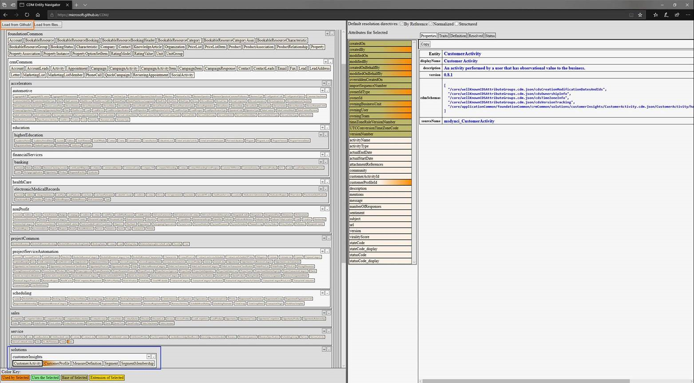

# Customer Insights entities schema in the Common Data Model

The [Common Data Model](https://docs.microsoft.com/common-data-model/) is a declarative specification, and definition of standard entities that represent commonly used concepts and activities across business and productivity applications, and is being extended to observational and analytical data as well. Common Data Model provides well-defined, modular, and extensible business entities such as Account, Business Unit, Case, Contact, Lead, Opportunity, and Product, as well as interactions with vendors, workers, and customers, such as activities and service level agreements. Anyone can build on and extend Common Data Model definitions to capture additional business-specific ideas.

It's a  shared data model that allows applications and data integrators to collaborate more easily by providing a unified definition of data. The Common Data Model includes a rich metadata system with standard entities, relationships, hierarchies, traits and more. It originated from Dynamics 365 apps and is open-sourced on GitHub with over 260 standard entities. A large ecosystem of internal and external partners contribute industry-specific concepts to the Common Data Model.

Multiple systems and platforms implement CDM today. For example Power BI dataflows, Azure Data Services, and more. The Common Data Model is already supported in the Common Data Service, Dynamics 365, PowerApps, Power BI, and upcoming Azure data services, directly accruing value towards the [Open Data Initiative](https://www.microsoft.com/open-data-initiative).

## Customer Insights entity schemas

To establish a 360° view of the customer and make Customer Insights models available in the Common Data Model for extensibility, we published the following entity schemas so they can be extended for various business scenarios.

|Entity  |Description  |
|---------|---------|
|[CustomerActivity](https://docs.microsoft.com/common-data-model/schema/core/applicationcommon/foundationcommon/crmcommon/solutions/customerinsights/customeractivity)    | An activity performed by a user that has observational value to the business.        |
|[CustomerProfile](https://docs.microsoft.com/common-data-model/schema/core/applicationcommon/foundationcommon/crmcommon/solutions/customerinsights/customerprofile)   | A person or organization that either performed or has the potential to engage in a business activity.        |
|[MeasureDefinition](https://docs.microsoft.com/common-data-model/schema/core/applicationcommon/foundationcommon/crmcommon/solutions/customerinsights/measuredefinition)     | Definition of KPIs partitioned by zero or more dimensions (e.g. Monthly Active Users, Total Spend By Customer, Average Customer Acquisition Cost)        |
|[Segment](https://docs.microsoft.com/common-data-model/schema/core/applicationcommon/foundationcommon/crmcommon/solutions/customerinsights/segment)   | Defines a group of members that exhibit common traits.        |
|[SegmentMembership](https://docs.microsoft.com/common-data-model/schema/core/applicationcommon/foundationcommon/crmcommon/solutions/customerinsights/segmentmembership)     | Members participating in a given segment.        |

For more details, see the documentation about the [Customer Insights entity schemas in the Common Data Model](https://docs.microsoft.com/common-data-model/schema/core/applicationcommon/foundationcommon/crmcommon/solutions/customerinsights/overview).

## View entities using the CDM Entity Navigator

You can view the Customer Insights entities in the [CDM Entity Navigator](https://microsoft.github.io/CDM/). Select the **Load from GitHub!** button and navigate to **foundationCommon** > **crmCommon** > **solutions** > **customerInsights** where you'll find the list of Customer Insights entities and their definitions.
> [!div class="mx-imgBorder"]
> 
