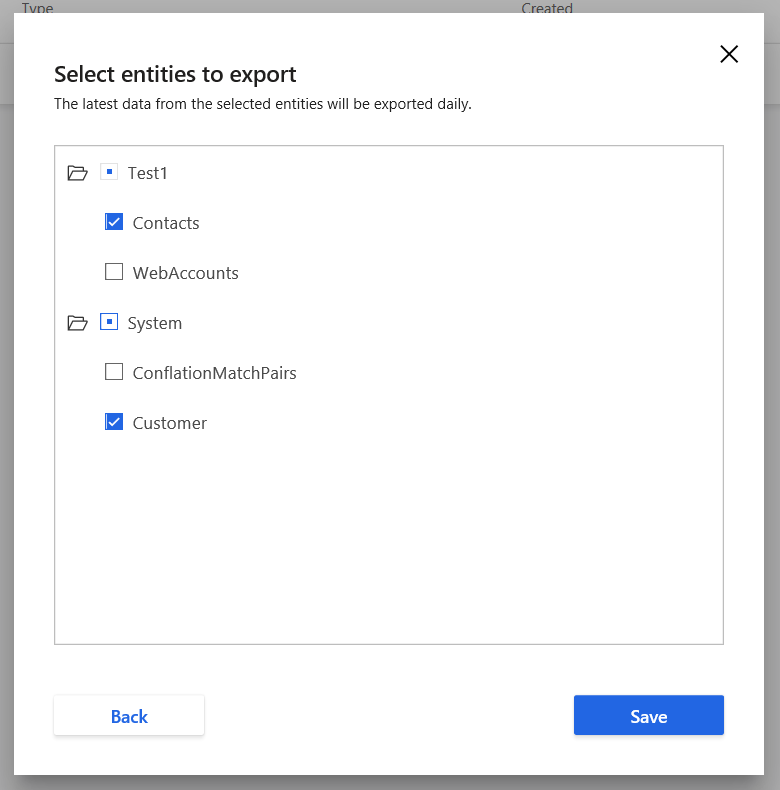
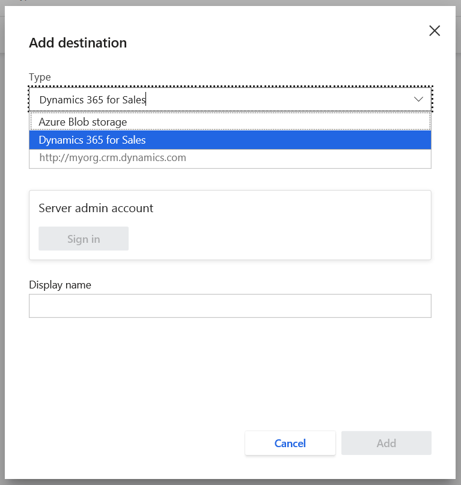

# Export destinations

The **Export destinations** page shows you all locations you’ve setup to export data to and allows you to add new destinations. To add or edit export destinations, you’ll need to be an administrator of your Customer Insights instance.

## Add a new Export destination

### Azure Blob storage

1. Within the **Export destinations** page, select **Add destination**.

   > [!div class="mx-imgBorder"] 
   > 

2. Select **Azure Blob storage** in the **Type** drop-down list.

3. Input the **Account name**, **Account key**, and **Container** for your Blob storage account.
    1. You can find more information on how to find the Azure Blob storage account name and account key here: https://docs.microsoft.com/en-us/azure/storage/common/storage-account-manage
    2. You can also find information on how to create a container here: https://docs.microsoft.com/en-us/azure/storage/blobs/storage-quickstart-blobs-portal#create-a-container

   > [!div class="mx-imgBorder"] 
   > 

4. Give your destination a recognizable name in the **Display name** field.

5. Select **Next**.

6. Check the box next to each of the entities you want exported to this destination.

   > [!div class="mx-imgBorder"] 
   > 

7. Select **Save**.

Your export should start shortly if all prerequisites for export have been completed.  In addition, your export will run at the end of every scheduled refresh.  You can find more information about scheduling here: https://docs.microsoft.com/en-us/dynamics365/ai/customer-insights/pm-settings#schedule-tab

#### Azure Blob storage locations

Data exported from the Export process will be stored in the Azure Blob storage container you set in your export destination.  The following folder paths are automatically created in your container:

  - Customer Insights generated entities: Dynamics365CustomerInsights/Export/%EntityName%/%EntityName%_%PartitionId%.csv
    - Example: Dynamics365CustomerInsights/Export/Customer/Customer_1.csv
  - Data Source entities: Dynamics365CustomerInsights/Export/%DataSourceName%_%EntityName%/%DataSourceName%_%EntityName%_%PartitionId%.csv
    - Example: Dynamics365CustomerInsights/Export/Retail_Contacts/Retail_Contacts_1.csv
	
### Dynamics 365 for Sales
1. Within the **Export destionations** page, select **Add Destination**.

   > [!div class="mx-imgBorder"] 
   > 

2. Choose "Dynamics 365 for Sales" in the **Type** drop-down list.

   > [!div class="mx-imgBorder"] 
   > 

3. Define your Dynamics 365 for Sales URL in **Server address*, **Sign in**, select a Dynamics 365 for Sales account, then give your destination a recognizable name in **Display name**.

4. Select **Add**.

## View Export destinations

When viewing the **Export destinations** page, if you’ve already created destination you will see a table containing several fields for destinations you’ve added, explained below:

   > [!div class="mx-imgBorder"] 
   > 
	
  - Display name: The name you created during the destination creation.
  - Type: The destination type set during the destination creation.  Currently supports:
    - Azure Blob storage
    - Dynamics 365 for Sales
  - Created: The date you created the destination.

## Remove an Export destination

To remove an Export destination, you'll need to start from the main Export destination page.

   > [!div class="mx-imgBorder"] 
   > 

1. Start by Selecting on the vertical ellipsis for the Export destination you wish to remove.

   > [!div class="mx-imgBorder"] 
   > 

2. Select **Remove**.

   > [!div class="mx-imgBorder"] 
   > 

3. Finalize the removal by Selecting **Remove** on the confirmation screen.

   > [!div class="mx-imgBorder"] 
   > 