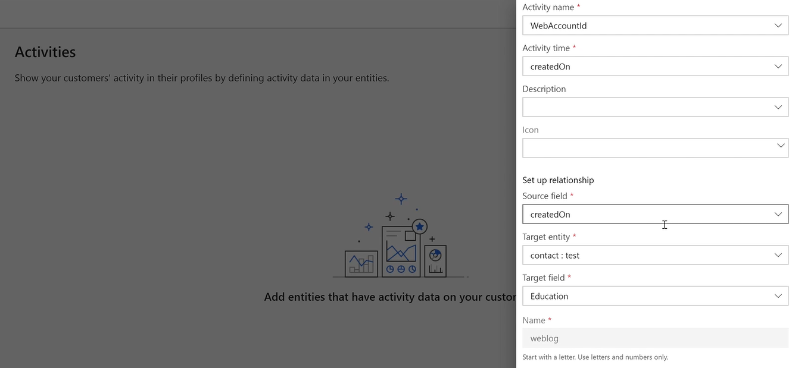

# Activities

Consolidate customer activities from various data sources in Dynamics 365 Customer Insights that you want to view on the customer's timeline. In a next step, you can create a customer timeline which consolidates all the activities of a customer in chronological order. It can be shown in model-driven apps in Dynamics 365 (such as Dynamics 365 Sales and Dynamics 365 Customer Service), via the Customer Card add-in, or within a Power BI dashboard. A specific control is used for the creation of the timeline. Visit the [**Timeline Control** section](pm-customer-card-addin.md#timeline-control) to learn how to work with that control.

This topic covers only the **Activities** page.

## Define an activity

Your data sources include entities with transactional and activity data from multiple data sources. Identify these entities and select the activities you want to view on the customer’s timeline. Choose the entity that includes your target activity or activities.

1. In Customer Insights, go to **Data** > **Activities**.

2. Select **Add activity**.

   > [!NOTE]
   > An entity must have at least one attribute of type **Date** to be included in a customer timeline and you can't add entities without **Date** fields. The **Add activity** control is disabled if no such entity is found.

3. In the **Add activity** pane, set the values for the following fields:

   - **Entity**: Select an entity that includes transactional or activity data.
   - **Primary key**: Select the field that uniquely identifies a record. It shouldn't contain any duplicate values, empty values, or missing values.
   - **Timestamp**: Select the field that represents the start time of your activity.
   - **Event**: Select the field that is the event for the activity.
   - **Details**: Optionally, select the field that is added for additional details.
   - **Icon**: Optionally, select the icon that represents this activity.

3. In the **Set up relationship** section, configure the detail to connect your activity data to its corresponding customer.

   > [!div class="mx-imgBorder"]
   > 

    - **Source field**: Select the field in your activity entity that will be used to establish a relationship with another entity.
    - **Target entity**: Select the customer entity with which your activity entity will be in relationship.
    - **Target field**: Select the field in the customer entity that will be used to establish a relationship with the activity entity.

4. Select **Save** to apply your changes.

5. On the **Activities** page, select **Run**.

## Edit an activity

1. In Customer Insights, go to **Data** > **Activities**.

2. Select the vertical ellipses (...) in the **Actions** column of the activity you want to edit.

3. Select **Edit** from the drop-down list.

4. In the **Edit activity** pane, update the values and select **Save**.

5. On the **Activities** page, select **Run**.

## Delete an activity

1. In Customer Insights, go to **Data** > **Activities**.

2. Select the vertical ellipses (...) in the **Actions** column of the activity you want to remove.

3. Select **Remove** from the drop-down list.

4. Confirm your deletion.

## Next steps

After defining your activities, review the [Customer Card add-in](pm-customer-card-addin.md) content to learn how to view information on these activities in model-driven apps in Dynamics 365. To learn how to set up the Power BI dashboard, see the [Power BI connector](pm-connectors.md) topic.
