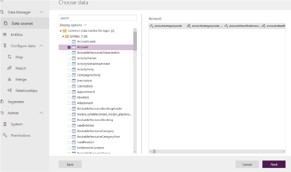

# Common connectors guidance

[!INCLUDE [cc-beta-prerelease-disclaimer](../includes/cc-beta-prerelease-disclaimer.md)]

> [!IMPORTANT]
> Currently, on-premises and OData data sources are not supported in Customer Insights. 

## Ingest data from a file hosted in Azure blob

> [!div class="mx-imgBorder"] 
> 

To ingest data to Customer Engagement from a CSV file hosted within a blob location in an Azure subscription, follow these steps.

1. Select **Blob connector** from the list of connectors.

   > [!div class="mx-imgBorder"] 
   > 

2. Enter the account name and account key, and then select **Next**.

   > [!div class="mx-imgBorder"] 
   > 

   **Note**: You can find the account name and key from the **Access keys** part in the Azure portal as shown below. 

   > [!div class="mx-imgBorder"] 
   > 

3. This will now list all the containers in the blob. Select the container that includes your CSV file and select **Next**.

   > [!div class="mx-imgBorder"] 
   > 

4.	Now you will see the various CSV files in the container. Select **[Table]** in the content column to expand and see the file content preview.

    > [!div class="mx-imgBorder"] 
    > 
   
## Ingest data from Dynamics 365

1. Select **Common Data Service for Apps**.

   > [!div class="mx-imgBorder"] 
   > 
 
2. Provide your server URL.

   > [!div class="mx-imgBorder"] 
   > 

   Log in with your username and password.

   > [!div class="mx-imgBorder"] 
   > 

   > [!div class="mx-imgBorder"] 
   > 

## Ingest data from Azure SQL database

1. Select **SQL Server database** from the connector list.

   > [!div class="mx-imgBorder"] 
   > 

2. Select **SQL Server database**.

3. Provide your database server, database name, username and password.

   > [!div class="mx-imgBorder"] 
   > 

4. Pick data from the specific tables you want to bring into Customer Insights.

   > [!div class="mx-imgBorder"] 
   > 
   
## Ingest data from a csv. file

1. If it’s a desktop file, you should first save it in SharePoint as explained here: [Work with worksheet data in OneDrive](https://support.office.com/article/Work-with-worksheet-data-in-OneDrive-C051A205-1C06-4FEB-94D8-793B0126B53A).

2. Select the **Text/csv** connector:

   > [!div class="mx-imgBorder"] 
   > 

3. Manually format the URL to your online document.

   Once you copy the URL to your online document from SharePoint, it should look like this: 

   https://microsoft.sharepoint.com/:u:/t/TeamName/EdP4Jh3iCj9DUteIBCzbdOX7C4bmVvzlDo81F0A?e=2Co1vj
   
   Format the URL as follows:

   > [!div class="mx-imgBorder"] 
   > 

   The final result for the above will be: 

   > [!div class="mx-imgBorder"] 
   > 

 An example of a copied link: 
 https://microsoft.sharepoint.com/:u:/t/yourTeamName/EdP4G8Jk2dZJh3iCj9DUteIBCzbdOX7C4bmVvzlDo811vj  

**Your team name**

> [!div class="mx-imgBorder"] 
> 

**Root folder to your documents**

> [!div class="mx-imgBorder"] 
> 

**File name and the folder structure for the file**

> [!div class="mx-imgBorder"] 
> 
