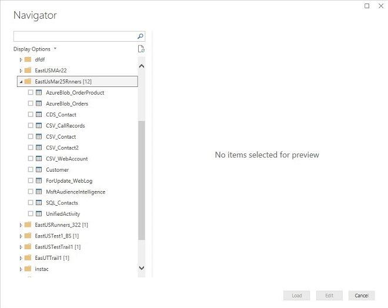

# Power BI connector

In  this section you will learn how to use the Customer Insights connector in Power BI to combine Customer Insights unified data with Power BI’s data visualization capabilities.

The Customer Insights connector enables you to use the unified data that you have unlocked through the data configuration process. This includes customer details such as roles and locations and unique key performance indicators (KPIs) you might have defined using the **Measures** page (such as Customer Lifetime Spend or Engagement Score). 

In order to see your customer insights in Power BI, make sure that you have created at least one data source within the **Data sources** page and ingested at least one dataset (entity) into it. Also, make sure you have [Microsoft Power BI Desktop](https://powerbi.microsoft.com/desktop/) installed on your computer. Then, complete the following steps.

1. Open Microsoft Power BI Desktop and select **Get Data** in the menu at the top of the page.

   > [!div class="mx-imgBorder"] 
   > 
 
2. Search for **Dynamics 365 Customer Insights (Beta)**, select it from the menu on the right, and then click **Connect** on the lower-right corner.

    > [!div class="mx-imgBorder"] 
    > 

3. If you have not used this connector before, you will need to sign in with the same account you use to view the data in Dynamics 365 Customer Insights.

4. You will see a list of all the environments you can access. You can select the arrow next to any of the environments to see a full list of entities you can import into:

   > [!div class="mx-imgBorder"] 
   > 

5. Select the check boxes next to the entities you want to load, and then click **Load** in the lower-right corner of the dialog box. You can select multiple entities from multiple environments.

   > [!div class="mx-imgBorder"] 
   > 

6. You will see the following loading dialog box while your entities are loaded. 

   > [!div class="mx-imgBorder"] 
   > 

Once all of your selected entities have loaded, you'll have the capabilities of Power BI combined with your data from Dynamics 365 Customer Insights!

### See also
 [Add a filter to a Power BI service report (in Editing view)](https://docs.microsoft.com/power-bi/power-bi-report-add-filter) 
 [What is Power BI Desktop?](https://docs.microsoft.com/power-bi/desktop-what-is-desktop)
