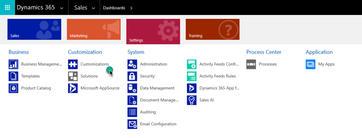
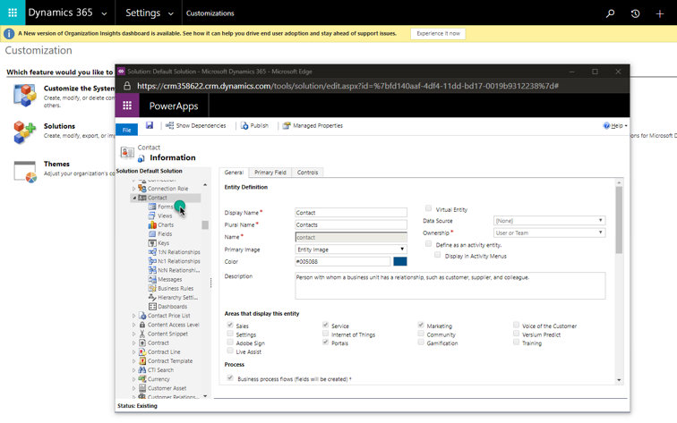
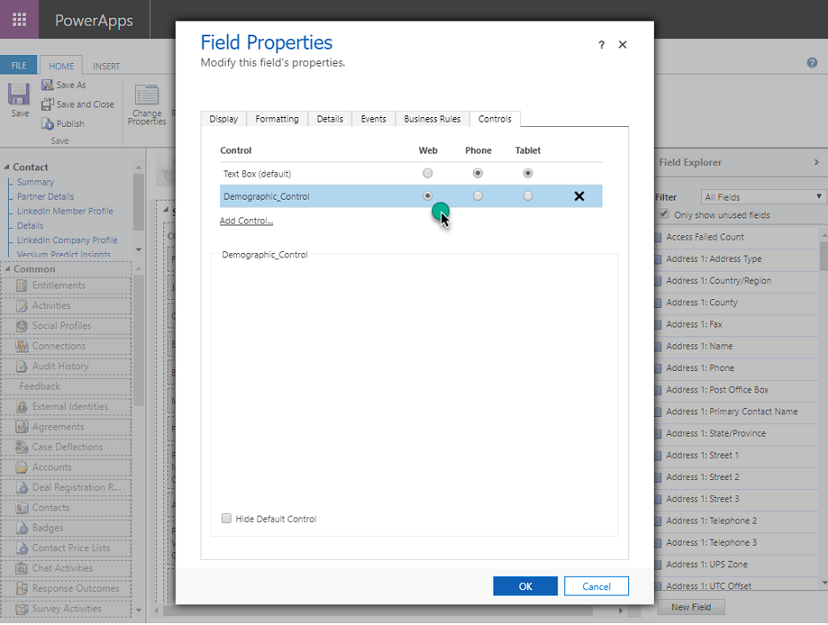
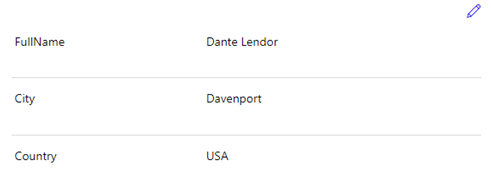

# Customer Card add-in

The Customer Card enables you to gain a 360 angle view on each of your customers. Once completing the Customer Card installation, you can start using the **Timeline Control** and **Demographic Control** to unlock rich insights on a selected customer, including his or her location, age, latest activities, and much more. Note that:
- In order to view customer activities, those should be first defined using the **Activities** screen.
- In order to view customer KPIs, those should be first defined using the **Measures** screen. 

## Requirements

- Dynamics 365 for Customer Engagement version 9.0 and later.
- Unified Interface enabled: Sales Hub, Customer Service Hub, Project Resource Hub. 
- Users who will use the Customer Insights Customer Card in Dynamics 365 for Customer Engagement need to be added as users on Dynamics 365 Customer Insights. You can do so on the **Permissions** page in the **Admin** section, as discussed later in this topic.

  > [!div class="mx-imgBorder"] 
  > 

## Install Customer Card Add-in

1. As an admin, go to the **Settings** section in Customer Engagement, and select **Solutions**. 

   > [!div class="mx-imgBorder"] 
   > 

2. Select the display name link for the Customer Insights solution.

   > [!div class="mx-imgBorder"] 
   > 

3. Here you will configure the overall settings for the Customer Card add-in. The first step is to sign in with the admin Azure Active Directory (AAD) account you use to configure Customer Insights.

   > [!NOTE]
   > Check that the browser pop-up blocker is not blocking the authentication window when you select the **Authenticate** button. 

   > [!div class="mx-imgBorder"] 
   > 

4. The next step is to select the Customer Insights instance you want to fetch data from.

   > [!div class="mx-imgBorder"] 
   > 

5. The last step on the overall setting is to select which field in the Customer Insights Customer entity corresponds to the ID of the Contact entity in your Customer Engagement organization. 

   > [!div class="mx-imgBorder"] 
   > 

6. Select **Save configuration** to save the setting. 

   > [!div class="mx-imgBorder"] 
   > 

   > [!div class="mx-imgBorder"] 
   > 

7. Next, you will need to assign the following user roles:

   - Customer Insights Customizer: Assign this role to the users who will customize the content to be shown on the card for the whole organization.
   - Customer Insights Card Standard User: Assign this role to the users who will use the card for consumption, but who won’t customize. 
   
   > [!div class="mx-imgBorder"] 
   > 

8. Now you can add the Customer Card controls into your contact form. To do so, go to the **Settings** section in Customer Engagement, and then select **Customizations**. 
 
   > [!div class="mx-imgBorder"] 
   > 

9. Select **Customize the System**.

   > [!div class="mx-imgBorder"] 
   > 

10.	Browse to the Contact entity, expand its menu, and then select **Forms**. 
    
    > [!div class="mx-imgBorder"] 
    > 

11. Select the contact form to which you would like to add the Customer Card controls.

    > [!div class="mx-imgBorder"] 
    > 

    > [!div class="mx-imgBorder"] 
    > 

## Demographic control

1. To add the demographic control, in the form editor, drag any field from the Field Explorer to where you would like the demographic control to be placed.  

   > [!div class="mx-imgBorder"] 
   > 

2. Select the field you just added, and select **Change Properties**. 

   > [!div class="mx-imgBorder"] 
   > 

3. Clear the **Display label on the form** box. 
   
   > [!div class="mx-imgBorder"] 
   > 

4. Go to the **Controls** tab and select **Add Control**.

   > [!div class="mx-imgBorder"] 
   > 

5. Select **Demographic_Control**, and then select **Add**.

   > [!div class="mx-imgBorder"] 
   > 

6. Select the **Web** option for **Demographic_Control**.

   > [!div class="mx-imgBorder"] 
   > 

7. Select **Save** and **Publish** to publish the contact form where you have placed the demographic control.

   > [!div class="mx-imgBorder"] 
   > 

8. Go to the published contact form. You will see the demographic control. You might need to sign in the first time you use it. To customize what you want to show on the demographic control, select the edit button in the upper-right corner. 

   The customization you perform here will apply across the organization.

   > [!div class="mx-imgBorder"] 
   > 

   > [!div class="mx-imgBorder"] 
   > 

## Timeline control

1. In the form editor, drag any field from the Field Explorer to where you would like the demographic control to be placed.  

   > [!div class="mx-imgBorder"] 
   > 

2. Select the field you just added, and then select **Change Properties**. 
 
   > [!div class="mx-imgBorder"] 
   > 

3. Clear the **Display label on the form** box.
   
   > [!div class="mx-imgBorder"] 
   > 

4. Go to the **Controls** tab, and select **Add Control**.

   
   > [!div class="mx-imgBorder"] 
   > 

5. Select **Timeline_Control** and then **Add**.

   > [!div class="mx-imgBorder"] 
   > 

6. Select the **Web** option for **Timeline_Control**.

   > [!div class="mx-imgBorder"] 
   > 

7. Select **Save** and **Publish** to publish the contact form where you have placed the timeline control.
   
   > [!div class="mx-imgBorder"] 
   > 

8. Go to the published contact form. You will see the timeline control. You might need to sign in the first time you use it. 

   > [!div class="mx-imgBorder"] 
   > 

