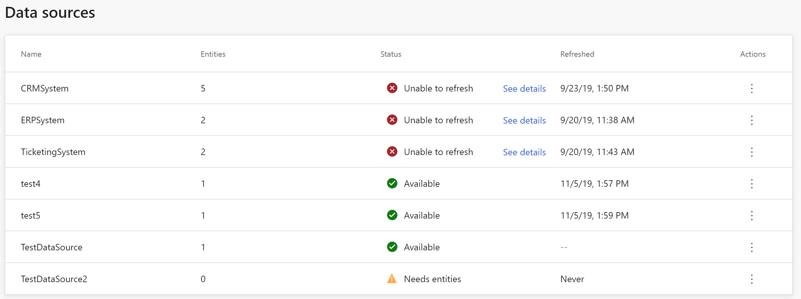
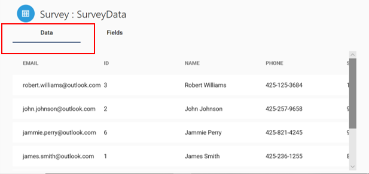

# Data sources

[!INCLUDE [cc-beta-prerelease-disclaimer](../includes/cc-beta-prerelease-disclaimer.md)]

Dynamics 365 for Customer Insights lets you bring together data from many sources:

- Transactional sources 
- Observational sources
- Behavioral sources
- Other sources

You can bring in data to Dynamics 365 Customer Insights by using the 20+ out-of-the-box connectors that we make available for sources such as Dynamics 365, Azure SQL Database, and Azure Blob storage. Even if you don’t find a suitable out-of-the-box connector for your source, you can export the data from your source as a CSV file and import it to Customer Insights with the CSV connector. 

To import data to Customer Insights, create a data source on the **Data sources** page. We recommend that you have multiple data sources because this allows you to have different refresh schedules and credentials for each of them.

## Bring your data into Customer Insights 

> [!IMPORTANT]
> Currently, on-premises data sources are not supported in Customer Insights. 

### Step One (mandatory): Create a new data source

Follow these steps to load data into Customer Insights:

1. Navigate to the **Data sources** page using the **Data sources** tab on the left-side menu.

2. Select **Get data**.

   > [!div class="mx-imgBorder"] 
   > 

3. Provide a name for the data source, and select **Save**. This creates the data source. 

   > [!div class="mx-imgBorder"] 
   > 

4. Choose one of the many connectors that are available.
  
   >[!NOTE]
   > Some of the data sources (such as OData) shown in the following image are not yet supported. 

    > [!div class="mx-imgBorder"] 
    > 

    To load data from Customer Engagement, choose the  **Common Data Service for Apps** connector.

     > [!div class="mx-imgBorder"] 
     > 
   
5. After you choose a connector, you are required to fill in some fields. For guidance on filling in fields for some of the most common data sources (for example, Dynamics 365, CSV and text files, Blob storage, and Azure SQL Database), see [Common Connectors Guidance](pm-common-connectors.md).  

### Step Two (mandatory): Adding, reviewing and transforming entities

In this step, you add entities to your data source. In Customer Insights, entities are datasets. If you have a database that includes multiple datasets, each of them (an Orders dataset or Sales dataset, for example) is an entity. 

<!--note from editor: 
Also--is the Power Query window something customers are familiar with? Nimrod's comment: We may want to add a link to the Power Query documentation. The downside is that we use Embedded Power Query and as far as I know there is no documentation for that. so we might end refering the reader to a documentation with functionalities he can't find, etc-->

1. Use the Power Query window shown in the following example to review and possibly configure the data. The entities that the system identified in your selected data source appear in the left pane (#1):

   > [!div class="mx-imgBorder"] 
   > 

2. You can also transform your data. First, choose an entity to edit or transform. Then, open one of the menus (see #2 in the preceding image) located at the top of the Power Query window to find a specific transformation. Each transformation is added as a processing step (see #3 in the preceding image), which can be modified as needed.

   >[!NOTE]
   >It might not be possible to make changes to data sources that are currently being used in one of the app's processes (*segmentation*, *match*, or *merge*, for example). Using the **Settings** page, you can track the progress of each of the active processes. When a process completes, you can return to the **Data Sources** page and make your changes. 

3. You can add additional entities to your data source by selecting **Get data**, as shown in the following example.

  > [!div class="mx-imgBorder"] 
  > 

 These transformations are highly recommended:

  - If you are ingesting data from a CSV file, and the first row has headers, go to **Transform table** and select **Use headers as first row**.

   > [!div class="mx-imgBorder"] 
   > 

  - We also recommend that you map your data to a standard format of data. Customer Insights allows you to map your data to the Common Data Model. To do this, go to **Map to Standard**, and then map fields from your source data to Common Data Model fields.

   > [!div class="mx-imgBorder"] 
   > 

4. Select **Create** at the bottom of the Power Query window to save.

   > [!div class="mx-imgBorder"] 
   > 

5. After saving, you can expect to see your data source added to the **Data sources** page.

   > [!div class="mx-imgBorder"] 
   > 

   You will see the name of each ingested data source, as well as the last time the data was refreshed for that data source and the status of the data source. There are three possible statuses:

   - Data was successfully ingested (see #1 in the preceding image).
   - No data was ingested yet (see #2 in the preceding image).
   - Data is still loading into Customer Insights (represented by a warning sign icon; see #3 in the preceding image).

   At this point, you should refresh the data source that you just saved. Select the button shown in the following image, and then select **Refresh**.

   > [!div class="mx-imgBorder"] 
   > 

   Repeat the same steps for each data source you want to ingest into Customer Insights.

### Step Three (optional): Review ingested data

It is possible that the data load will take some time. After successfully refreshing, the ingested data can be reviewed from the **Entities** page as shown in the following example. For more information on the **Entities** page, see [Data Manager: Entities](pm-entities.md).

> [!div class="mx-imgBorder"] 
> 

### Step Four (optional): Edit existing data sources

> [!NOTE]
> The Edit operation is available only for data sources that are not currently refreshing.

Follow these steps to edit an existing data source. 

1. Browse to the data source that you want to edit.

   > [!div class="mx-imgBorder"] 
   > 

2. Select **Edit** to edit the data source in Power Query.

   > [!div class="mx-imgBorder"] 
   > 

3. Select **Create** in the Power Query window after completing your edits. This saves your changes. If you want to remove a data source, select **Delete** for that data source.

   > [!div class="mx-imgBorder"] 
   > 

### Next steps:
<!--note from editor:  link to topics  JimH: I don't know what that topic is -->

At this point, you are ready to unlock unique customer insights. See the **Unify** topic to learn more. If you want to review all the entities that were ingested to the system first, see **Entities**. 

