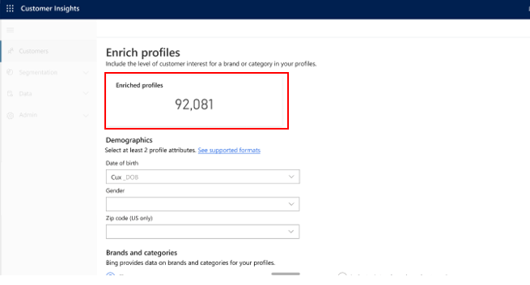

# Enrich Profiles

[!INCLUDE [cc-beta-prerelease-disclaimer](../includes/cc-beta-prerelease-disclaimer.md)]

Through its *Configure Data* process, Customer Insights enables you to consolidate data around your customers from all of your sources. At the same time, Customer Insights goes beyond that and puts at your fingertips additional machine language produced knowledge about your customers that comes from proprietary data. This section covers the **Enrich Profiles** page that can be used to unlock data on the affinity of your customers to hundreds of brands and dozens of interest-categories (which might be *Home Appliances*, *Shoes*, or *Financial loans* as examples).

The **Enrich Profiles** page can be accessed through the app left-side menu as well as from the **Configure Data** page:

// missing 1

**Note**: Completing both the *Data Ingestion* and *Data Configuration* processes is a prerequisite to enrichment. If you didn't complete one or more of those steps, you can expect to get the following notification.

> [!div class="mx-imgBorder"] 
> 

## Explore the Enrich Profiles page

> [!div class="mx-imgBorder"] 
> 

As shown above, this page includes two major sections:

- The **Demographics** section, where you should make selections for at least two fields among **Date of Birth**, **Gender**, and **Zip Code**. The intent behind these selections is to focus on the specific cohort of customers for which you wish to gain knowledge around preferred brands and interests. 
- The **Brands and Categories** section, where you can take one of two approaches: **Choose on my own** and **Industry's top Brands and Categories**.

### Make selections on the Demographics section

As mentioned earlier, you are required to make at least two selections. 

Only some formats are supported for each of the fields.

- Supported formats for **Date of Birth**: M/d/yyyy, MMMM d, yyyy-mm-dd, MMMM yyyy
- Supported formats for **Gender**: Male, Female, Unknown
- Supported formats for **Zip Code**: Should be a 5-digit US zip code (only US supported at this point)

### Make selections on the Brands and Categories section

> [!div class="mx-imgBorder"] 
> 

First choose one of the following options (also highlighted in the image above). Then complete your selections for that option.

1. **Choose on my own**: This option allows you to choose brands and interest-categories that are of most interest to you and get your customers' affinities for those selections. For example, *Coca-Cola* and *Starbucks* were chosen in the example below.
  
  > [!div class="mx-imgBorder"] 
  > 

To add a brand or interest, type the keywords field (highlighted in blue above) and than type a keyword. If that keyword matches a brand or interest name in the Microsoft database it will be saved. You can save up to five selections. If there is no match, you will get the following notice which you can use to send a suggestion to the Customer Insights team.

  > [!div class="mx-imgBorder"] 
  > 

2. **Industry's top brands and categories**: Get the brands and interests which all of your customers, taken together, have the highest affinities with. In *Customers* we refer only to the customers you chose in the **Demographics** section. In the example below, **Home&Garden** was chosen as an industry.
  
<!-- // enrich 6 - still missing

Here is the list of supported industries: To complete -->
  
### Run the Enrichment process

That can be easily done via **Run** at the top of the screen (shown in red).

> [!div class="mx-imgBorder"] 
> 

You'll see the following page as long as the Enrichment algorithm is still running.

> [!div class="mx-imgBorder"] 
> 

You can also use the **Discard** button to reselect your definitions and keywords (shown in blue above).

### Validate the Enrichment process output

If the Enrichment process succeeded, you'll see the following screen.

> [!div class="mx-imgBorder"] 
> 

Utilize the **Enriched Profiles** figure (shown in red above) to assess your enrichment definitions and keywords, and to consider if any of them should be reconfigured.

If the Enrichment process failed, however, you'll find the reason for that failure at top of the screen.

> [!div class="mx-imgBorder"] 
> 

### Gain Richer Insights on your Customer Base
Upon the completion of the Enrichment process, you have unlocked additional information on affinities to brands and interests within your customer base. To explore those insights:
1. Go to the entities screen
2. Select the **MsftAudienceIntelligence: Customer 360** entity

// missing 2

....

Lastly, you can also **Export** this entity as shown below:

// missing 3

## Next Step
You may wish to extract more insights using the **Segments**, **Customer Card** and **Connectors** modules if you havn't done so. You may also want to define **Measures** and/or **Activities** for richer insight exploration. 
