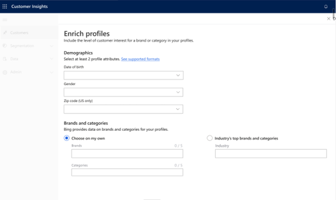

# Enrichment

Dynamics 365 Customer Insights consolidates customer data from all of your data sources after completing the map, match, and merge phases. At the same time, Customer Insights goes beyond that and provides information about your customers that comes from proprietary data. The **Enrichment** page enables your to get insights from data on affinities for hundreds of brands and dozens of interest-categories. These affinities are extracted from profiles that might be similar to the profile of you customers.

In Customer Insights, go to **Data** > **Enrichment** to configure and view the data.

## Explore the Enrichment page

The **Enrichment** page includes two major sections where you define the parameters to enrich your data.

- **Demographics**: Define demographics for a specific group of profile types for which you want to gain insights around preferred brands and interests.

- **Brands and categories**: Select wether Customer Insights delivers the insights about groups of profiles based on your own selections or based on selecting an industry.

## Demographics section

You need to define the values for at least two fields to enrich your unified customer profiles.

The following formats and values are supported:

- **Date of Birth**: m/d/yyyy, mmmm d, yyyy-mm-dd, mmmm yyyy
- **Gender**: Male, Female, Unknown
- **Zip Code**: 5-digit US ZIP Code (only supported for the US)

## Brands and categories section

Choose one of the following options. Then, provide the information for that option.

- **Choose on my own**: This option lets you choose brands and categories of interest to get affinities for those selections.

   To add a brand or category, enter a keyword in the corresponding input field. If the system finds a match for the keyword in the underlying database, it will be saved. If there is no match, you can send a suggestion to the Customer Insights team. You can add up to five brands or categories.

- **Industry's top brands and categories**: For a selected industry, get the brands and interests that your customer base has the highest affinity for. *Customer base* refers to the customer profiles that are similar to the ones defined in the **Demographics** section.
  
## Run the enrichment process

After defining or updating values on the **Enrichment** page, you need to select **Run** in the page header to start the enrichment process. It can take a few minutes to run the enrichment algorithm.

## Validate the enrichment process output

After the enrichment process completes, you'll find the number of **Enriched profiles** on the **Enrichment** page.

> [!div class="mx-imgBorder"]
> 

If the enrichment process fails, you'll find the reason at the top of the screen.

## Gain richer insights into your customer base

After completing the enrichment process, you'll find additional information on affinities for brands and interests.

1. Go to the **Home** page and find affinity bar charts in the **Insights** section.

2. Go to **Data** > **Entities** and select the **MsftAudienceIntelligence: Customer Insights** entity.

   > [!div class="mx-imgBorder"]
   > 

   - The **Segment** column lists the brands and interests that were evaluated by the enrichment algorithm.
   - The **IndustryVertical** column lists industry the brands and interests belong.
   - The rest of the columns specify relative affinities to these brands and interests among profiles that are similar to your customers'. The affinity numbers represent ranks. A rank of 1 stands for the strongest affinity and the affinity decreases as the number increases.  
   - To export this entity, select **Download as CSV**.

## Next step

You might want to extract more insights using the **Segments**, **Customer Card**, and **Connectors** modules if you haven't done so. You also might want to define **Measures** and/or **Activities** for richer insights.
