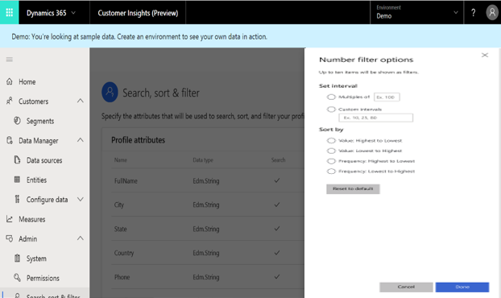

## Search, Sort and Filter

[!INCLUDE [cc-beta-prerelease-disclaimer](../includes/cc-beta-prerelease-disclaimer.md)]

The end result of the Data Configuration process is the creation of the Customer Profile entity that equips you with a unified view into your total customer base. At the same time, there are cases in which you might want to quickly pull information on a specific customer or a group of customers. That can be done via the **Search** and **Filter** capabilities on the **Profiles** page:

> [!div class="mx-imgBorder"] 
> 

To further understand how to utilize those capabilities, visit the **Profiles** section. **In this section** we will cover the complementing capability that enables you, as an administrator, to edit the attributes by which you are searching, filtering and sorting profiles. That is done on the **Search, Sort and Filter** screen (accessable via the corresponding tab on the left side menu).

### Adding Attributes
The first screen you can expect to see is the following one. Click **Add attributes** to get started: 

> [!div class="mx-imgBorder"] 
> 

Within the attributes panel you should choose all the attributes by which users will be able to search, filter and sort customers on the **Profiles** page. You can use the search fieled (shown in red) to search for a specific attribute by it's name. Note that you can select only attributes that exist in the Customer Profile entity you have created during the data configuration process.

> [!div class="mx-imgBorder"] 
> 

Then you will get to the main screen. In the example shown below many attributes were already selected:

> [!div class="mx-imgBorder"] 
> 

You can always add more attributes via the **Add attribute** button (shown in red below). You can also remove any selected attributes using the button shown in blue:

> [!div class="mx-imgBorder"] 
> 

### Exploring the Main Screen
Let's explore the table found on the main screen, going left to right:

> [!div class="mx-imgBorder"] 
> 

**Name**: Presents the attribute's name as appears in the Customer Profile entity
**Data Type**: Specifies whether it's a *String*, a *Number*, or a *Date* type of data
**Search**: Specifies whether this attribute can be used for searching customers on the Profiles page (using the Search field)
**Filter**: Specifies whether this attribute can be used for filtering customers on the Profiles page (using the Filter panel)
**Sort** Specifies whether this attribute can be used for sorting customers
**Filter Options**: Clicking the **Edit** button (highlighted above) will enable you to define how exactly this attribute can be used for searching, filtering and sorting (we will expand on it below)

### Editing the Way an Attribute can be used for Searching, Filtering and Sorting
Upon clicking the edit button for a given attribute, one of three possible panels will show up, depending on the attribute's data type.

The Filter menu on the Profiles page can include a varying number of attribute levels (for example anywhere between 2 and 10 age groups to filter customers by). Using the editing panel, you can specify:
1. How many results will apear on the filter panel
2. In what order they will be organized

- **Editing panel for string-type attributes:

> [!div class="mx-imgBorder"] 
> 

In this panel you can specify the number of desired results on the filter panel as well as the order policy by which they will be organized. 

- **Editing panel for number-type attributes:

> [!div class="mx-imgBorder"] 
> 

In this panel you can specify the intervals included on the filter panel as well as the order policy by which they will be organized.

- **Editing panel for date-type attributes:

> [!div class="mx-imgBorder"] 
> 

In this panel you can specify the intervals included on the filter panel as well as the order policy by which they will be organized.

Lastly, don't forget to save your selections using the **Save** button (shown in red below). Click **Run** (shown in blue) once you are ready to apply your settings (so your definitions will affect the way other users can search and filter for customers using the Profiles page):

// 10

## Next Step
