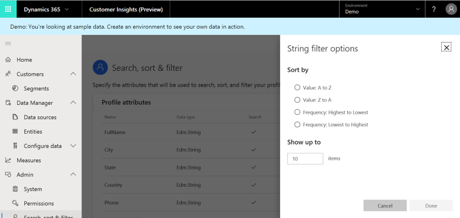
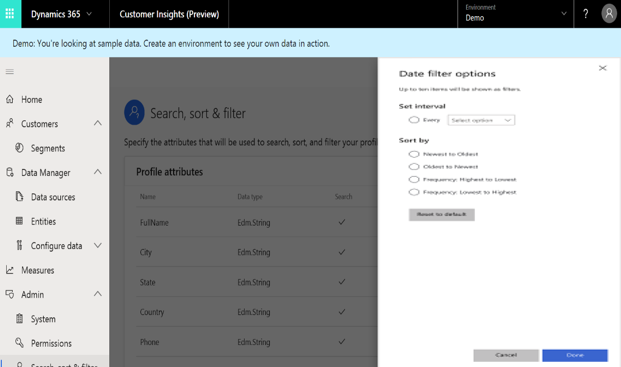
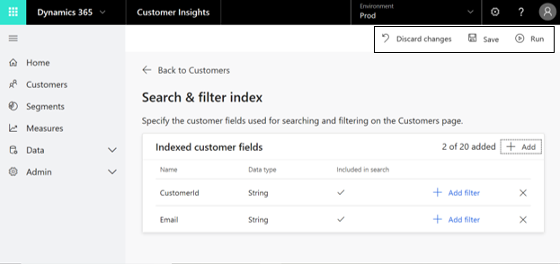

## Search, sort, and filter

[!INCLUDE [cc-beta-prerelease-disclaimer](../includes/cc-beta-prerelease-disclaimer.md)]

The end result of the data configuration process is the creation of the Customer Profile entity that equips you with a unified view into your total customer base. At the same time, there are cases in which you might want to quickly pull information on a specific customer or a group of customers. That can be done via the **Search** and **Filter** capabilities on the **Profiles** page.

> [!div class="mx-imgBorder"] 
> 

To further understand how to utilize those capabilities, visit the **Profiles** section. In this section, we will cover the complementing capability that enables you to edit the attributes by which you are searching, filtering, and sorting profiles. This is done on the **Search, sort & filter** page.

> [!div class="mx-imgBorder"] 
> 

## Adding attributes

After selecting the **Search, sort and filter** tab on the left-side menu, you'll see the following page, where you should select **Add attributes** to get started.

> [!div class="mx-imgBorder"] 
> 

In the **Profile attributes** panel shown in the following example, choose all the attributes by which users will be able to search, filter, and sort customers on the **Profiles** page. You can use the **Search** field (shown in red) to search for a specific attribute by its name. Note that you can select only attributes that exist in the Customer Profile entity you have created during the data configuration process.

> [!div class="mx-imgBorder"] 
> 

You will see the **Search, sort & filter** page. In the following example, many attributes were already selected.

> [!div class="mx-imgBorder"] 
> 

You can always add more attributes via **Add** (shown in red in the following example). You can also remove any selected attributes using the button shown in blue.

> [!div class="mx-imgBorder"] 
> 

## Exploring the Search, sort & filter page

Let's explore the table on this page, going left to right.

> [!div class="mx-imgBorder"] 
> 

- **Name**: Presents the attribute's name as it appears in the Customer Profile entity.
- **Data type**: Specifies whether the data type is string, number, or date.
- **Search**: Specifies whether this attribute can be used for searching customers on the **Profiles** page (using the **Search** field).
- **Filter**: Specifies whether this attribute can be used for filtering customers on the **Profiles** page (using the **Filter** panel).
- **Sort** Specifies whether this attribute can be used for sorting customers.
- **Filter options**: Selecting **Edit** enables you to define how this attribute can be used for searching, filtering, and sorting.

## Editing search, sort, and filter options for a given attribute

The **Filter** menu on the **Profiles** page can include a varying number of attribute levels (for example, anywhere between 2 and 10 age groups to filter customers by). 

After selecting **Edit** for a given attribute on the **Search, sort & filter** page, one of three possible panels will show up, depending on the attribute's data type. Using this panel you will be able to determine:

- How many results will appear on the **Filter** menu on the **Profiles** page. 
- In what order they will be organized.

The following image shows the **Edit** panel that will open for string-type attributes.

> [!div class="mx-imgBorder"] 
> 

In this panel, you can specify the number of desired results on the **Filter** panel, as well as the order policy by which they will be organized. 

The following image shows the **Edit** panel that opens for string-type attributes:

> [!div class="mx-imgBorder"] 
> 

In this panel, you can specify the intervals included on the **Filter** panel, as well as the order policy by which they will be organized.

Lastly, the following image shows the **Edit** panel that opens for date-type attributes.

> [!div class="mx-imgBorder"] 
> 

In this panel, you can specify the intervals included on the filter panel, as well as the order policy by which they will be organized.

Save your selections using **Save** (shown in red in the following image). Select **Run** (shown in blue) once you are ready to apply your settings. Once processing has completed, your definitions now dictate how other users can search and filter for customers using the **Profiles** page.

> [!div class="mx-imgBorder"] 
> 

