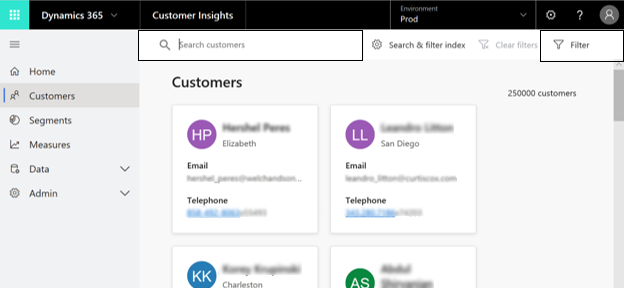
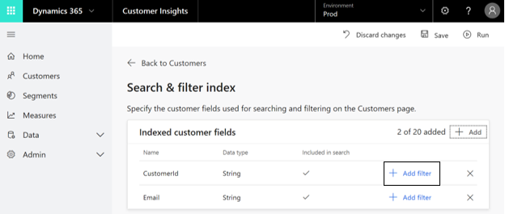

## Search & Filter Index

[!INCLUDE [cc-beta-prerelease-disclaimer](../includes/cc-beta-prerelease-disclaimer.md)]

The end result of the data unification process is the creation of the Customer Profile entity that equips you with a unified view into your total customer base. At the same time, you might want to quickly pull information on a specific customer or a group of customers. That can be done with the **Search** and **Filter** capabilities on the **Customers** page.

// replace 1
> [!div class="mx-imgBorder"] 
> 

<!--note from editor: Include links to Profiles topic below   -->

To further understand how to utilize those capabilities, visit the **Customers** section. In this section, we will cover the complementing capability that enables you to edit the attributes by which you are searching and filtering profiles. This is done on the **Search & Filter Index** page that is accessible via the **Search & Filter Index** button on the **Customers** page:

// replace 2
> [!div class="mx-imgBorder"] 
> 

## Adding attributes

In the panel shown below, choose all the attributes by which users will be able to search and filter customers on the **Customers** page. You can use the **Search** field to search for a specific attribute by its name. Note that you can select only attributes that exist in the Customer Profile entity that you created during the data unification process.

// replace 3
> [!div class="mx-imgBorder"] 
> 

At this point you will see the **Search and Filter Index** page. In the following example, many attributes were already selected.

// replace 4
> [!div class="mx-imgBorder"] 
> 

You can always add more attributes with **Add** (#1 in the following example). You can also remove any selected attributes using the button shown in #2.

// replace 5
> [!div class="mx-imgBorder"] 
> 

## Exploring the Search and Filter Index page

Let's explore the table on this page, going left to right.

// replace 6
> [!div class="mx-imgBorder"] 
> 

- **Name**: Presents the attribute's name as it appears in the Customer Profile entity.
- **Data type**: Specifies whether the data type is a string, number, or date.
- **Included in Search**: Specifies whether this attribute can be used for searching customers on the **Customers** page (using the **Search** field)
- **Add Filter**: Selecting this button enables you to define how this attribute can be used for filtering on the **Customers** page

## Editing filtering options for a given attribute

<!--note from editor: Throughout--are there actual names for the Edit panel and the Filter panel? If those aren't the names in the UI, don't use bold for "Edit" and "Filter". Also, "panel" or "pane" or "grid"? Nimrod comment: Panel (not pane or grid). And yes, those are the panels names on the UI. SO I think comment can be removed, thanks  -->

The **Filter** menu on the **Customers** page can include a varying number of attribute levels (for example, anywhere between two and 10 age groups to filter customers by). 

After selecting **Add Filter** for a given attribute on the **Search & Filter Index** page, one of three possible panels will show up, depending on the attribute's data type. Using this panel you will be able to determine:

- The number of results that will appear on the **Filter** menu on the **Customers** page. 
- The order in which they will be organized.

The following image shows the panel that will open for string-type attributes.

> [!div class="mx-imgBorder"] 
> 

In this panel, you can specify the number of desired results on the **Filter** panel, as well as the order policy by which they will be organized. 

The following image shows the panel that opens for numerical-type attributes:

> [!div class="mx-imgBorder"] 
> 

In this panel, you can specify the intervals included on the **Filter** panel, as well as the order policy by which they will be organized.

Lastly, the following image shows the panel that opens for date-type attributes.

> [!div class="mx-imgBorder"] 
> 

In this panel, you can specify the intervals included on the filter panel, as well as the order policy by which they will be organized.

Save your selections using **Save**. Select **Run** once you are ready to apply your settings. 

// replace 7
> [!div class="mx-imgBorder"] 
> 

Once processing has completed, your definitions now dictate how other users can search and filter for customers using the **Customers** page. To go back to the **Customers** page, click the following button:

// add 1

