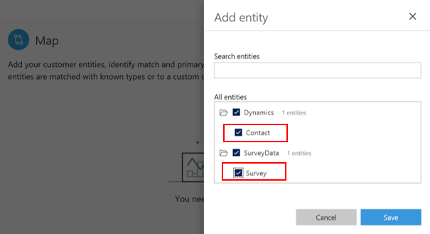
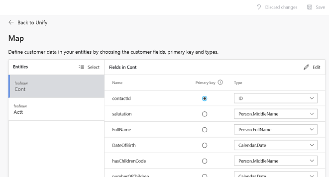

# Map

[!INCLUDE [cc-beta-prerelease-disclaimer](../includes/cc-beta-prerelease-disclaimer.md)]

There are two main goals behind the map phase:

- **Entity selection:** Identify the customer entities which, upon unification, may lead to a dataset with more complete information on your customers
- **Attribute selection:** For each customer entity, identify the columns upon which you will want to combine your data in the next phase (those columns are also called **Attributes**)

Select the **Map** tile on the **Configure Data** page to open the **Entity Selection** page.

> [!div class="mx-imgBorder"] 
> 

### Add entities to the Map page

In **Entities Selection**, select **Add Entities**.

> [!div class="mx-imgBorder"] 
> 

Select **Add Entities**.

> [!div class="mx-imgBorder"] 
> 

Add all the entities which, upon unification, might lead to a better understanding of your customers. 

In the example below, the user searched for the Contact and Survey entities since these include information that might be valuable to combine. One example might be understanding what address corresponds to what survey participant (given that Address exists only in the Contact entity). 

Then, the user selected the Contact and Survey entities. Those were found within the **Dynamics** and **Surveydata** data sources that were ingested during the **Get Data** phase. The user selected those two entities, and then selected **Save**.

> [!div class="mx-imgBorder"] 
> 

> [!NOTE]
> You should search for and select at least two entities in order to benefit from the data configuration process.

### Add attributes to entities in the Map page

Following entity selection, the **Map** page appears.

> [!div class="mx-imgBorder"] 
> 

On the left, you can see your ingested entities. The first entity is automatically selected. In the example, above it's the Contact entity. 

At this point, you should start adding attributes to each of your entities. You should select all the attributes on the basis of which you want to combine with your entities. You can either manually add attributes (**Define my own**) or let the system auto-identify the attributes for the selected entity (**Use system recommendations**).

#### Manually adding attributes

When you select **Define my own**, a window appears on the right in which you can manually add attributes.

> [!div class="mx-imgBorder"] 
> 

Here you can select all the attributes that are relevant for each of your entities. Remember, in the example above we had two entities: Contact and Survey. Use either **Search attributes** (red) and/or scroll down the **Attributes** menu (blue) to locate and select all the attributes. Finish by selecting **Save**. Note that you can also choose all the attributes by selecting **Select all attributes** (green). Selecting **Select all attributes** again to deselect all your chosen attributes.

## Select primary keys and define attribute types

> [!div class="mx-imgBorder"] 
> 

Select each of the customer entities tabs on the left to open its corresponding attributes table as shown above for the Survey entity example. Below we will explore this table's columns from left to right. Note: you must make selections within all the mandatory columns:

- **Primary key (mandatory selection):** For executing the identity-resolution process, it's mandatory to select one attribute as a unique key for each of the customer's entities. For example, if one of your data sources is a Contacts dataset, you may want to assign *Customer Name* as the unique key for that source, while for a *Call-Logs* file you may prefer to define *Phone Number* as a unique key. 
- **Column Name**: The attribute's name as appears in the ingested dataset.
- **Customer attribute (mandatory selection)**: By checking this box you confirm that this is an attribute on the customer-level rather than on the aggragated customer-base level.
- **Entity Type (mandatory selection):** Categories under which your attributes fall such as email or name. Adding a custom entity type is also possible. Select the type for a given attribute and select **Custom**  to specify your custom type.
- **Normalize:** Optional column. Here you can select whether and how to normalize all the data that you use for the matching process. Several options are available such as removing whitespaces, normalizing digits, removing punctuation, and others. 

## Add or Edit entities and attributes

Select **Edit** to add or edit entities and attributes.

> [!div class="mx-imgBorder"] 
> 

Select **Customer entity**. Then, select the entities that you want to add to your existing entities and deselect entities that you want to remove. 

> [!div class="mx-imgBorder"] 
> 

To add an attribute to an existing entity, first select the entity to which you want to add data. Select **Edit**, and then select **Attributes to [entity's name]**. In the example below, we are adding attributes to the Contact entity.

> [!div class="mx-imgBorder"] 
> 

You might want to select additional attributes or deselect attributes you have selected in the past. In the example below, we deselect **Gender** and add **Residence Country**.

<!-- [Map final 15] -->

## Keep unmatched records
As part of the next stage (match), it's possible that not all of your data entities will be successfully matched. Enable **Keep unmatched records** to save all the records of your unmatched entities in your master data profile for future use. 

> [!div class="mx-imgBorder"] 
> 

## Next Step
As part of the data configuration process, proceed to the **Match** page either by selecting **Match** in the left menu or by selecting the **Match** tile from the **Configure Data** page.
