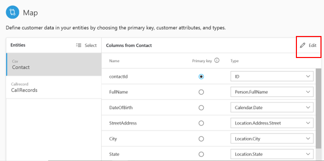

# Map

**Map** is the first stage in the data unification process that Customer Insights unlocks for you as a user. If haven't so, you can get some more context around the unique data unification capabilities that Customer Insights offers by visiting the **Unify** section. 

There are two main goals of the map phase:

- **Entity selection:** Identify the entities that can be combined to lead to a dataset with more complete information about your customers.
- **Attribute selection:** For each entity, identify the columns you want to combine and reconcile in the next data unification phases, match and merge. In Customer Insights, those columns are called *Attributes*.

Select the **Map** tile on the **Unify** page to start the map phase.

> [!TIP]
> Check out the following video: [Getting Started: Creating a Unified Customer Profile](https://youtu.be/J0oDeHgaL3w).

## Select first entities

Start the map phase by selecting **Add entities**.

> [!div class="mx-imgBorder"] 
> 

On the next screen, choose the entities you want. 

> [!div class="mx-imgBorder"] 
> 

In the preceding example, the user searched for the **Contact** and **Survey** entities, since these include information that might be valuable to combine. An example might be understanding what address corresponds to what survey participant (given that the **Address** attribute exists only in the **Contact** entity). 

Then, the user selected the **Contact** and **Survey** entities. Those were found within the **Dynamics** and **Surveydata** data sources that were ingested through the **Data sources** page. 

Lastly, the user selected **Save**.

> [!NOTE] 
> You should search for and select at least two entities in order to benefit from the data unification process.

## View system auto-selections

The following page appears after you select your entities.

> [!div class="mx-imgBorder"] 
> 

- On the left, you can see your ingested entities. By default, the first entity is auto-selected (**ContactCSV** in the preceding example). To move to any other entity, select that entity's tile. 

- Note that the system auto-selected all the attributes for which an attribute type was auto-identified. Those attributes include names, email address, and several others in the preceding example. Shown outlined in red, those preselected attributes appear in the first column, while their types are specified in the third column. You should review those preselected attributes since they will be used to combine your entities in the *match* configuration phase. 

## Add and remove attributes

Use **Edit** to add and remove attributes.

> [!div class="mx-imgBorder"] 
> 

After you select **Edit**, the **Attributes** panel opens.

> [!div class="mx-imgBorder"] 
> 

Use **Search** or scroll down the **Attributes** list to locate and select your attributes of interest. Finish by selecting **Save**. Note that you can also choose all attributes by selecting **Select all**. Once one attribute is selected, the same button will turn into a **Clear all** button that can be used to clear all your selections.
## Add and remove entities

Use **Select** to either add or remove entities.

> [!div class="mx-imgBorder"] 
> 

Select the entities that you want to add to your existing entities list, and clear entities that you want to remove.

>[!NOTE]
>Currently, it's not possible to remove entities from the **Map** page if they were already matched on the **Match** page. 

> [!div class="mx-imgBorder"] 
> 

## Select primary keys and define attribute types

> [!div class="mx-imgBorder"] 
> 

There are two selections you must complete prior to the completion of the map phase.

- **Primary key:** (selected in the preceding example). It is mandatory that you select one attribute as a primary key for each of your chosen entities. Note that for an attribute to be a valid primary key, it should not include either duplicate values, missing values, or null values. 
- **Attribute type:** Categories of your attributes, such as email address or name. Adding a custom entity type is also possible. Select the type field for that attribute, and type your custom attribute-type name. You can also change the attribute types that were auto-identified by the system.  

### Next step
As part of the data unification process, go to the **Match** page by selecting **Match** in the left-side menu or by selecting the **Match** tile on the **Unify** page. Visit the [**Match** section](pm-match.md) to learn about this phase.
