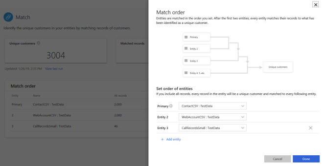
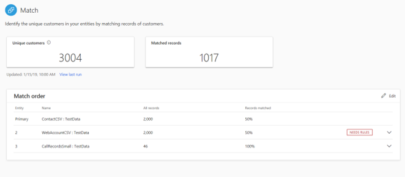
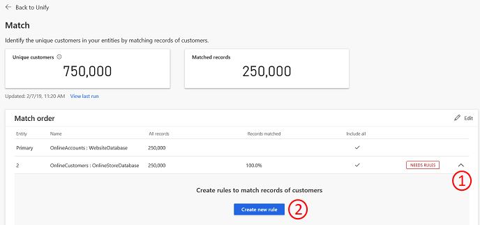
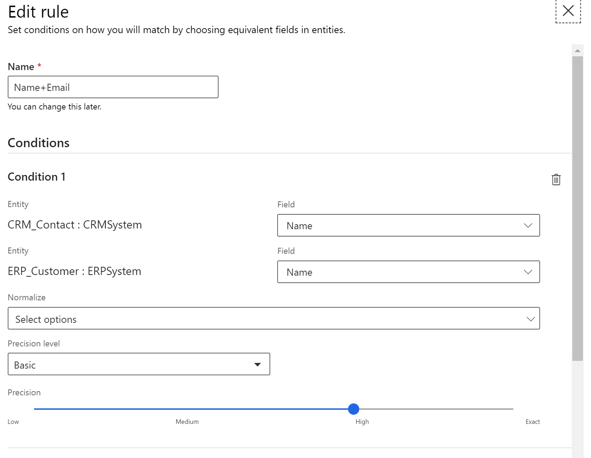
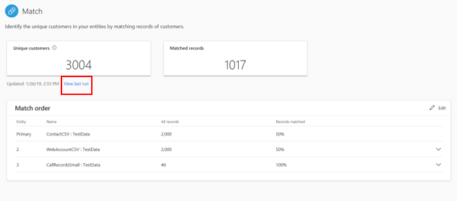
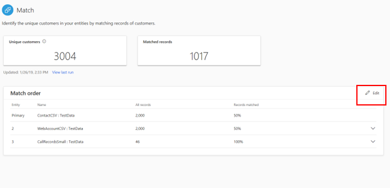

# Match

[!INCLUDE [cc-beta-prerelease-disclaimer](../includes/cc-beta-prerelease-disclaimer.md)]

Once the Map phase is completed, you're ready to match your entities. Select the **Match** tile in the **Unify** page to get to the **Match** page.

- Note that the Match phase requires at least two mapped entities. If you have not mapped at least two entities, you can expect to receive a message that requires you to go back to the **Map** page and map at least two entities.

- If you did map at least two entities, you can expect to reach the following page, where you should select **Set Order** once you are ready to start the Match phase.

<!--note from editor: re: bullet item above--I don't see "Set Order" in the screen shot   -->

  > [!div class="mx-imgBorder"] 
  > 

## The Match phase

The Match phase enables you to specify how to combine your datasets into a unified **Customer Profile** dataset, which will be used later to unlock unique insights about your customers.

If it's the first time you are going through the match process, you should complete these mandatory steps:

1. Specify the order by which your mapped entities will be matched.
2. Define rules for the first match pair.
3. Run your specified matches.

In addition, you might want to complete the following steps:

4. (Optional) Review and validate your matches.
5. (Optional) Make changes to your **Match order** and **Rules** definitions.
  
In the following sections, we will explore these steps in sequential order. 

## Step One: Specify the match order

Each match involves two entities that are unified into a single entity, while maintaining unique customer's records. In the following example, the user has selected three entities: **ContactCSV: TestData** as the **Primary** entity, **WebAccountCSV: TestData** as **Entity 2**, and **CallRecordSmall: TestData** as **Entity 3**. The diagram above these selections helps explain how the match order will be executed: 

- **First match**: First, the **Primary** entity will be matched with **Entity 2**.
- **Second match**: Then, the dataset that results from the first match will be matched with **Entity 3**.
- And so forth (in our example, we made selections only for two matches, but the system supports more than two).

  > [!div class="mx-imgBorder"] 
  > 
  
> [!IMPORTANT]
> The entity that you will choose as your **Primary** entity will serve as the basis for your unified master data set. In other words, any future entities that are selected during the Match phase will be added to this entity. At the same time, this doesn't mean that the unified entity will include **all** of the data included in this entity.
>There are two considerations that can help you select your **Primary** entity:
> - What entity do you consider having the most complete and reliable data about your customers?
> - Does the entity that you just identified have attributes that are also shared by other entities (for example, name, phone number, or email address)? If not, choose your second most reliable entity.

> [!NOTE]
> Considerations for your first selection can help you choose your **Entity 2** as well. Among your ingested (and mapped) entities, what entity do you consider to have the second most reliable and complete data? Moreover, does it include at least one field that is shared by the **Primary** entity and possibly additional fields that are shared by other ingested entities?

You can always remove entities from your match order. Select **Save** to save your match order as outlined here in red.

> [!div class="mx-imgBorder"] 
> 

## Step Two: Define rules for your first match pair

Once you've completed Step One, you can expect to reach the **Match** page that is shown in the following example and which includes your defined matches (in the following example, the user specified two matches). Note that the tiles at the top of the screen will be empty until we run our match order in Step Three. These will be used for validation as explained in Step Four.

> [!div class="mx-imgBorder"] 
> 

The warning sign (outlined in red in the preceding example) implies that we didn't define **at least one match rule** for our match pair, which is mandatory for each of our match pairs. Match rules dictate the logic by which a specific pair of entities will be matched. In order to define your first rule, open the **Rule Definition** panel by selecting the corresponding match row in the matches table (#1) and then selecting **create new rule** (#2).

> [!div class="mx-imgBorder"] 
> 

That will open the following rule panel.

> [!div class="mx-imgBorder"] 
> 

The new rule panel enables you to specify all the conditions for that role. Each condition is represented by two rows that include the following mandatory selections.

1. An attribute that will be used for matching from the first match pair entity: Name, Phone, Email Address, etc. Choose an attribute that is likely unique to the customer, and similar information can be found in other entities.

>[!IMPORTANT]
> You should avoid matching on the basis of activity-type attributes. In other words, if an attribute seems to be an activity, then it might be a poor criteria to match by.  

2. An attribute that will be used for matching from the second match pair entity.

3. **Normalization method**: Various normalization options are available for the attributes chosen in fields (1) and (2) from removing punctuation, to removing spaces, to many others. 

4. The level of precision that will be used for that condition:

   - Selecting **Exact** on the left-side of the scale to have only matching records matched. 

   - Selecting one of the other levels will dictate that records that are not 100% identical will also be matched. **High** fits cases where precision is more important than reach, such as a financial service to a specific customer. **Low** fits cases where the opposite is true, such as a marketing campaign. The **Medium** level serves as a middle-ground option. 

### Add multiple conditions

If you want to match your entities only if multiple conditions are met, you can do so by adding more conditions that will be linked through an **AND** operator. Simply select **Add Condition** as shown below in blue. You can also remove conditions by selecting the button that is highlighted in red.

// 3 <!-- in the text and in the image that will replace the one below, replace the blue color with "1" and the red color with "2"-->

> [!div class="mx-imgBorder"] 
> 

For the purpose of this section we will limit our match rule to only one condition.

### Add multiple rules

If each condition applies to a single pair of attributes, then rules represent sets of one or more conditions. If you believe that your entities can be matched on the basis of different sets of attributes, you should add more rules using **Add Rules**. Note that when creating rules order matters. The matching algorithm will try to match on the basis of your first rule (represented by the first row in the table shown in red in the following example) and continue to the second rule (represented by the second row) only if no matches were identified under the first rule.

// 3 <!-- no markings are needed, just image replacement-->

> [!div class="mx-imgBorder"] 
> 

For the purpose of this section we will stay with only one rule.

## Step Three: Run your specified match order

Now you are ready to run the match order that you have defined in Steps One and Two. This can be done by selecting **Save** and then **Run** as shown in the following example. Next to these buttons there is a **Discard** button that enables you to delete the definitions of your match (shown in red).

// 4 <!-- In the text above and the image that will replace the one below, mark "Save" with "1", "Run" with "2" and "Discard" with "3"-->

> [!div class="mx-imgBorder"] 
> 

It's possible that the matching algorithm will take some time to complete. While running, you can expect to see the following status diagram.

> [!div class="mx-imgBorder"] 
> 

While it's not possible to use any of the **Match** page functionalities until the match process completes, it's possible to visit other product modules through the left navigation menu. For example, you may want to use this time to define relationships through the **Relationships** page or activities via the **Activities** page. Visit those sections to learn more.

Also note that above the diagram there is a **Matching records** notification as long as the match algorithm is running. Upon the completion of the process, the match screen will become available again, and the **Matching records** message will disappear. 

> [!div class="mx-imgBorder"] 
> 

As mentioned in Step One, the first match results in the creation of a unified master entity while all subsequent matches result in the expansion of that entity. Upon completion of the matching process, a preview of the unified customer entity can be viewed by selecting the following button.

> [!div class="mx-imgBorder"] 
> 

**Customer Profile Preview** opens. 

// 5 <!-- in the image to come below and the text beneath it, replace blue color with 1, and red color with 2. Plus, we need to blur the data in the pop-up window that appears at the center of the image-->

> [!div class="mx-imgBorder"] 
> 

Note that:

- The column shown in preceding example in blue reflects for each of your records how certain it is that it was accurately matched (confidence score).
- The rest of the columns present the data that was taken from the two original entities. Columns to the left of the highlighted column present data that was taken from the first match pair entity, while columns to the right present data taken from the second match pair entity. 
- You can also view the customer profile entity in the **Entities** page.
- As shown in red, you can also download the customer profile dataset. 

At this point, you can either continue to the **Merge** page or go through any of the optional steps in this section (Steps Four and Five). However, we recommend you review some of the match preview results to validate that records were matched according to your expectations.

## Step Four (optional): Review and validate your matches

Here you will learn how to evaluate in depth the quality of your match pairs and improve it. There are a few things you can do.

First, you can gain first insights by reviewing the tiles at the top of the page (shown in red in the following example):

// 6 <!-- in the image to come below, replace red with 1 and blue with 2-->

> [!div class="mx-imgBorder"] 
> 

- The left tile shows the number of unique profiles that the system identified.
- The right tile shows the number of matches, in total, that were completed across all of your match pairs. This tile will provide you more context into the first number—is it a relatively good or poor result?

Second, you can assess the results of each match pair as shown in blue in the preceding example—by viewing the number of records that came from this match-pair entity side-by-side with the percentage of successfully matched records.

// 7 <!-- in the image to come below, replace red with 1 and blue with 2-->

> [!div class="mx-imgBorder"] 
> 

Third, you can view the percentage of successfully matched records at the rule level (shown in red in the preceding example). By selecting the button that is shown in blue, you can view all these records (again, on the rule level). The following window exemplifies the preview you can expect to see.

> [!div class="mx-imgBorder"] 
> 

We recommend that you review at least a part of it in order to validate that records were matched according to your expectations.

Fourth, you can experiment with different thresholds around your conditions in order to identify the optimal thresholds. In order to perform these experiments, follow the next few steps.

1. Select (...) for the match pair rule that you want to experiment with (an example is shown in red in the following example). Then select **Edit**, also shown in red.

// 8 <!-- replace blue with 1 and red with 2-->

  > [!div class="mx-imgBorder"] 
  > 

2. Identify the condition that you want to experiment with. Each criterion is represented by one row in the **Match rule** panel.

3. At this point the page that you see depends on the match level you have selected for that condition. 

   If you chose **Exact** for that condition, you will see the following page.

   > [!div class="mx-imgBorder"] 
   > 

   Here you can view the number of matched and unmatched records for that condition (shown in red in the following example. You can also view the records in the table section (shown in blue).
       
   If you chose one of the other levels for that condition, you will see the following page.

// 9 <!-- replace red with 1, blue with 2 and green with 3. Also we need to blur the data in the pop up window that shows at the cnter of the image-->

  > [!div class="mx-imgBorder"] 
  > 
     
This page gives you a rich understanding of the effects of the three threshold levels. You can compare how many records will be matched under each of the threshold levels (shown in red in the following example), as well as viewing the records under each option. Select each of the tiles (shown in blue) and view the table section (shown in green). 
       
## Step Five (optional): Make changes to optimize your matches

If you followed Step Four, then at this point you should have a better understanding of the quality of your first match. At this point, you can translate that understanding into better match quality by reconfiguring some of your match parameters.

- **Changing the Match Order**: This can be done by selecting **Edit**, shown in the following example, and editing the match order fields.

> [!div class="mx-imgBorder"] 
> 

- **Changing the order of your rules**: If you defined multiple rules, it might be worth changing their order so you can yield a better match quality. That can be done by substituting the two rules' attributes. At this point, you need to delete (button is shown below in red) and re-create (button is shown below in blue) the two rules with the new attributes:

- **Editing your rules**: This includes several important changes that you should try as you optimize the match quality. All the following options are accessible via the rule's **Edit** button:

    - **Changing attributes for a condition**: This can be done by reselecting new attributes within the specific condition row.
    - **Changing threshold for a condition**: This can be quickly achieved via the threshold bar. In Step Four, we covered how to get insight into the effects of the three threshold levels on your match quality.
    - **Changing normalization method for a condition**: This can be done by reselecting the normalization method.
    
## Next Step

Once you've completed the match process for at least one match pair, you are ready to resolve possible contradictions in your data by going through the **Merge** section.

