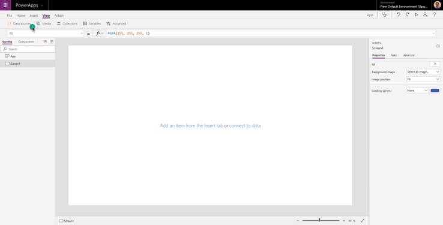
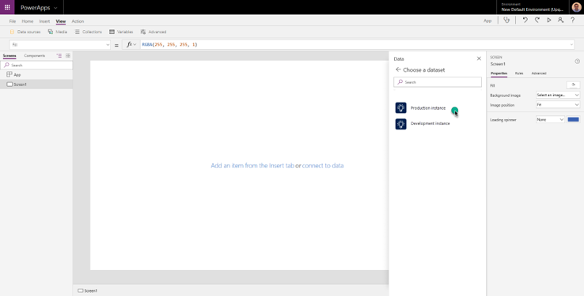
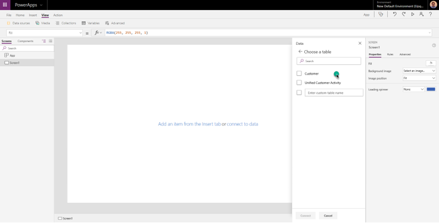
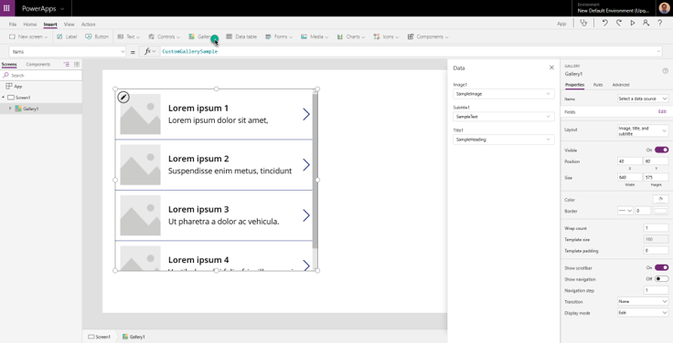
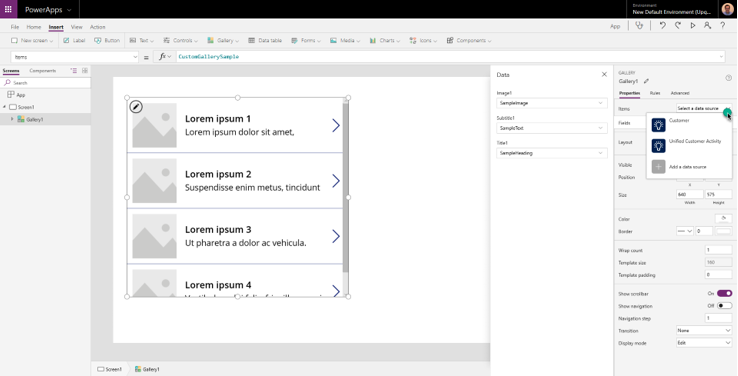
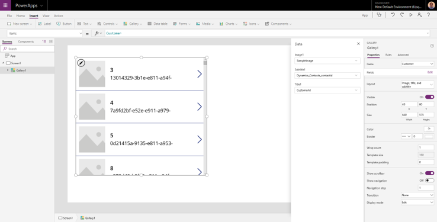

# PowerApps connector

Follow these steps to connect your PowerApps app to Customer Insights:

1. Go to [https://powerapps.microsoft.com/](https://powerapps.microsoft.com/).

2. Select **New** and then create a **Blank app**. Choose phone or tablet layout. Tablet layout gives you more workspace.
   
   > [!div class="mx-imgBorder"] 
   > 

3. Add the Customer Insights connector by going to **View** > **Data Sources**.

   > [!div class="mx-imgBorder"] 
   > 

4. Select **Add data source**.

   > [!div class="mx-imgBorder"] 
   > 

5. Select **New connection**.

   > [!div class="mx-imgBorder"] 
   > 

6. Search for "Dynamics 365 Customer Insights" and select the **Dynamics 365 Customer Insights (Preview)** connector.

   > [!div class="mx-imgBorder"] 
   > ")

7. Create the connection and sign in with the account you use for Customer Insights.

   > [!div class="mx-imgBorder"] 
   > 

8. Select the Customer Insights instance you want to fetch data from.

   > [!div class="mx-imgBorder"] 
   > 

9. Choose one or both of the following entities:

   - Customer: to use data from the unified customer profile.
   - Unified Customer Activity: to display the unified timeline on the app.

   > [!div class="mx-imgBorder"] 
   > 

10. You are now ready to start building an app with Customer Insights data. For example, let's add a gallery element to list the customers we have ingested on Customer Insights.

    > [!div class="mx-imgBorder"] 
    > 

11. Select **Customer** as the data source for items.

    > [!div class="mx-imgBorder"] 
    > 

    > [!div class="mx-imgBorder"] 
    > 

12.	You can change the data panel on the right to select which field for the Customer entity to show on the gallery.

    <!--Please confirm that the names in this and the next two screenshots are from an approved fictitious names list. -->

    > [!div class="mx-imgBorder"] 
    > 

13.	If you want to show any field from the selected customer on the gallery, fill in the Text property of a label:  **{Name_of_the_gallery}.Selected.{property_name}** 

    Example: Gallery1.Selected.address1_city
 
    > [!div class="mx-imgBorder"] 
    > 

14.	To display the unified timeline for a customer, add a Gallery element, and add the Items property: **Filter('Unified Customer Activity', CustomerId = {Customer_Id})** 

    Example: Filter('Unified Customer Activity', CustomerId = Gallery1.Selected.CustomerId)

    > [!div class="mx-imgBorder"] 
    > 
