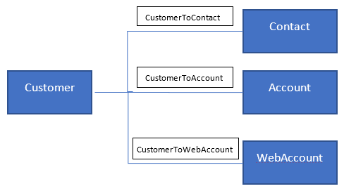

# Relationships

[!INCLUDE [cc-beta-prerelease-disclaimer](../includes/cc-beta-prerelease-disclaimer.md)]

## What are relationships useful for?

In Customer Insights you can define relationships between entities. As we will see within the **Segments** section, these relationships are useful for segmentation. In the future they will be used for additional analytical purposes within Customer Insights.

> [!div class="mx-imgBorder"] 
> 

There are two types of relationships:

- **System relationships:** These are created by the system automatically and cannot be edited.
- **Custom relationships:** These are created by the user during configuration and can be edited.

During the match and merge processes, system relationships are created behind the scenes based on intelligent matching. These relationships help relate the Customer Profile records with other corresponding entities' records. The diagram below exemplifies the creation of three system relationships when the customer entity is matched with additional entities to produce the final Customer Profile entity.

> [!div class="mx-imgBorder"] 
> 

- **CustomerToContact relationship** was created between the Customer entity and the Contact entity. The Customer entity gets the key field **Contact_contactId** to relate to the Contact entity key field **contactId**.
- **CustomerToAccount relationship** was created between the Customer entity and the Account entity. The Customer entity gets the key field **Account_accountId** to relate to the Account entity key field **accountId.**
- **CustomerToWebAccount relationship** was created between the Customer entity and the WebAccount entity. The Customer entity gets the key field **WebAccount_webaccountId** to relate to the WebAccount entity key field **webaccountId.**

## Use the Relationships page to add and edit entities

In addition, you can use the **Relationships** page to define custom relationships as shown below (accessible through the **Relationships** tab on the left-side menu).

> [!div class="mx-imgBorder"] 
> 

Each relationship has two key parts:

- **Source Entity:** This represents the many ends of the relationship. In relational schema terminology, this represents the entity that holds the foreign key.
- **Target Entity:** This represents the one end of the relationship. In relational schema terminology, this represents the entity that the source entity’s foreign key points to.

To create a relationship, first select **Add Relationship**.

> [!div class="mx-imgBorder"] 
> 

Then you need to provide the following information in the Relationship panel.

> [!div class="mx-imgBorder"] 
> 

- **Relationship Name:** The name that you, as a user, assign to that relationship. Each relationship name must be unique. This should provide a useful name to reflect the purpose of the relationship (for example, AccountWebLogs).
- **Description:** Optional information to describe the relationship.
    - **Source Entity:** The name of the entity that is used as a source in the relationship (for example, WebLog).
    - **Cardinality:** This represents the cardinality of the source entity records. For example, many means that multiple Weblog records are related to one WebAccount.
    - **Source lookup/link field:** This field represent the foreign key field in source entity. For example, WebLog has the **accountId** foreign key field.
    - **Target Entity:** The name of the entity that is used as a target in the relationship (for example, WebAccount).
    - **Target Cardinality:** This represents the cardinality of the target entity records. For example, one means that multiple Weblog records are related to one WebAccount.
    - **Target key field:** This field represent the key field of target entity. For example, WebAccount has the **accountId** key field.

**Note**: For now, only many-to-one and one-to-one type relationships are supported. Many-to-many type relationships can be created using two many-to-one relationships using a link entity - an entity that is used to connect the source entity and the target entity.

## Use the Relationships page to delete relationships

This can be done by:

1. Selecting the checkbox of the relationship/s you wish to delete.

   > [!div class="mx-imgBorder"] 
   > 

2. Select **Delete** at the top of the relationship table.

   > [!div class="mx-imgBorder"] 
   > 

## Next Step

System and custom relationships are used in the **Segment Editor** page to navigate from the entity on one end of the relationship to the entity on the other end of the relationship as you define conditions to filter customers. Visit the **Segments** section to learn more. Alternatively, you might want to define activities in your data. Visit the **Activities** section.

