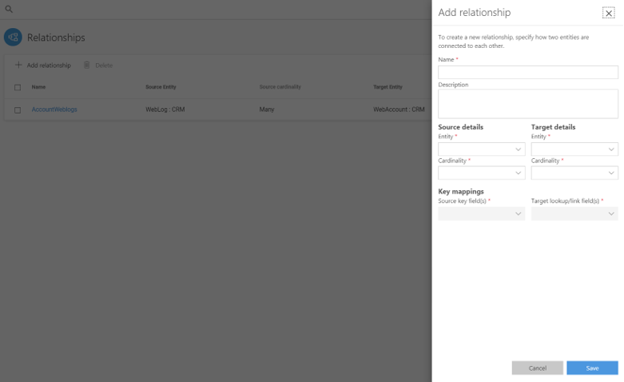

# Relationships

[!INCLUDE [cc-beta-prerelease-disclaimer](../includes/cc-beta-prerelease-disclaimer.md)]

In Customer 360 you can define relationships between entities. Relationships help define the **Data Graph** based on entities ingested from different data sources (the notion of **Data Graph** will be explored later). It also relates the data graph to the **master customer entity** you have created through the Data Configuration process based on intelligent AI/ML algorithms. As we will see within the **Segments** section, these relationships-based data graphs are useful for segmentation and other analytical purposes. 

> [!div class="mx-imgBorder"] 
> 

There are two types of relationships:

- **System relationships:** These are created by the system automatically and cannot be edited.
- **Custom relationships:** These are created by the user during configuration and can be edited.

During the match and merge process, system relationships are created behind the scenes based on intelligent matching. These system relationships are created to relate master customer entity with match rule entities. One relationship is created per master customer entity and match rule entity combination. These relationships help relate the master customer record with corresponding match entity records. The diagram below exemplifies the creation of three system relationships when three match entities are merged to create the master customer entity.

> [!div class="mx-imgBorder"] 
> 

- **CustomerToContact relationship** was created between the **Customer entity and the Contact** entity and is based on the match executed between Customer entity and Contact entity. Customer entity gets the key field **Contact_contactId** to relate to the Contact entity key field **contactId**.
- **CustomerToAccount relationship** was created between the **Customer entity and the Account entity** and is based on the match executed between Customer entity and Account entity. Customer entity gets the key field **Account_accountId** to relate to Account entity key field **accountId.**
- **CustomerToWebAccount relationship** was created between the **Customer entity and the WebAccount entity** and is based on the match executed between Customer entity and WebAccount entity. Customer entity gets the key field **WebAccount_webaccountId** to relate to WebAccount entity key field **webaccountId.**

In addition, you can use the **Relationships** page to define custom relationships as shown below.

> [!div class="mx-imgBorder"] 
> 

This page provides actions to add, edit, or delete relationships. Each relationship has two key parts.

- **Source Entity:** This represents the **many ends** of the relationship. In relational schema terminology, this represents the entity that holds the foreign key.
- **Target Entity:** This represents the **one end** of the relationship. In relational schema terminology, this represents the entity that the source entity’s foreign key points to.

To create a relationship, you need to provide the following information.

> [!div class="mx-imgBorder"] 
> 

- **Relationship Name:** The name that you, as a user, assign to that relationship. Each relationship name must be unique. This should provide a useful name to reflect the purpose of the relationship (for example, AccountWebLogs).
- **Description:** Optional information to describe the relationship.
    - **Source Entity:** The name of the entity that is used as a source in the relationship (for example, WebLog).
    - **Cardinality:** This represents the cardinality of the source entity records. For example, many means that multiple Weblog records are related to one WebAccount.
    - **Source lookup/link field:** This field represent the foreign key field in source entity. For example, WebLog has the accountId foreign key field.
    - **Target Entity:** The name of the entity that is used as a target in the relationship (for example, WebAccount).
    - **Target Cardinality:** This represents the cardinality of the target entity records. For example, one means that multiple Weblog records are related to one WebAccount.
    - **Target key field:** This field represent the key field of target entity. For example, WebAccount has the accountId key field.
For now, only many-to-one and one-to-one type relationships are supported. Many-to-many type relationships can be created using two many-to-one relationships using a link entity.

System and custom relationships are used in **Segment Editor Page** to navigate from the entity on one end of the relationship to the entity on the other end of the relationship as you define conditions to filter customers. Filtering is based on the data graph ingested entities from data sources. For more information on segmenting customers and how relationships play an important rule there, visit the **Segments** section.

> [!div class="mx-imgBorder"] 
> 
