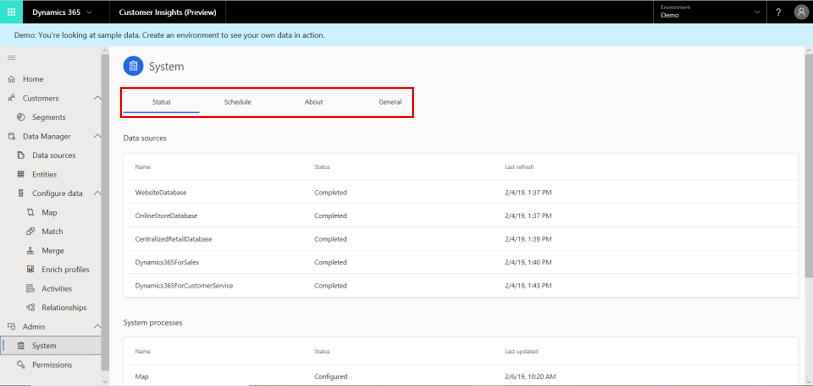
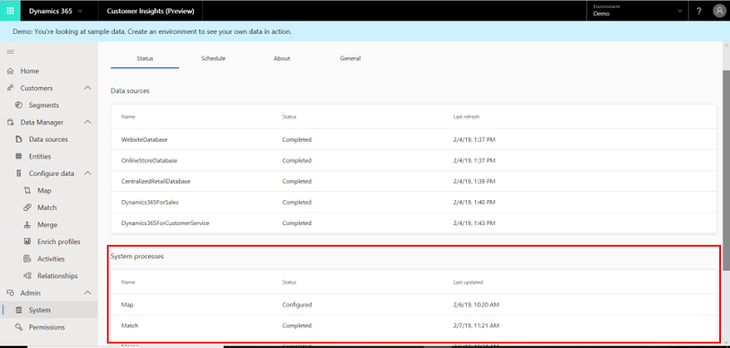

# System

[!INCLUDE [cc-beta-prerelease-disclaimer](../includes/cc-beta-prerelease-disclaimer.md)]

The **System** page encapsulates everything that you need as an administrator to closely monitor the various processes that run behind the scenes of Customer Insights. As shown here, it includes four parts: **Status**, **Schedule**, **About**, and **General**.

> [!div class="mx-imgBorder"] 
> 

> [!NOTE]
> If your data sources are updated on a regular basis, we highly recommend that you use the **Schedule** tab. Make sure to review "Schedule tab" later in this topic.

## Status tab

The **Status** tab enables you to track the progress of data ingestion as well as several important product processes. With that, you can ensure the completeness of any major process you define in Customer Insights. This tab includes two tables:

- **Data sources**: This table lists all the data sources from which you are ingesting your data. The left-side column specifies the names of those data sources. The middle column shows the status of ingestion for each of the data sources: 
  - Didn't start
  - In progress
  - Already completed
  
   The right-side column shows the last data refresh date for each of the data sources.

    > [!div class="mx-imgBorder"] 
    > 

- **System processes**: This table lists all the processes that should be executed in Customer Insights to create a unified customer profile. The left-side column specifies the names of those processes. The middle column shows the status of progress for each of the processes:
    - Didn't start 
    - In progress 
    - Already completed 
  
  The right-side column shows the last data refresh date for each of the processes.

    > [!div class="mx-imgBorder"] 
    > 

- In addition, you can view the details of each completed data source ingestion or system process by selecting that data source or system process row. In the following example, the user has selected the **Dynamics** data source that has ingestion status **Completed** (#1). Additional details on that data source are also displayed (#2).

  > [!div class="mx-imgBorder"] 
  > 

## Schedule tab

Use the **Schedule** tab to refresh all of your ingested Customer Insights data and to schedule the frequency and timing of the refreshes. As data is constantly updated in some or all of your data sources, it's important to ensure that those updates appear in your unified customer profile. The **Schedule** tab enables you to achieve that automatically.

> [!div class="mx-imgBorder"] 
> 

In Customer Insights, the default state for data refresh is **Off**, reflecting no scheduled refreshes (as shown in the preceding example). To allow scheduled refreshes, change the toggle at the top of the screen to **On**, as shown in the following example.

> [!div class="mx-imgBorder"] 
> 

The next step is to decide between **Weekly** (default) and **Daily** refreshes.

> [!div class="mx-imgBorder"] 
> 

**To schedule a daily refresh:**

1. Select the **Time** field.

   > [!div class="mx-imgBorder"] 
   > 

2. In the timer shown in the preceding example, use the four arrows to set your refresh timing. When you are finished, select **Set**. You can also close the timer without saving your selections by selecting **Close**.

3. Set multiple daily refreshes by selecting **Add another time**.

   > [!div class="mx-imgBorder"] 
   > 

4. To discard any of your saved timings, select the boxes shown here.

   > [!div class="mx-imgBorder"] 
   > 

**To schedule a weekly refresh:**

1. Check the boxes for the days on which you want to execute a refresh.
  
    > [!div class="mx-imgBorder"] 
    > 

2. Follow the steps for scheduling a daily refresh to complete the weekly refresh setting.

3. **Save** your changes.

    > [!div class="mx-imgBorder"] 
    > 

## About tab

> [!div class="mx-imgBorder"] 
> 

Several options are available on this page, as shown in the following example. These options can serve important business requirements, such as using Customer Insights from different regions or distinguishing between multiple work instances.

> [!div class="mx-imgBorder"] 
> 

- **Display name**: Determine how your user name will be shown.
- **Instance name**: Give your work instances identifiable names. This is recommended if you have more than one instance.
- **Region**: Determine your organization's region.

## General tab

Currently, only one option, **Language**, is available to you on the **General** tab. The languages we support show up in this menu. Don't forget to **Save** your selection. 

> [!div class="mx-imgBorder"] 
> 
