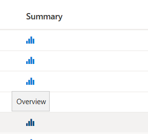
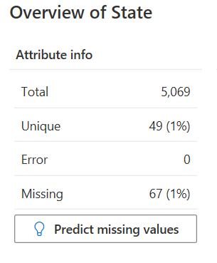
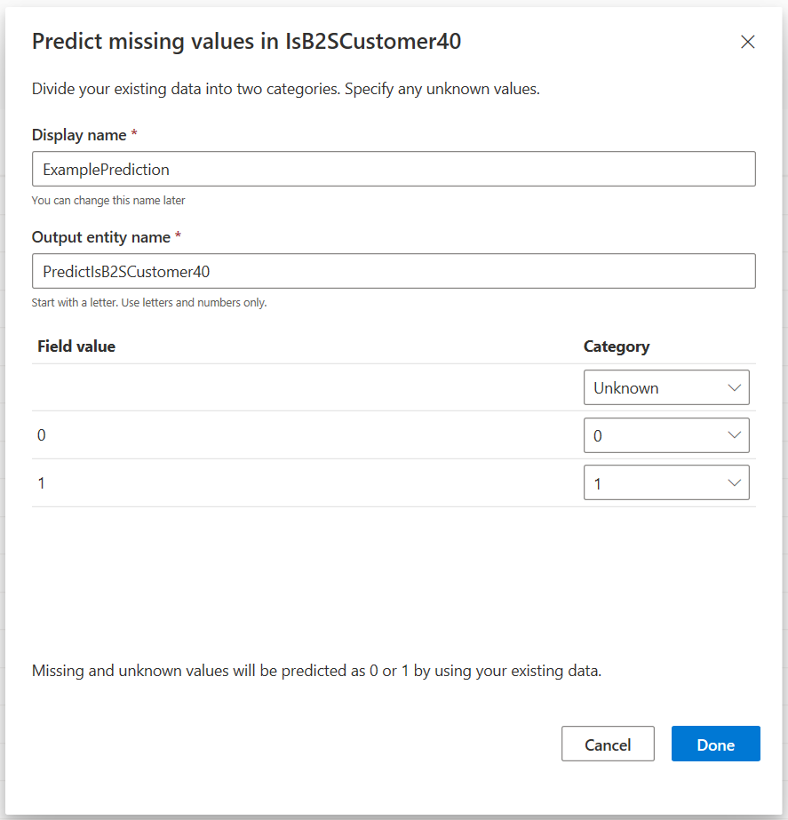

# Predictions

Predictions lets you easily create predicted values that can enhance your understanding of a customer. ON the Predictions page, you can see predictions that you’ve configured in other parts of Customer Insights, and enables you to further customize them.

[!NOTE]
This feature requires a Common Data Service environment to work properly.

You can't use this feature if your environment uses Azure Data Lake Gen 2 storage.

<!--is this vetted with CELA-->
The predictions feature uses automated means to evaluate data and make predictions based on that data, and therefore has the capability to be used as a method of profiling, as that term is defined by the General Data Protection Regulation (“GDPR”). Customer’s use of this feature to process data may be subject to GDPR or other laws or regulations. You are responsible for ensuring that your use of Customer Insights, including predictions, complies with all applicable laws and regulations, including laws related to privacy, personal data, biometric data, data protection, and confidentiality of communications.

There currently are two methods to create a prediction.

## Create a prediction in the Customer Entity

1. In Customer Insights, go to **Data** > **Entities**.

2. Select the **Customer** entity.

3. In the **Customer: CustomerInsights** entity, select on the **Fields** tab.

4. Find the attribute name you wish to predict values for, then select the **Overview** icon in the **Summary** column.
   > [!div class="mx-imgBorder"]
   > 

5. If there’s a high rate of missing values for your attribute, select **Predict missing values** to continue with your prediction.
   > [!div class="mx-imgBorder"]
   > 

6. Provide a **Display name** and and an **Output entity name** for the results of the prediction. 

7. A pre-populated list of options will show where you can map the values to a predicted category. In this case, your only category options will be 0 or 1 as they map to the true/false or binary nature of the prediction. Map the field values you would like to be classified as “0” in the final prediction to “0” in the Category column, and the items you would like to be classified as “1” in the final prediction to the “1”.
   > [!div class="mx-imgBorder"]
   > 

8. Select **Done** and the prediction will be processed. The processing will take some time, depending on the size and complexity of data. After completion, results will be available in a new entity based on the **Output entity name** of the prediction you created.

## Create a prediction while creating a Quick Segment

Predicting missing values for a specific attribute of choice can also be done at the context of creating a segment. Specifically, as part of the Quick Segment creation flow which enables you to quickly create a segment based on either your unified Customer entity or Customer_Measure entity.

As part of this flow you choose a specific attribute to base your segment on such as Customer Satisfaction, Purchase Amount, or any attribute of preference. The system will suggest you to use a prediction for predicting missing values for this attribute once you choose to create the segment.

1. To create a Quick Segment:
	1. Navigate to the "Segments" menu item, then click on "Profiles"
	   > [!div class="mx-imgBorder"] 
       > 
	2. Choose a Field to create a segment on.
	   > [!div class="mx-imgBorder"] 
       > 
	[!NOTE] On the right side, you will be able to see sample values within your Field.
	3. Choose an operator, input a value, then click "Review"
	   > [!div class="mx-imgBorder"] 
       > 
	4. Create a name for the segment.  If you need spaces in your name, update the Display Name field with your desired name.
	   > [!div class="mx-imgBorder"] 
       > 
	5. Click Save.
2. To complete your prediction:
	1. If the Quick Segment you just created has incomplete data in the source Field, a dialogue will be shown asking if you would like to predict the missing values.
	   > [!div class="mx-imgBorder"] 
       > 
	2. Create a name for the prediction.  If you need spaces in your name, update the Display Name field with your desired name.
	   > [!div class="mx-imgBorder"] 
       > 
	3. Click Done.
	4.  Your prediction will be generated after some time and will be available in a new entity with the name you created in step 2.

## View a prediction

1. Navigate to the **Predictions** page in the **Intelligence** navigation menu item.
   > [!div class="mx-imgBorder"] 
   > 
2. Click on the prediction you would like to edit, then click on the View or magnifying glass icon.
   > [!div class="mx-imgBorder"] 
   > 
3. You'll see a number of data points in the view of your prediction.
   > [!div class="mx-imgBorder"] 
   > 
   1. The title of your prediction will be at the top of your page
   2. On the left side of your page, the mapping you created during the Field Value to Category mapping phase will be presented.  This will show you what values in your data set have been mapped to a specific category.
   3. In the middle right of the page, the top influencers will be shown.  These are the factors within your dataset that were most likely to influence the prediction's confidence of your Field Value being mapped to a specific category.
   4. In the top right of the page, you'll see the Performance.  The link titled "How should I interpret this score?" will give you more information on the meaning of this.
   5. In the bottom right of the page, you'll see the Preview tab, which will present you with samples of the output dataset from your prediction and the likelihood, or our confidence, of the predicted value where 0 is uncertain, and 1 is certain.

## Update a prediction

1. Navigate to the **Predictions** page in the **Intelligence** navigation menu item.
   > [!div class="mx-imgBorder"] 
   > 
2. Click the prediction you would like to update, then click on the update button
   > [!div class="mx-imgBorder"] 
   > 
3. The prediction will be scheduled for processing.  You can see the last updated time in the "Updated" column of the Predictions page.

## Edit a prediction

After you have created a Prediction, you can customize the model within AI Builder to increase the effectiveness of your model.  

1. Navigate to the **Predictions** page in the **Intelligence** navigation menu item.
   > [!div class="mx-imgBorder"] 
   > 
2. Click on the prediction you would like to edit, then click on the View or magnifying glass icon.
   > [!div class="mx-imgBorder"] 
   > 
3. Click on the Customize In AI Builder button
   > [!div class="mx-imgBorder"] 
   > 
4. Follow the AI Builder instructions here: https://docs.microsoft.com/en-us/ai-builder/manage-model#retrain-and-republish-existing-models

The next run of your Prediction will use the updated model you've created.

[!NOTE] New models created in AI Builder will not be displayed in Customer Insights unless the model was created from within Customer Insights experiences listed above.

## Remove a prediction

1. In Customer Insights, go to **Intelligence** > **Predictions**.

2. Select the prediction you want to delete.

3. Select the ellipsis in the **Actions** column and choose **Delete**.

4. Confirm the deletion.
