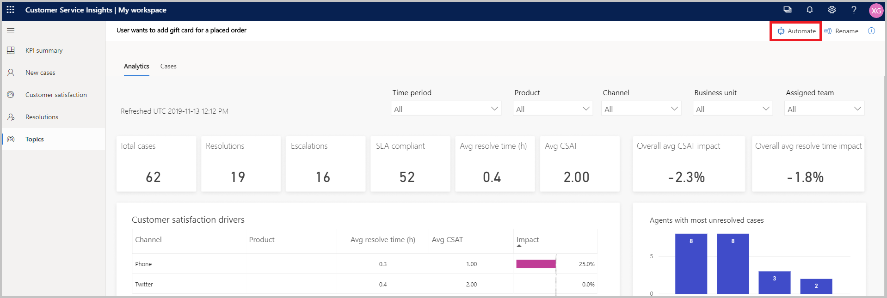

# Automate topics to Power Virtual Agents

Power Virtual Agents empowers teams to easily create powerful bots and automate support conversations using a guided, no-code graphical interface without the need for data scientists or developers. Using Power Virtual Agents, you can:

* Empower your teams by allowing them to easily build bots themselves without needing intermediaries, or coding or AI expertise.
* Reduce costs by easily automating common support inquiries and freeing human agent time to deal with more complex issues.
* Improve customer satisfaction by allowing customers to self-help and resolve issues quickly 24/7 using rich personalized bot conversations.

For topics discovered by Customer Service Insights, you can identify automation candidates by reviewing the topic details analytics, selecting a topic to automate and then editing the topic in Power Virtual Agents. For more information about Power Virtual Agents, see [Power Virtual Agents overview](https://docs.microsoft.com/power-virtual-agents/overview). 

## Prerequisite to automate topics

It requires the following prerequisites to automate a topic from Customer Service Insights to Power Virtual Agents:

* A valid license to access Power Virtual Agents. Go to https://aka.ms/TryPVA to sign up for a trial if you haven't sign up. 
* A bot created in Power Virtual Agents. See [Quickstart: Create and deploy a customer service bot](https://docs.microsoft.com/power-virtual-agents/quickstart) to create your first bot. 

## Identify topics for automation 

You can consider topics as good candidates for automation, if they are:

* Straightforward to resolve, so that a bot is more likely capable to handle it. You can tell that if a topic has lower average resolution time, higher resolution rate, and/or fewer escalations;
* Topics appear or will appear with higher volume, so that the automation can bring you more business benefit and impact. You can tell that from [case volume drivers](dashboard-kpi-summary.md#case-volume-drivers-chart) and [emerging topics](dashboard-kpi-summary.md#emerging-topics-chart) in Customer Service Insights.

Customer Service Insights also calculates resolution time impact for each topic, which has already taken into account both average resolution time and case volume. See [Resolution time drivers chart](dashboard-case-resolutions.md#resolution-time-drivers-chart) for more details how resolution time impact is calculated. 

To view topic details analytics, see [Topic details analytics dashboard](dashboard-topic-details.md) for more information. 

## Automate topics from topic details page
After reviewing topic details and identify a candiate for automation, you can automate the topic right away from the topic details page:

1. In topic details page, select **Automate** on the top. 

    

2. Customer Service Insights creates a new topic in Power Virtual Agents in a new browser tab. **Name** and **Trigger phrases** are prefilled from the topic you selected for automation. Customer Service Insights prefills **Trigger phrases** with non-duplicated case titles from the most relevant cases (up to 3 cases). 

3. Review the topic name and trigger phrases, and follow the other steps in [Create custom topics for your bot](https://docs.microsoft.com/power-virtual-agents/getting-started-create-topics) to complete the creation of your bot topic. 

## Automate topics from Topics page
You can also automate topics from Topics page. To do that, go to Topics page, hover over the topic you want to automate in the topic list, rhwn select **Automate** icon. 

