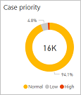
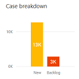
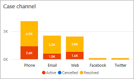
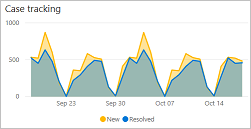
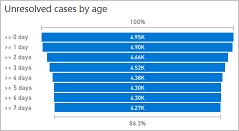
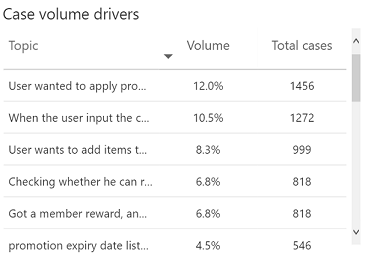
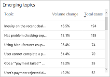

# KPI summary dashboard

> [!div class="mx-imgBorder"]
> 

The KPI (key performance indicator) summary dashboard gives you a broad overview of the customer service experience at your organization, including using artificial intelligence (AI) technology to show you topics that are having the greatest impact on case volume and resolution time.

The KPI summary dashboard includes a variety of charts with graphical views of your system's key performance indicators. For information about each chart, click the link for the chart in the following list, or scroll down to the chart's section below.

* [KPI summary charts](#kpi-summary-charts)
* [Case breakdown](#case-breakdown-chart)
* [Case priority](#case-priority-chart)
* [Case channel](#case-channel-chart)
* [Case tracking](#case-tracking-chart)
* [Unresolved cases by age](#unresolved-cases-by-age-chart)
* [Case volume drivers (AI Insights)](#case-volume-drivers-chart)
* [Emerging topics (AI Insights)](#emerging-topics-chart)

The *Case volume drivers* and *Top resolve time impactors* charts use natural language understanding artificial intelligence technology to group support cases as *topics* that are a collection of related cases. These charts show you the customer support topics that are generating the most volume and the topics that are having the most impact on case resolution time, helping you identify areas for improvement that can have the greatest impact on system performance.

By default, the dashboard shows you key performance indicators for the past month, and for all products, channels, business units, and teams in your system. To change the time period, select a value from the Time Period drop-down list at the top of the dashboard. You can select either past day, past week, or past month.

To filter data by product, channel, business unit, or team, select a value from the Product, Channel, Business Unit, or Team drop-down list. For more information on working with filters, see [Work with AI for Customer Service Insights dashboards](use-dashboard-sample-data.md).

## KPI summary charts

> [!div class="mx-imgBorder"]
> 

The KPI summary charts summarize the key performance indicators for the specified time period, and the percent change over the period.

Description | Details
----------- | -------
Total cases | *New cases created within the specified time period plus rollover cases (including all rollover cases that are active, resolved or canceled within the specified time period)*
Resolutions | *All cases resolved within specified time period*
Escalations | *All cases escalated within specified time period*
SLA compliant | *Of the total cases, the cases that are SLA compliant (including rollover cases and new cases that are SLA compliant)*
Average resolution time | *The average resolution time of all cases resolved within specified time period*
Average CSAT | *The sum of CSAT scores divided by the count of resolved cases that have CSAT values*

A blue up and down indicator next to the value indicates the percent change in a positive direction. A red indicator indicates the percent change in a negative direction.

## Case priority chart

> [!div class="mx-imgBorder"]
> 

The case priority chart shows the percentage breakdown for the specified time period between high, normal, and low priority support cases.

Description | Details
----------- | -------
Case priority | *Case breakdown by case priority*

## Case breakdown chart

> [!div class="mx-imgBorder"]
> 

The case breakdown chart shows the breakdown in support cases for the specified time period between new cases and backlog cases that were carried over from earlier. Backlog cases are support cases that were unresolved at the beginning of the specified time period.

Description | Details
----------- | -------
Case breakdown | *Case breakdown by rollover cases (backlog) plus new cases for the specified time period*

## Case channel chart

> [!div class="mx-imgBorder"]
> 

The case channel chart shows the breakdown in support cases for the specified time period by support channel.

Description | Details
----------- | -------
Case channels | *Case breakdown by channel*

## Case tracking chart

> [!div class="mx-imgBorder"]
> 

The case tracking chart shows the trend in the number of new support cases for the specified time period as well as the trend in how many cases are being resolved.

Description | Details
----------- | -------
New | *The number of cases created each day for the specified time period*
Resolved | *The number of cases resolved each day for the specified time period*

## Unresolved cases by age chart

> [!div class="mx-imgBorder"]
> 

The unresolved cases by age chart shows the relative number of support cases for the specified time period by how many days ago they were created.

Description | Details
----------- | -------
Unresolved cases by age | *Total unresolved cases by days unresolved*

## Case volume drivers chart

> [!div class="mx-imgBorder"]
> 

The case volume drivers chart uses artificial intelligence technology to group related support cases as support topics, and then display topics in order of volume over the specified time period, showing both the percent of total volume and number of cases for each topic.

Description | Details
----------- | -------
Topic | *Artificial intelligence clustering of cases based on language understanding applied to case titles*
Volume | *The total cases associated with this topic divided by total cases*
Total cases | *The total cases associated with this topic*

To see additional information about each topic, right-click the topic name, hover over **Drillthrough**, and then select **Topic Drill Through** to display the Topic Details dashboard. For more information, see [Topic details dashboard](dashboard-topic-details.md).

## Emerging topics chart

> [!div class="mx-imgBorder"]
> 

The emerging topics chart displays support topics that have a high volume change in order of volume over the specified time period.

Description | Details
----------- | -------
Topic | *Artificial intelligence clustering of cases based on language understanding applied to case titles*
Volume change | *The percent change in volume over the specified time period*
Total cases | *The total cases associated with this topic*

To see additional information about each topic, right-click the topic name, hover over **Drillthrough**, and then select **Topic Drill Through** to display the Topic Details dashboard. For more information, see [Topic details dashboard](dashboard-topic-details.md).
