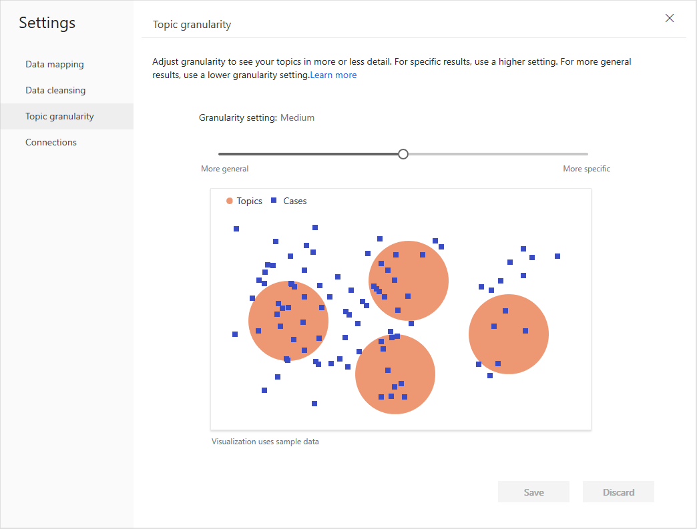
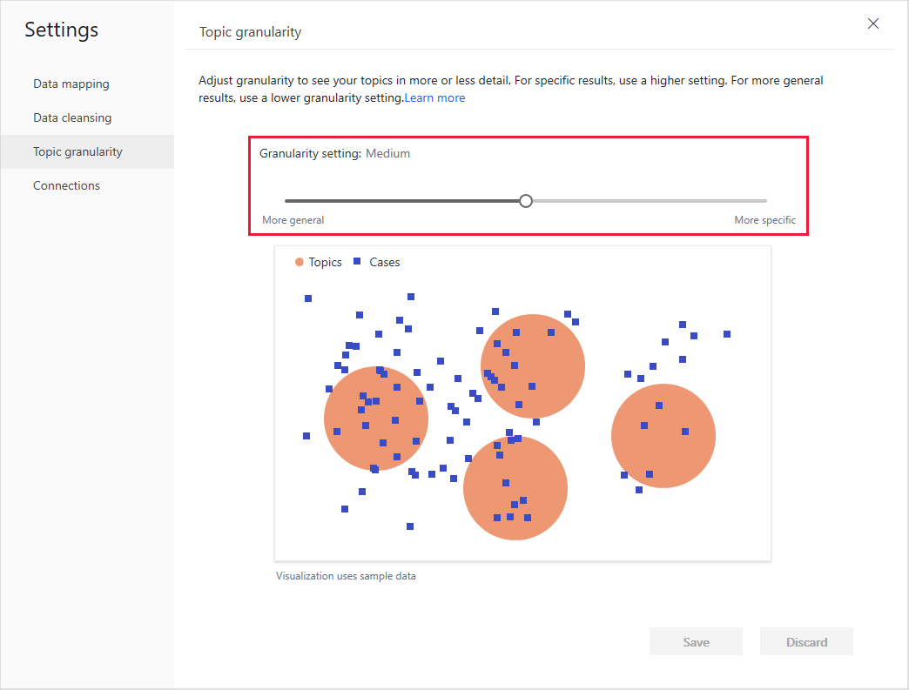
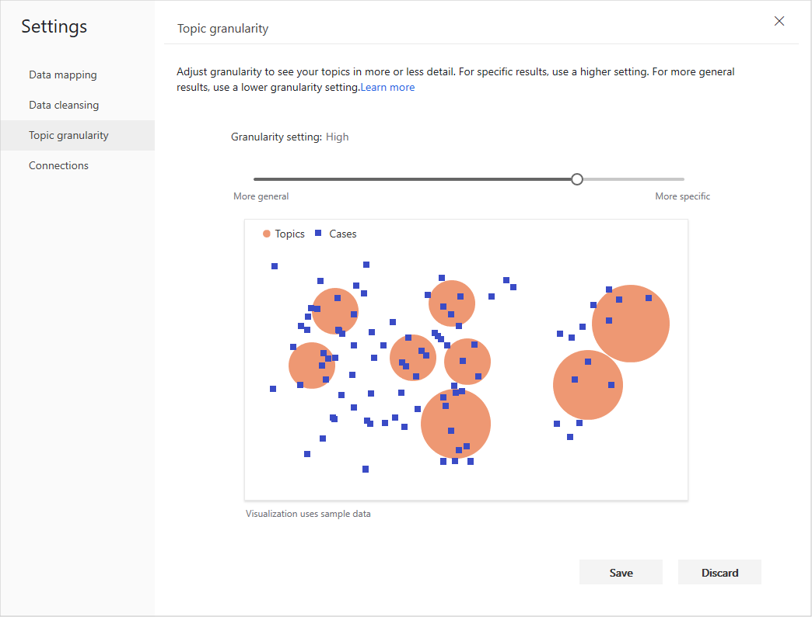
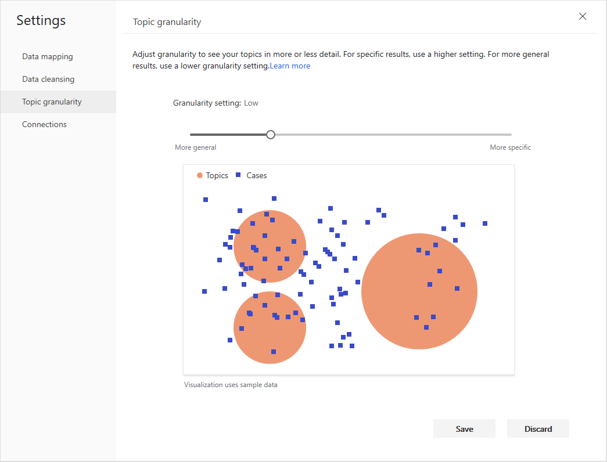

# Set the granularity of how Customer Service Insights generates customer service topics

The artificial intelligence technology that Customer Service Insights uses to group support cases as support topics is fine-tuned and configured to cover the most common support environments and cases. However, you may want to group topics for your customer service system in a more general way, or more specifically.

You can control the scope of how Customer Service Insights generates customer service topics by setting topic granularity.

## To set topic granularity

1. Select the **Settings** button on the Customer Service Insights title bar and then select **Topic granularity**.

   > 

   Customer Service Insights displays the Topic granularity page, which shows a graphical illustration of the current topic granularity.

   > 

2. Use the Granularity setting slide bar to adjust the topic granularity.

   > 

   Moving the slide bar to the right makes the granularity more specific.

   > 

   Moving the slide bar to the left makes the granularity more general.

   > 

   You can choose from five levels of granularity.

3. Select **Save** to save the granularity setting.

   > 

**Note:**  When you save a change to your granularity settings, any feedback you have given on the placement of support cases in topics is reset. For more information on providing feedback for the placement of support cases in topics, see [Providing feedback to fine-tune the way cases are grouped into topics](topics-page.md#providing-feedback-to-fine-tune-the-way-cases-are-grouped-into-topics).

The topic granularity impacts the scope of a topic. It doesn’t determine the total number of topics that are generated. Depending on the similarity between your case titles, you may see more or fewer topics when the granularity is more specific.