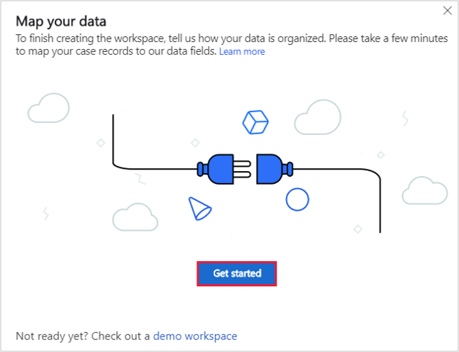
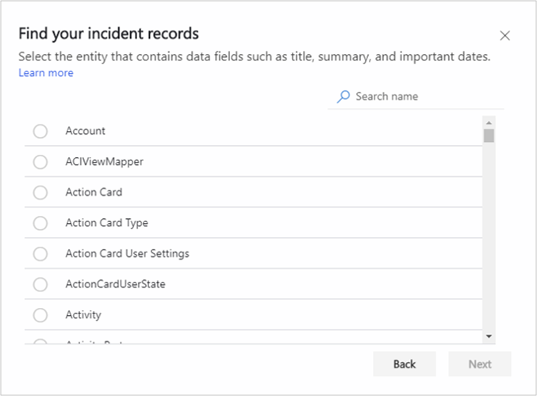
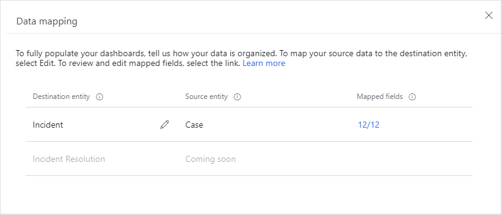
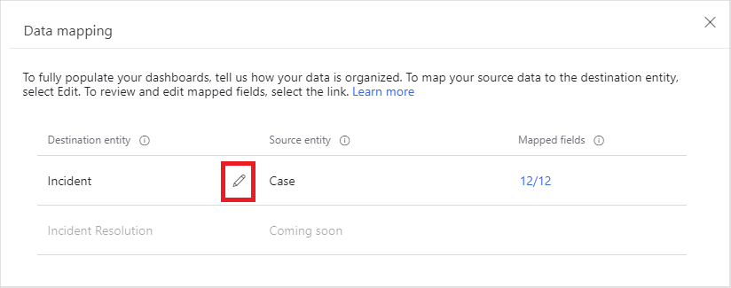
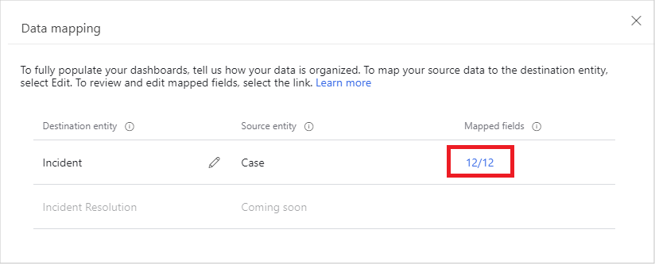

# Map your data to custom entities and fields

[!INCLUDE [public-preview](../includes/public-preview.md)]

Dynamics 365 Customer Service Insights works by default with data from the Dynamics 365 for Customer Service application. The built-in dashboards and interactive charts in Customer Service Insights use data stored in default Dynamics 365 entities and data fields, primarily in the Incident (case) entity and several other related entities in Common Data Service.

However, you may want to generate insights by mapping to data from custom entities and fields in Common Data Service for Apps. Mapping to data from custom entities and fields is useful in the following cases:

* You are not a Dynamics 365 for Customer Service customer.
* You are a Dynamics 365 for Customer Service customer, but your service solution is customized and you use custom entities and fields to store support case data.
* You want to use a custom field other than the support case title in your Dynamics 365 Customer Service Insights dashboards.

When you create a Customer Service Insights workspace and connect to a Dynamics 365 environment, Customer Service Insights prompts you to map your data:

* If the environment doesn't have an Incident entity.
* If the environment has an Incident entity but it doesn’t contain enough required data.

After a workspace is created, you can map to data from custom entities and fields by specifying Data mapping settings.

See [Dynamics 365 for Customer Service entities used by Customer Service Insights](customer-service-entities.md) for more information about common entities.

See [Use workspaces to connect to different customer service environments](use-workspaces.md) for more information on using a workspace to connect to an environment.

## To map data when you connect to a Dynamics 365 environment

1. Follow the steps in [Use workspaces to connect to different customer service environments](use-workspaces.md) to connect to a Dynamics 365 environment.

2. If the environment doesn't have an Incident entity, or if the environment has an Incident entity but it doesn’t contain enough required data, Customer Service Insights displays the **Map your data** screen. Select **Get started** to begin mapping your data.

   > 

3. On the **Find your incident records** page, select the entity or entities that contain the data fields you want to use for mapping, and then select **Next**.

   > 

4. On the **Map your incident records** page, select the data fields you want to use from the drop-down menu. Some fields have been mapped automatically. Then select **Done**.

   > 

## To map data by specifying data mapping settings

1. Select the **Settings** button on the Customer Service Insights title bar, and then select **Settings**.

   > 

   Customer Service Insights displays the **Settings** page.

2. Select **Data mapping** to display the Data mapping pane. Customer Service Insights displays the available destination entities.

   > 

3. To edit your mapping settings for an entity, hover over the entity in the list and then select the edit icon.

   > 

    Customer Service Insights displays the **Map your incident records** page, where you can update the data mapping for the entity.

4. You can view the status of the mapping in the **Mapped Fields** column.

   > 

Here are some things to keep in mind when you map your data to custom entities and fields:

* The drop-down list in the form only shows source fields in types that are compatible with the destination fields.

* Data mapping is not currently supported for lookup fields. These include the Owning User, Owning Business Unit, Owning Team, and Product fields in the Incident entity.

* Several data fields in the Incident entity are pick lists, including Priority, Support Channel, SLA Status, and Satisfaction. Pick list is an attribute type in Common Data Service for Apps that allows the selection of multiple options. Each option consists of a numeric value and a string label.

  For example, SLA Status indicates whether a case is compliant with the service level agreement (SLA). You can define multiple different values for compliant cases. Customer Service Insights only uses the value 4 to identify noncompliant cases. The pick list values defined for Satisfaction indicate the customer satisfaction score (CSAT). Customer Service Insights reads value from 1 to 5 to calculate the average CSAT.

* When you create a custom entity and field in PowerApps, a custom option value is auto-generated for each option label you add to a form. As a result, make sure a pick list's option values are aligned with data requirements. For example, the values of a CSAT field should reflect the actual CSAT score (1-5 in most of cases) and an SLA status field should use the value 4 to indicate that a case is not compliant.