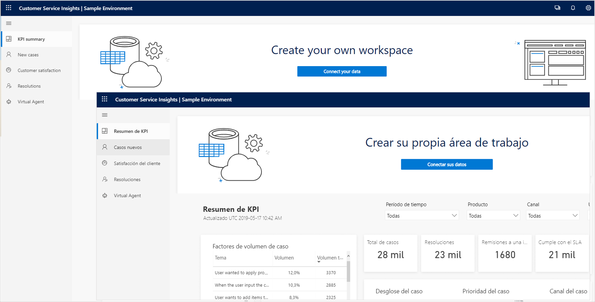

# Supported languages for Customer Service Insights 

The languages shown in the product is based on the language preferences on your computer and your browser settings. This article lists supported languages for Dynamics 365 Customer Service Insights and details on how to update the language preferences.  

## Languages for Customer Service Insights 

- Basque 
- Bulgarian
- Catalan
- Chinese (Simplified)
- Chinese (Traditional)
- Croatian
- Czech
- Danish
- Dutch
- English
- Estonian 
- Finnish
- French 
- Galician
- German
- Greek 
- Hebrew 
- Hindi
- Hungarian 
- Indonesian
- Italian
- Japanese
- Kazakh
- Korean
- Latvian
- Lithuanian
- Malay
- Norwegian (Bokmål)
- Polish
- Portuguese (Brazil)
- Portuguese (Portugal)
- Romanian
- Russian 
- Serbian (Cyrillic) 
- Serbian (Latin)
- Slovak
- Slovenian
- Spanish 
- Swedish
- Thai
- Turkish
- Ukrainian
- Vietnamese
 
## What's translated? 

Customer Service Insights will use your language preference to display elements like the menu, dashboard label text, and messages in your preferred language. 

Because the dashboard is connected to your data, the following items remain in their original language: 

- Your case titles 
- Topics generated by AI based on the case titles 
- Your environment name 

## Choose your language settings  

Customer Service Insights detects your language based on the language preferences on your computer. The way you access and change these preferences may vary depending on your operating system and browser. 

### Microsoft Edge

For details about changing languages in Windows 10 and Edge, see [Change the display language in Microsoft Windows 10 and Microsoft Edge](https://support.microsoft.com/help/4496404/windows-10-manage-the-input-and-display-language#display_language).

### Google Chrome

1. Open the menu in Chrome and select **Settings**.
2. Select **Show advanced settings**.
3. Under **Languages**, add your desired language. For additional details, see [Change languages in Google Chrome](https://support.google.com/chrome/answer/173424).
4. Open the menu for the desired language. 
5. Select the checkbox **Display Google Chrome in this language**, then select **Move to the top**.
6. Select the **Relaunch** button to bring up your preferred language in Chrome.

