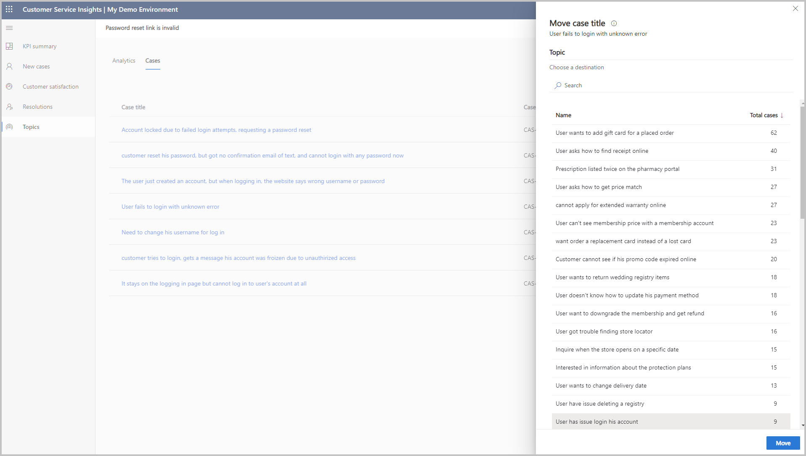
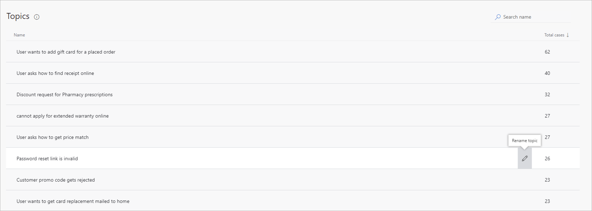
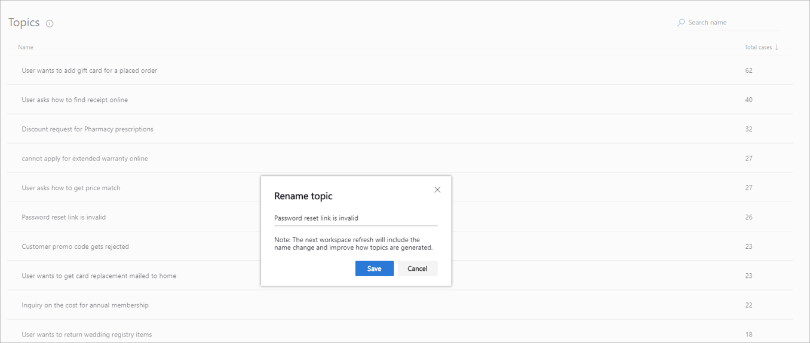
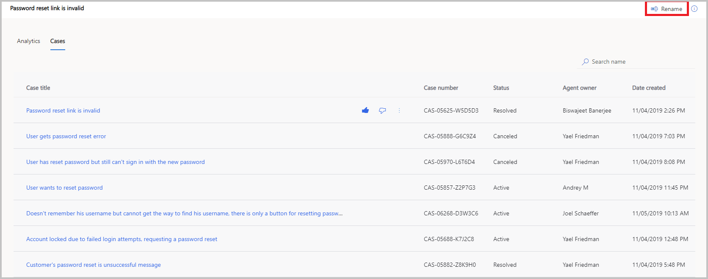
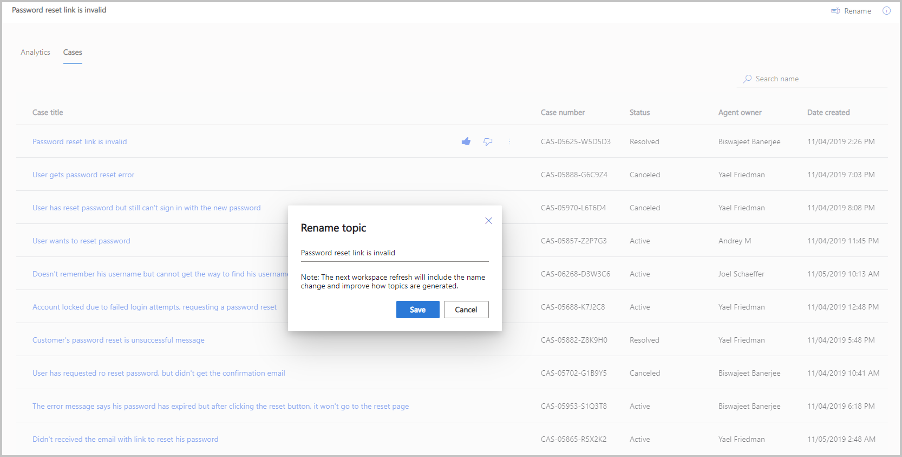

# Manage and improve artificial intelligence grouping of support cases as topics

You can manage and improve the artificial intelligence grouping of support cases as topics by using the Topics page. You can display the Topics page by selecting **Topics** in the navigation pane.

> [!NOTE]
> The Topics page is not available in the sample environment. To make the Topics page available, create your own Customer Service Insights environment.

Customer Service Insights uses artificial intelligence technology to group related support cases as topics and display them on the Topics page in order of the number of cases associated with each topic. The Topics page shows all topics that contain three or more cases.

The AI model automatically detects the language used in your support cases and understands text semantics in English, Spanish, German, and French as of July 2019. You will get the best case grouping results with these languages.

You can then view and manage the topics and associated support cases in a variety of ways, including:

* [Searching for a topic](#searching-for-a-topic)
* [Viewing support cases for a topic](#viewing-support-cases-for-a-topic)
* [Providing feedback to fine-tune the way cases are grouped into topics](#providing-feedback-to-fine-tune-the-way-cases-are-grouped-into-topics)
* [Moving cases to another topic](#moving-cases-to-another-topic)
* [Renaming a topic](#renaming-a-topic)
* [Controlling the granularity of how support topics are generated](#controlling-the-granularity-of-how-support-topics-are-generated)
* [Refreshing the data displayed on the Topics page](#refreshing-the-data-displayed-on-the-topics-page)

## Searching for a topic

You can narrow down the list of topics displayed on the Topics dashboard by searching for a specific keyword in the **Search** box in the upper right corner of the dashboard.

For example, to find topics related to login issues, enter *login* in the **Search** box. Customer Service Insights narrows down the list to topics that include the word *login*.

To restore the original topic list, clear the search box by selecting the close icon.

## Viewing support cases for a topic

You can view the top 200 support cases associated with a topic by selecting it in the Topics list. For example, to view the support cases associated with the *Password reset link is invalid* topic, select it in the list.

Customer Service Insights displays a list of the support cases associated with the topic. Based on the case title similarities, Customer Service Insights uses artificial intelligence technology to group the cases together in a single topic. In addition to text similarity, it also groups cases with similar semantics meaning. For example:

* Cases related to *promo code* and *coupon* are included in the same topic.
* Cases related to *reset password* and *login issue* are included in the same topic.

To view the details of a support case, click the case title in the list.

Customer Service Insights opens the support case details in Dynamics 365.

## Providing feedback to fine-tune the way cases are grouped into topics

You can fine-tune the way Customer Service Insights artificial intelligence technology groups support cases into topics by rating the placement of cases within topics. By rating the placement, you can help the Customer Service Insights artificial intelligence learn and improve case grouping.

To rate the placement of a topic's support cases, select the topic in the Topics page's Topics list to displays the list of cases associated with the topic. Then hover over the case title to display the **Thumbs up** and **Thumbs down** ratings icons.

Select the **Thumbs Up** icon to indicate the case has been placed correctly within the topic. Select the **Thumbs Down** icon to indicate the case was not placed correctly.

For every new topic discovered in Customer Service Insights, the **Thumbs up** icon is automatically selected for the very first case title. You can change it if needed. When you change it, or select the rating icons for any other case title in the same topic, the AI model will record all the feedback to improve the topic generation results in future refreshes.

## Moving cases to another topic

If you find support cases grouped in a topic that should be grouped in a different topic on the Topics page, you can move them between topics. When a case is moved to another topic, Customer Service Insights uses that action as implicit feedback to tune its artificial intelligence model. For example, the model will determine whether a similar case should also belong to the other topic. As a result, Customer Service Insights improves its topic generation results in next workspace refresh.

To move a support case, hover over the case in a topic's case list, select the ellipses to display the **Move** option, and then select **Move**.

Select the destination topic from the **Move case title** pane and then select **Move**.

## Renaming a topic

When Customer Service Insights groups support cases into topics, it automatically uses the title of the most relevant support case as the name of the topic. However, you may want to rename the topic. For example, you may want a topic name that is shorter or more clearly describes the underlying support issue. A renamed topic name will send a signal to Customer Service Insights to improve grouping of cases for a topic. The next workspace refresh will include the name change to improve how topics are generated.

You can rename a topic either in the Topics list or in the list of the support cases associated with the topic.

### To rename a topic in the Topics list

1. Hover over the topic and select the pencil icon to the left of the Total cases number for the topic and select **Rename topic**.

   

3. In the **Rename topic** dialog box, enter the updated name and then select **Save**.

   

4. Customer Service Insights updates the topic's name in the Topics list and gives you an opportunity to refresh your workspace.

   

5. To refresh your workspace, select **Refresh**.

   

### To rename a topic in the list of the support cases

1. Select **Rename topic** at the top of the list.

   

2. Enter the updated name and select **Save**.

   

3. Customer Service Insights updates the topic's name and gives you an opportunity to refresh your workspace.

   

4. To refresh your workspace, select **Refresh**.

## Controlling the granularity of how support topics are generated

You can control the scope of how Customer Service Insights generates support topics by adjusting topic granularity settings.

For more information, see [Set the granularity of how Customer Service Insights generates customer service topics](granularity.md).

## Refreshing the data displayed on the Topics page

Customer Service Insights automatically refreshes the data displayed on the Topics page daily. However, you can trigger a refresh on demand without waiting for next daily refresh.

For more information on triggering a refresh of your data, see [Trigger a refresh of your Customer Service Insights dashboard data](trigger-refresh.md).
