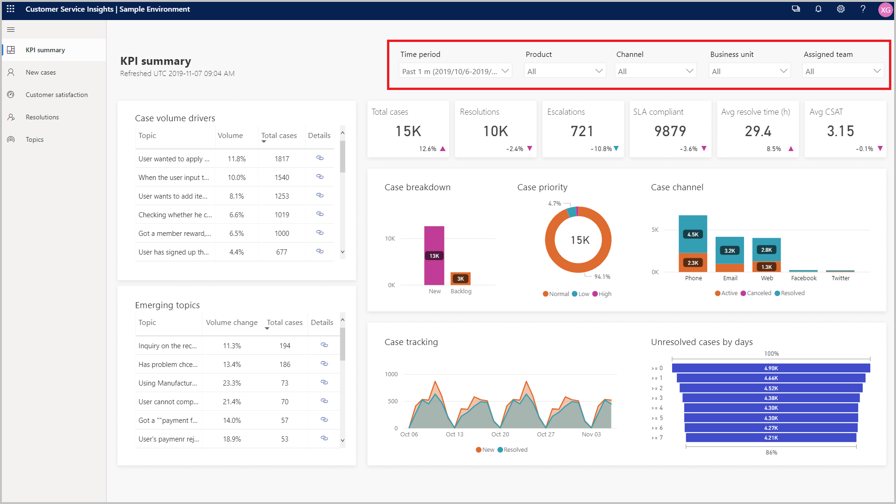
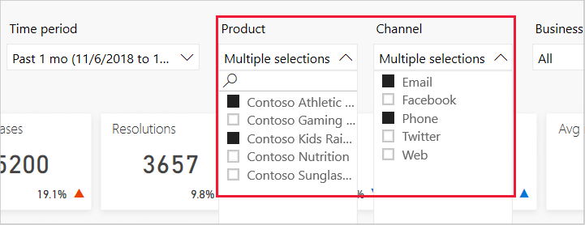
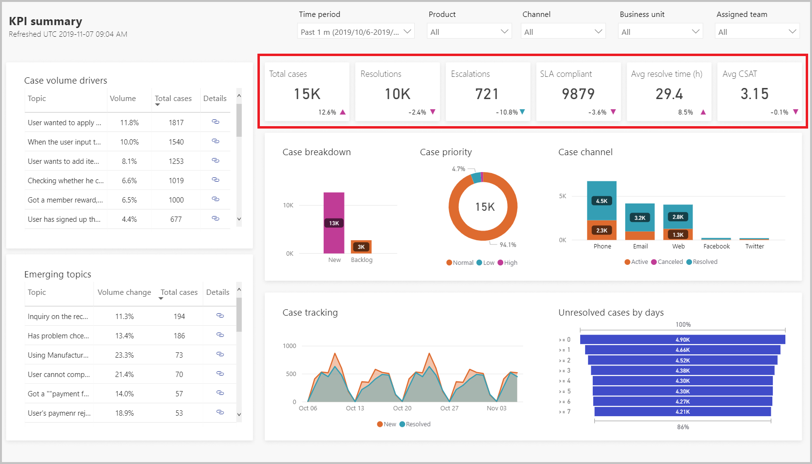

# Work with Customer Service Insights dashboards

The dashboards included in Customer Service Insights provide a rich set of analytic tools to give you a clear picture of your customer service system. Whether you connect immediately to your customer service data or spend time exploring the sample environment, becoming familiar with the dashboards can help you gain a variety of insights to help you improve system performance.

Some key features of the dashboards include:

* Filters to let you view customer service data for a specific time period, product, support channel, business unit, or team.
* Key performance indicator charts that give you the basics of how your system is performing.
* Graphical charts showing trends and breakdowns of cases from a variety of views.
* AI Insights charts that use artificial intelligence technology to show the impact and trends of cases related to specific support topics.

## Dashboard filters

Filters on each dashboard let you view a subset of your customer service data. You can view information for support cases for a specific time period, or according to one or more specific product areas, support channels, business units, or teams associated with your case data. If you switch to a different dashboard, the filter you specify persists and is applied to the data on all dashboards.

By default, dashboards display information for the past month, but you also display information for the past day or week by selecting **Past 01 Days** or **Past 07 Days**.

Specify the value or values to use to filter data by selecting the check boxes in the filter drop-down lists. Use **Ctrl+Click** to select multiple values.

You can also select a category in most charts to view a result filtered on that category. For example, selecting *High* in the Case priority chart on the KPI summary dashboard displays the number of high-priority cases.

## Key performance indicator charts

Key performance indicator charts give you a view of the key performance data in your customer service system for the specified time period. For example, the key performance indicator charts on the KPI summary dashboard show you:

* The total number of cases during the period.
* The number of resolved cases during the period.
* The number of escalated cases during the period.
* The number of SLA compliant cases during the period.
* The average resolution time during the period.
* The average customer satisfaction (CSAT) score during the period.

Each key performance indicator chart includes a blue or red up and down indicator next the value. A blue up and down indicator next to the value indicates the percent change in a positive direction. A red indicator indicates the percent change in a negative direction.

The [KPI summary](dashboard-kpi-summary.md) and [Topic details](dashboard-topic-details.md) dashboards include key performance indicator charts.

## Graphical trend and breakdown charts

The dashboards include a variety of graphical charts that give you views of different trends in your support cases, and the breakdown of cases by key criteria such as resolution time, customer satisfaction, case priority, and support channel.

Graphical charts showing trends include:

* [Case tracking (KPI summary dashboard)](dashboard-kpi-summary.md#case-tracking-chart)
* [Unresolved cases by age (KPI summary dashboard)](dashboard-kpi-summary.md#unresolved-cases-by-age-chart)
* [Case timing (New cases dashboard)](dashboard-incoming-cases.md#case-timing-chart)
* [New cases versus average resolution time (Resolutions dashboard)](dashboard-case-resolutions.md#new-cases-versus-average-resolution-time-chart)
* [New escalations versus resolved escalations (Resolutions dashboard)](dashboard-case-resolutions.md#new-escalations-versus-resolved-escalations-chart)
* [Topic case composition (Topic details dashboard)](dashboard-topic-details.md#topic-case-composition-chart)

Graphical charts showing the breakdown of support cases by key criteria include:

* [Case priority (KPI summary dashboard)](dashboard-kpi-summary.md#case-priority-chart)
* [Case breakdown (KPI summary dashboard)](dashboard-kpi-summary.md#case-breakdown-chart)
* [Case channel (KPI summary dashboard)](dashboard-kpi-summary.md#case-channel-chart)
* [Case priority (New cases dashboard)](dashboard-incoming-cases.md#case-priority-chart)
* [Case channel (New cases dashboard)](dashboard-incoming-cases.md#case-channel-chart)
* [Average CSAT (Customer satisfaction dashboard)](dashboard-CSAT.md#average-csat-chart)
* [Agents with longest resolve time (Resolutions dashboard)](dashboard-case-resolutions.md#agents-with-longest-resolve-time-chart)
* [Agents with most escalations (Resolutions dashboard)](dashboard-case-resolutions.md#agents-handling-most-escalations-chart)
* [Agents with most unresolved cases (Topic details dashboard)](dashboard-topic-details.md#agents-with-most-unresolved-cases-chart)
* [Agents with longest average resolve time (Topic details dashboard)](dashboard-topic-details.md#agents-with-longest-average-resolve-time-chart)
* [Agents with lowest average CSAT (Topic details dashboard)](dashboard-topic-details.md#agents-with-lowest-average-csat-chart)

All dashboards include graphical trend and breakdown charts.

## AI Insights charts

AI Insights charts use language understanding technology to group support cases as topics, helping you identify the types of cases that are having the greatest impact, both positive and negative, on the customer service system.

AI Insights charts include:

* [Case volume drivers (KPI summary dashboard)](dashboard-kpi-summary.md#case-volume-drivers-chart)
* [Popular topics (New cases dashboard)](dashboard-incoming-cases.md#popular-topics-chart)
* [Emerging topics (New cases dashboard)](dashboard-incoming-cases.md#emerging-topics-chart)
* [Customer satisfaction drivers (Customer satisfaction dashboard)](dashboard-CSAT.md#customer-satisfaction-drivers-chart)
* [Resolution time drivers (Resolutions dashboard)](dashboard-case-resolutions.md#resolution-time-drivers-chart)
* [Top CSAT impactors (Topic details dashboard)](dashboard-topic-details.md#customer-satisfaction-drivers-chart)

All dashboards include AI Insights charts.

Customer Service Insights automatically detects the language used in your support cases. It comes with a general language model that can discover topics with your cases written in any language. In addition, it also includes four models optimized for specific languages (English, French, German, and Spanish). Each language model also has the capability to process English cases, in addition to the other language it’s optimized for. Note that this feature is in public preview and not yet generally available. If you have questions, find issues, or have general inquiries, please refer to our [forum](https://community.dynamics.com/365/aicustomerservice/f/dynamics-365-customer-service-insights). For more information about the supported languages in general, see [Supported languages for Customer Service Insights](supported-languages.md).
