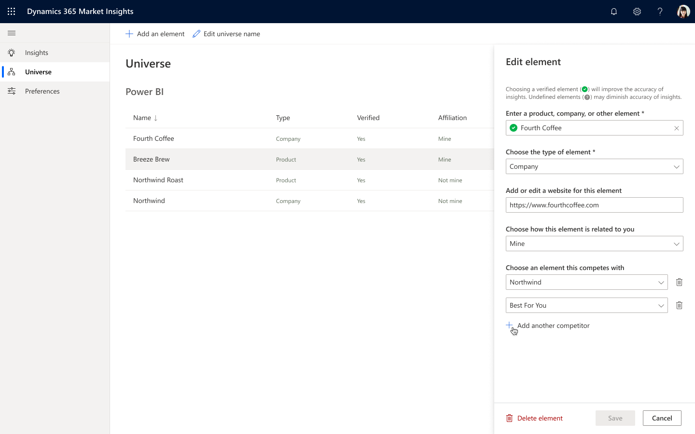

# Configure the universe and elements in Dynamics 365 Market Insights Preview

(This topic is pre-release documentation and is subject to change.)

The universe represents the setup of Market Insights Preview. It consists of one or more elements and the relationship between these elements. You can create up to 30 elements for your universe.

> [!div class="mx-imgBorder"]
> 

## How to configure the universe

### Quickly create a new element

1. In the left navigation select **Universe**.
2. Select **Add an element**.
3. In the **Create element** pane, enter a search term and select a result from the list. If you choose a verified element (the list item shows a green check mark), it'll auto-populate the remaining fields but you can change them if needed.
4. If you have already created elements, you can choose an element this competes with.
5. To save your element, select **Create**

### Change the name of the universe

Changing the name of the universe has no impact on the insights. 

1. In the left navigation select **Universe**.
2. Select **Edit universe name**.

### Edit an existing element

Editing an element has an impact on insights based on that element. Depending on the change, some or all previously available insights will be removed.   
New insights will be generated for the updated element. If there is data available, some insights show right after applying the changes while other insights can take up to 3 hours to appear in the feed.

1. In the left navigation select **Universe**.
2. Select an element from the list.
3. In the **Edit element** pane, update the values. 
4. To save your updates, select **Apply**.

### Delete an element

Deleting an element will remove all insights based on that element and it can't be undone. Re-creating the element treats it as a new element.

1. In the left navigation select **Universe**.
2. Select an element from the list.
3. In the **Edit element** pane, select **Delete element**.
4. To confirm your deletion, select **Delete**.

### Advanced configuration of elements

#### Search field

When entering a product or a company, a list with suggested results appears that lets you choose the most appropriate entry. We strongly recommend to select a verified entry (the list item shows a green check mark) to have the highest accuracy and relevance for your insights.

> [!NOTE]
> When selecting a verified entry, you can't change the values for element type and website.

#### Element type

This field is automatically filled in if you select a verified entry in the Product/Company field but you can always change the type of an element.  

Currently, 3 types of elements are supported:

- Product
- Company
- Other

Changing the type of an element will influence the accuracy and relevance of the insights for that element. 

Example: If you select the verified entry for Microsoft, the element type will be **Company**. Changing the element type will reduce the quality, accuracy, and relevance of your insights. We recommend to change the auto-populated type only if it's incorrect.

#### Website field

This field is auto-populated if you select a verified entry in the Product/Company field. You can delete or edit the suggested website URL or add a URL if there is no suggested value.

You can enter only one URL.

#### Affiliation field

This field lets you specify how your business universe is related to an element. 

Currently, 3 types of affiliation are supported:

- Mine
- Not mine
- No affiliation

#### Competes with field

This field lets users specify which companies or products compete with their products or companies. You can only define the competition between the same type of elements and you need to create these elements first.

Select **Add another competitor** if you want to add additional competing elements.
