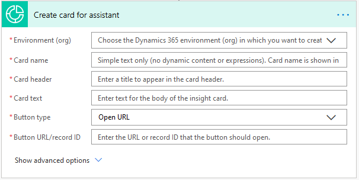
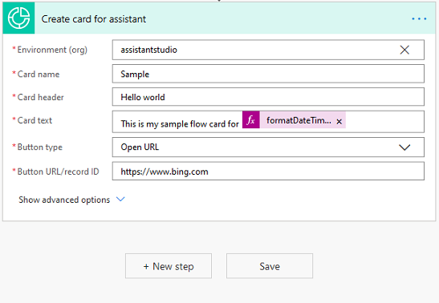

# Tutorial 1: Hello world

## Objective

To create an insight card that displays "Hello world" every morning on your dashboard.

## Step 1: Create a trigger to start the flow

Set a trigger that runs every morning at 8 AM.

On the **Assistant Studio** page, select **+ Create a new insight card**, and then select **+ Create from blank**.

In the search box, enter **Recurrence**. In the search results, under **Triggers**, select **Recurrence**. You'll see the following trigger.

> [!div class="mx-imgBorder"]
> 

Open the recurrence schedule trigger. Enter **Interval** as **1**, and select **Frequency** as **Day**. This ensures that the trigger will run once a day. Set **At these hours** to **8**, to run the trigger every morning at 8 AM.

> [!div class="mx-imgBorder"]
> 

## Step 2: Add an action to the flow

In the **Search connectors and actions** box, enter **Sales insights** or **Assistant**, and then select the **Dynamics 365 Sales Insights** connector. Under **Actions**, select **Create card for assistant**.

> [!div class="mx-imgBorder"]
> 

If you haven't made a connection by using the Dynamics 365 Sales Insights connector, use your Dynamics 365 account to sign in.

> [!div class="mx-imgBorder"]
> 

When you sign in, you'll see the following screen, where you can define the fields required to create a card.

> [!div class="mx-imgBorder"]
> 

| Parameter | Description |
|-----------|-------------|
| **Environment** | The Dynamics 365 organization in which we're creating the card. You can choose your organization from the list. |
| **Card name** | The name of the card, which is displayed at the top of the card. This should be a simple string, with no special characters or dynamic content. |
| **Card header** | The title of the card, which appears just below the card name. |
| **Card text** | The text that's displayed in the body of the card. |
| **Button type** | The type of action to be performed when the button on the card is selected. It can be either **Open URL** or **Open Entity**. In this tutorial, we're leaving this at the default value of **Open URL**. |
| **Button URL/record ID** | Because the button type selected above is **Open URL**, we'll enter a URL to be opened. If the button type were **Open Entity**, we'd enter the record ID of the entity to be opened. |

## Step 3: Enter the information for the insight card

Enter the following information on the **Create card for assistant** screen. The other fields are optional and can be left blank for the purpose of this tutorial.

> [!div class="mx-imgBorder"]
> 

| Parameter | Value |
|-----------|-------|
| **Environment** | assistantstudio (or the name of your org)|
| **Card name** | Sample |
| **Card header** | Hello world |
| **Card text** | This is my sample flow card for **formatDateTime(utcNow(), 'D')** (This expression gets the current date in the format **DayOfWeek, Month Day, Year**.)  |
| **Button type** | Open URL |
| **Button URL/record ID** | https://www.bing.com |

## Step 4: Save the flow

Select **Save** on the **Create card for assistant** screen.

## Step 5: Test the flow

Testing ensures that the insight card has been configured properly. To test, select **Test** in the upper-right corner and follow the instructions.

> [!div class="mx-imgBorder"]
> 

Now, every morning at 8 AM you'll see a card on your Dynamics 365 dashboard that says "Hello world." The following image shows what the insight card will look like.

> [!div class="mx-imgBorder"]
> 

You can also see the card type on the **Assistant Studio** home page.

> [!div class="mx-imgBorder"]
> 

### See also

[Tutorial 2: Sample insight for each user in your org](assistant-tutorial2.md)