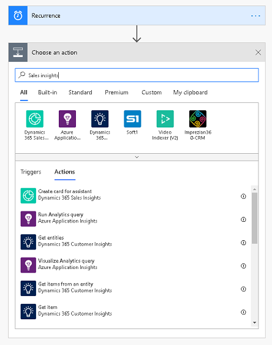
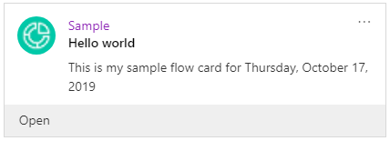
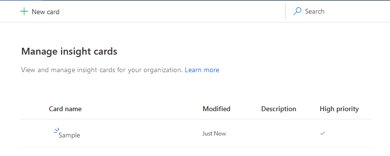

# Building custom insights for Dynamics 365 Sales – Tutorial 1: Hello World 

## Objective

To create a *hello world* insight which displays every morning on your dashboard. 

## Step 1: Create a trigger to start the flow 

Set a trigger that runs every morning at 8 am. 

On the Assistant Studio page, select **+ Create a new insight card** and select **+ Create from blank**.

In the search, enter **Recurrence**. From the search results, under the **Triggers** option, select **Recurrence**. You’ll see the below trigger. 

> [!div class="mx-imgBorder"]
> 

Open the recurrence schedule trigger. Enter **Interval** as **1** and select **Frequency** as **Day**. This ensures that the trigger will run once in day. 

The other fields can be set according to your requirement. In this example, we are setting **At these hours** as **8**, as we want the trigger to run every morning at 8 AM. 

> [!div class="mx-imgBorder"]
> 

## Step 2: Add an action to the flow

In the box that says Search connectors and actions, enter *Sales insights* or *Assistant* and select the **Dynamics 365 Sales Insights** connector. Under actions, choose **Create card for assistant**.

> [!div class="mx-imgBorder"]
> 

If you have not made a connection with the Dynamics 365 Sales Insights connector, use your Dynamics 365 account to Sign in.

> [!div class="mx-imgBorder"]
> 

When you sign in, the below screen is displayed, where you can define the fields required to create a card.

> [!div class="mx-imgBorder"]
> 

| Parameter | Description |
|-----------|-------------|
| **Environment** | The Dynamics 365 org in which we want to create the card. We can choose your org from the drop down provided. |
| **Card name** | The name of that card that will be shown on the top of the card. It should be a simple string with no special characters/dynamic content. |
| **Card header** | The title of the card that appears in the card header just below the card name. |
| **Card text** | The description to be shown in the body of the card. |
| **Button type** | The type of action to be performed when the button on the card is clicked. It can be either **Open URL** or **Open Entity**. By default, the value is **Open URL**. |
| **Button URL/record ID** | If the button type selected above is **Open URL**, then enter the URL to be opened. If the button type is **Open Entity**, then enter the record ID of the entity to be opened. In this case, it is **Open URL**, so we have entered a URL in this field. |

## Step 3: Enter the information for the insight  

Enter information in the **Create card for assistant** insight configuration. The other fields are optional and left blank for the purpose of this flow.

> [!div class="mx-imgBorder"]
> 

| Parameter | Value |
|-----------|-------|
| **Environment** | assistantstudio |
| **Card name** | Sample |
| **Card header** | Hello World |
| **Card text** | Card text is populated with some text and an expression. The expression is **formatDateTime(utcNow(), 'D')** which gets the current date in the format: **Thursday, October 17, 2019**.  |
| **Button type** | Open URL |
| **Button URL/record ID** | https://www.bing.com |

## Step 4: Save the flow

Select **Save** on the **Create card for assistant** configuration section.

## Step 5: Test the flow 

Testing ensures that the insight is configured properly. To test, select **Test** on the top right corner and follow the instructions.
 
> [!div class="mx-imgBorder"]
> 
 
Now, you can see a card on your Dynamics 365 dashboard every morning at 8 am. The following image is an example of how the insight will display.

> [!div class="mx-imgBorder"]
> 
 
You will also see the card type in the Studio configuration:

> [!div class="mx-imgBorder"]
> 