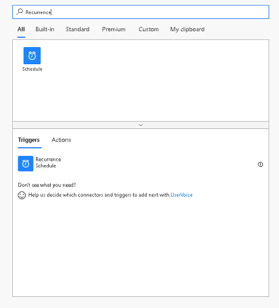
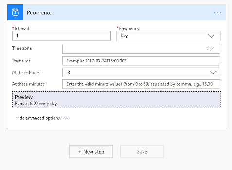
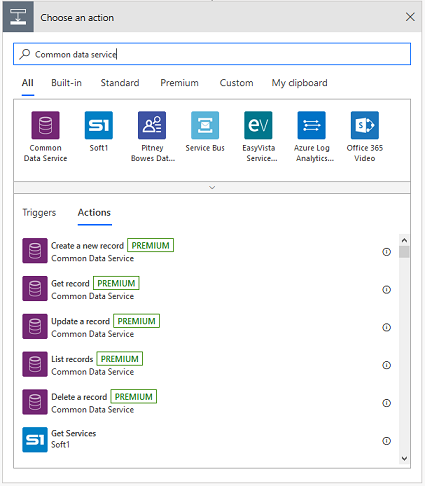
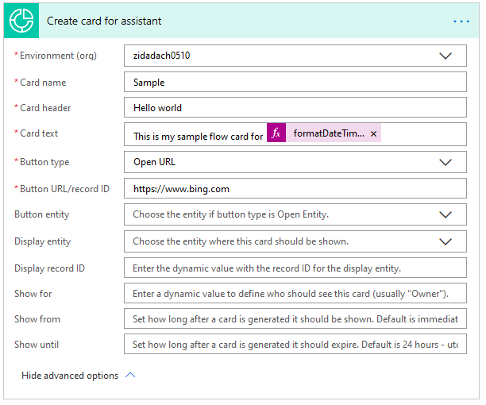

# Tutorial 2: Sample insight for each user in your organization 

## Objective

To create a “hello world” insight which shows up each morning on the dashboard for all users in your organization. 

## Step 1: Create a trigger to start the flow

Set a trigger that runs every morning at 8 AM.

On the **Assistant Studio** page, select **+ Create a new insight card**, and then select **+ Create from blank**.

In the search box, enter **Recurrence**. In the search results, under **Triggers**, select **Recurrence**. You'll see the following trigger.

> [!div class="mx-imgBorder"]
> 

Open the recurrence schedule trigger. Enter **Interval** as **1**, and select **Frequency** as **Day**. This ensures that the trigger will run once a day. Set **At these hours** to **8**, to run the trigger every morning at 8 AM.

> [!div class="mx-imgBorder"]
> 

## Step 2: Get all users in the organization

Add an action to the flow to get the list of users from your Dynamics 365 organization.

In the **Search connectors and actions** box, Search and select **Common data service** connector. Under **Actions**, Select **List records**.

> [!div class="mx-imgBorder"]
> 

You'll see the List records dialog box. Enter the required information to retrieve the users from your organization.

> [!div class="mx-imgBorder"]
> 

| Parameter | Description |
|-----------|-------------|
| **Environment** | Select your organization from the drop down.|
| **Entity Name** | Select Users from the entity drop down. |

## Step 3: Create the insight card

Enter the basic information along with advanced information on the **Create card for assistant** screen. 

> [!div class="mx-imgBorder"]
> 

| Parameter | Value |
|-----------|-------|
| **Environment** | assistantstudio (or the name of your org)|
| **Card name** | Sample |
| **Card header** | Hello world |
| **Card text** | This is my sample flow card for **formatDateTime(utcNow(), 'D')** (This expression gets the current date in the format **DayOfWeek, Month Day, Year**.)  |
| **Button type** | Open URL |
| **Button URL/record ID** | https://www.bing.com |
| **Button entity**| If the **Button type** is selected as **Open Entity**, then choose the entity type from the drop down. |
| **Display entity** | Choose the entity type from the drop down. This decides on which entity’s form the card must display. |
| **Display record ID** | The record ID of the entity corresponding to the entity type selected in the **Display entity** field. |
| **Show for** | The record ID/userId of the user who should see this card on their Dynamics 365 dashboard.  Select **Show for**, a dialog pops up. Select an output of a previous action. In this case, the **List records** action of **Common Data Service** connector.  Select **Add dynamics content** and then search and select **User (Unique identifier for the user)**.  This creates an **Apply to each** statement, which creates a card for each user that are returned from the **List records**.|
| **Show from** | The start time from when the card should be displayed (default is immediately after the creation). |
| **Show until** | The expiry time of the card after it has been displayed (default is 24 hours after the creation). |

## Step 4: Save the flow

Select **Save** on the **Create card for assistant** screen.

## Step 5: Test the flow

Perform the steps that are specified in [Tutorial 1: Create Hello World card](assistant-tutorial1.md) to test the flow of the card. 

### See also

[Tutorial 1: Create Hello World card](assistant-tutorial1.md)