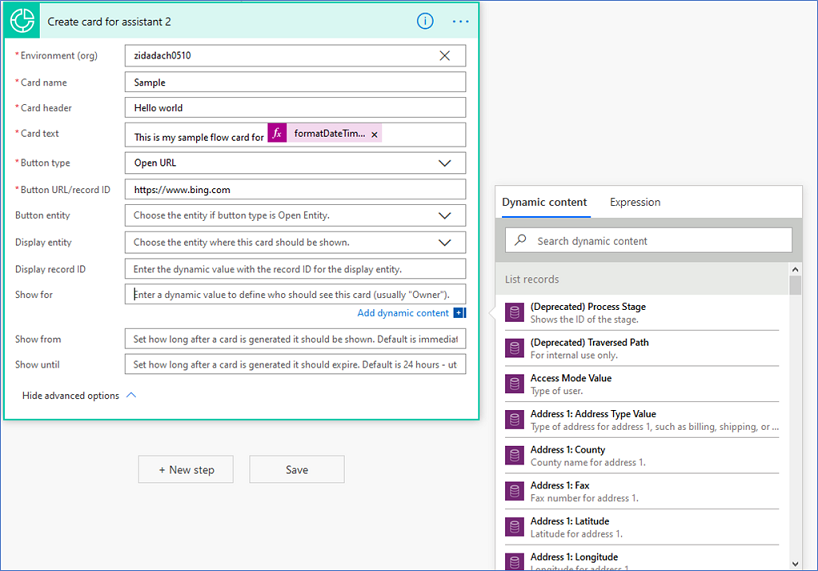
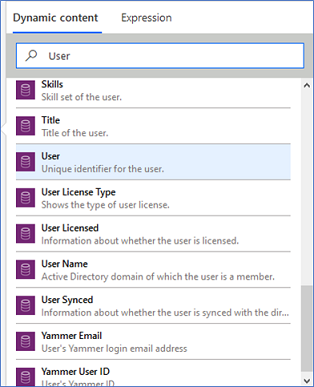
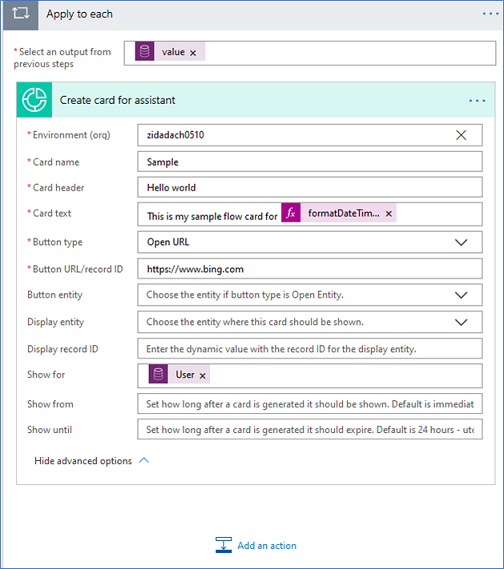

# Tutorial 2: Create a Hello World card for each user in your organization

## Objective

To create a "hello world" insight card that shows up each morning on the dashboard for all users in your organization.

## Step 1: Create a trigger to start the flow

Set a trigger that runs every morning at 8 AM.

On the **Assistant Studio** page, select **+ Create a new insight card**, and then select **+ Create from blank**.

In the search box, enter **Recurrence**. In the search results, under **Triggers**, select **Recurrence**. You'll see the following trigger.

> [!div class="mx-imgBorder"]
> 

Open the recurrence schedule trigger. Enter **Interval** as **1**, and select **Frequency** as **Day**. This ensures that the trigger will run once a day. Set **At these hours** to **8**, to run the trigger every morning at 8 AM.

> [!div class="mx-imgBorder"]
> 

## Step 2: Get a list of all the users in your organization

Add an action to the flow to get the list of users from your Dynamics 365 organization.

In the **Search connectors and actions** box, enter **Common data service**, and then select the **Common Data Service** connector. Under **Actions**, Select **List records**.

> [!div class="mx-imgBorder"]
> 

You'll see the **List records** dialog box, where you define the parameters for retrieving users from your organization.

> [!div class="mx-imgBorder"]
> 

| Parameter | Description |
|-----------|-------------|
| **Environment** | Select your organization from the list.|
| **Entity Name** | Select **Users** from the list. |

## Step 3: Create the insight card

Enter the following information on the **Create card for assistant** screen.

> [!div class="mx-imgBorder"]
> 

| Parameter | Value |
|-----------|-------|
| **Environment** | assistantstudio (or the name of your org)|
| **Card name** | Sample |
| **Card header** | Hello world |
| **Card text** | This is my sample flow card for **formatDateTime(utcNow(), 'D')** (This expression gets the current date in the format **DayOfWeek, Month Day, Year**.) |
| **Button type** | Open URL |
| **Button URL/record ID** | https://www.bing.com |
| **Button entity**| Leave this box blank as you have selected **Button type** as **Open URL**. |
| **Display entity** | Choose an entity type from the list. Here select the entity type as **Opportunity** and the card will be displayed on the opportunity forms of the of the selected **Display record ID**. |
| **Display record ID** | The record ID of the entity corresponding to the entity type selected in the **Display entity** field. |
| **Show for** | The record ID of the user who should see this card on their Dynamics 365 dashboard. More information: [Configure Show for](#configure-show-for). |
| **Show from** | The start time from when the card will be displayed (you can accept the default, which is immediately after creation). |
| **Show until** | The expiry time of the card after it has been displayed (the default is 24 hours after creation). |

### Configure Show for

Configure the **Show for** field to display this card for each user in your organization.

1. In the **Show for** dialog box, select an output of a previous action&mdash;in this case, the **List records** action of the **Common Data Service** connector.

    > [!div class="mx-imgBorder"]
    > 

2. Select **Add dynamic content**, and then search for and select **User (Unique identifier for the user)**.

    > [!div class="mx-imgBorder"]
    > 

    This creates an **Apply to each** statement, which creates a card for each user who was returned from the **List records** action.

    > [!div class="mx-imgBorder"]
    > 

## Step 4: Save the flow

Select **Save** on the **Create card for assistant** screen.

## Step 5: Test the flow

Perform the steps for testing the flow as described in [Tutorial 1: Create a Hello World card](assistant-tutorial1.md#test-the-flow).

### See also

[Tutorial 1: Create a Hello World card](assistant-tutorial1.md)