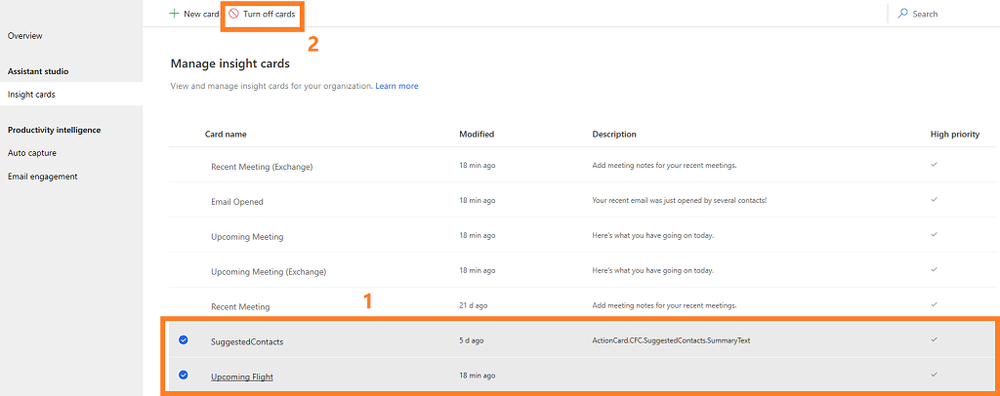

# Configure Sales Insights assistant

The assistant helps the sellers to track their daily actions and communications through a collection of actionable cards known as insight cards. 

> [!IMPORTANT]
> By enabling this feature, you consent to share data about your customers' email activity with an external system. Data imported from external systems into Dynamics 365 for Sales are subject to our privacy statement.

The Sales Insights provides assistant in two forms:

- **Assistant for free**: This feature is available as free along with Dynamics 365 Sales. As an administrator, you must configure this feature for sellers in your organization to view insight cards such as task due today, custom activity due today, and email due today. By default, the base cards are available in your organization, even if you do not enable the assistant. To configure Assistant (free), see [Configure and manage insight cards for Assistant (free)](#configure-and-manage-insight-cards-for-assistant-free). 

- **Assistant with advanced features through Studio**: The advanced assistant is available in Dynamics 365 Sales through the **Dynamics 365 Sales Insights** license. As an administrator, you must configure this feature for sales managers and sellers to create and manage insight cards through Studio. To configure the advanced Assistant, see [Configure Assistant (full capabilities) to manage insight cards](#configure-assistant-full-capabilities-to-manage-insight-cards).

    > [!NOTE]
    > If you are using the preview Assistant, you will see the tabs **Home** and **Optimize ranking** already available for you and you don't need to do any additional configuration to enable the feature.

## Configure and manage insight cards for Assistant (free)

1. Assign user privileges to give access to the Assistant features. The privileges required to access Sales Insights features are automatically enabled for all out-of-the-box security roles, but they're initially disabled for all custom roles. If you enable any Sales Insights features, you must check the settings listed in the following table to help ensure that your users can access those features, and to help ensure that other features don't stop working because of privilege cascades related to these features.

    |Privilege| Security role tab |Description and requirements|
    |--|--|--|
    |**Action Card**| **Core Records**  |Gives the ability to view and interact with action cards that are generated by Assistant.   **Warning:** If Assistant is enabled, all users *must* have a role with read access for this privilege. Because of cascading, users without this privilege will lose access to many Dynamics 365 Sales features when assistant is enabled.|
    | **Action Card User Settings** | **Core Records**  | Gives the ability to view and change user preferences for action cards that are generated by Assistant. **Warning:** If Assistant is enabled, all users *must* have a role with read access for this privilege. Because of cascading, users without this privilege will lose access to many Dynamics 365 Sales features when Assistant is enabled. |

    To learn more, see [Security roles and privileges](/dynamics365/customer-engagement/admin/security-roles-privileges).

2. Verify that you have [enable and configure free Sales Insights features](intro-admin-guide-sales-insights.md#enable-and-configure-free-sales-insights-features).

3. On the sitemap, select **Insight cards** under **Assistant** to go to **Manage insight cards** page.

    > [!TIP]
    > Alternatively, in the **Sales Insights settings** page, select **Manage** from the **Assistant (free)** section to go to **Manage insight cards** page.

    The list of cards that are available are displayed. For complete details about each available action card, including details about the configuration settings available for each of them and other details, see [Action cards reference](action-cards-reference.md).

    > [!div class="mx-imgBorder"]
    > 
    
4. To enable or turn on the insight cards, select the cards that are grayed out and select **Turn on cards**.
    
    In this example, we have selected the cards **Recent Meetings (Exchange)** and **Email Opened**.

    > [!div class="mx-imgBorder"]
    > 
    
5. To disable or turn off the insight cards, select the cards that are enabled and select **Turn off cards**.
    
    In this example, we have selected the cards **SuggestedContacts** and **Upcoming Flight**.

    > [!div class="mx-imgBorder"]
    > 
    
6. To view more details of the cards such as preview of the cards, last modified time, turn on or off the card, and description, select the card.

    > [!TIP]
    > Alternatively, select the more options icon corresponding to the card and then select **Edit**. 

    > [!div class="mx-imgBorder"]
    > 

Sellers can also set their own personal preferences for their action cards. They can't add cards that you disable here, but they can disable cards that you have enabled if they don't find them useful. They can also change the configuration settings for those cards that have them, though your settings will be the defaults. To learn more, see [Guide customer communications with assistant](assistant.md)

## Configure Assistant (full capabilities) to manage insight cards

