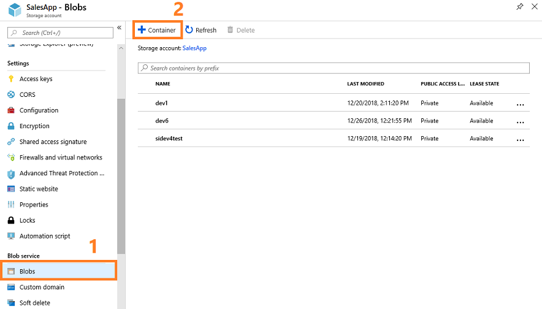
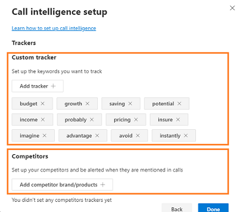
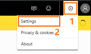
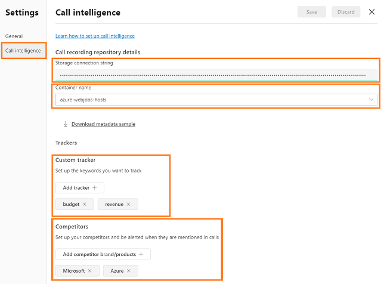

# Preview: Configure Call intelligence

Applies to [!INCLUDE[pn-crm-online](../includes/pn-crm-online.md)] version 9.1.0. <br>

[!INCLUDE [cc-beta-prerelease-disclaimer](../includes/cc-beta-prerelease-disclaimer.md)]

> [!IMPORTANT]
> [!INCLUDE[cc_preview_features_definition](../includes/cc-preview-features-definition.md)]

Call intelligence in [!INCLUDE[pn_dynamics_sales_insights](../includes/pn-dynamics-sales-insights.md)] assists the sales managers in your organization to get an overview of the call center and drill down to get call statistics for individual sales reps. This helps the sales managers to change the shape of the business by giving smarter coaching and enhancing sales to generate revenue.

You must have administrative privileges to configure Call intelligence for your organization. To configure Call intelligence, perform the following steps:

1. Review the prerequisites. 
2. Create a blob container on Azure.
3. Configure the blob container and trackers with Call intelligence.
4. Upload call recordings.

These steps are described in detail here.

## Review prerequisites
Verify the following requirements before configuring Call intelligence for your organization:

- You have access to the [!INCLUDE[pn_dynamics_sales_insights](../includes/pn-dynamics-sales-insights.md)] app.
If you do not have access, follow these steps:<br>
    1. Go to the [Dynamics 365 Sales Insights](https://aka.ms/salesai) marketing page and select **Try Preview**.<br>
    2. Enter your work email address.<br>
    3. When the application recognizes the email, you must sign in using Azure Active Directory.<br> 
        [!INCLUDE[proc_more_information](../includes/proc-more-information.md)] [Azure AD Connect user sign-in options](/azure/active-directory/hybrid/plan-connect-user-signin)
- Create a v2 storage account with an Azure subscription. [!INCLUDE[proc_more_information](../includes/proc-more-information.md)] [Create a storage account](/azure/storage/common/storage-quickstart-create-account?tabs=portal#create-a-storage-account-1)

## Create call recording repository
Create a call recording repository (blob container) in an Azure storage account. This helps you to upload the call recordings in the repository for Call intelligence to assess.
 
1. Sign in to the Azure dashboard.
2. On the navigation pane, select **All resources** and open the desired storage account.
    > [!div class="mx-imgBorder"]
    > 
3. From **Blob service**, select **Blobs** > **+ Container**.
    > [!div class="mx-imgBorder"]
    > 
4. Specify the container information such as name and public access level.
5. Select **OK**.
    The container is created. [!INCLUDE[proc_more_information](../includes/proc-more-information.md)] [Create a container](/azure/storage/blobs/storage-quickstart-blobs-portal#create-a-container)<br> 
6. From **Settings**, go to **Access keys** and note the **Connection string** of the storage account. This connection string is used to connect Call intelligence to your Azure storage account.
    > [!div class="mx-imgBorder"]
    > 

Now you are ready to configure the blob container and trackers for Call intelligence. 

## Configure blob container and trackers for Call intelligence 
Configuring the blob container that you created helps us to fetch the call recording from your repository and process the audio file for call analytics. The analysis includes creating transcripts and providing insights for the call recordings.

Also, you should configure trackers, competitors, and competitor products that you would like to track in the calls. Trackers are the keywords that are relevant to you and your organization. Whenever the defined keywords, competitors, or competitor products are mentioned in a call, Call intelligence will gather the data and display it appropriately on the dashboard.

There are two ways to configure Call intelligence: 

- While setting the app.
- After setting the app. 

### While setting the app 
The Call intelligence configuration procedure is part of the initial app setup and you can continue the configuration after connecting to your Dynamics 365 organization. We recommend that you configure Call intelligence during the initial app setup. 

1. Open the [!INCLUDE[pn_dynamics_sales_insights](../includes/pn-dynamics-sales-insights.md)] app. 
2. When you are signing in for the first time, select your Dynamics 365 organization to connect the organization data with the app.
    After connecting your Dynamics 365 organization with the app, continue to configure Call intelligence.
3. Select **Connect your call data**.
    > [!div class="mx-imgBorder"]
    > <br>
4. On the **Call intelligence setup** page, specify the call recording repository details—**Storage connection string** and **Container name**—that you configured in Azure.
    > [!div class="mx-imgBorder"]
    > <br>
5. (Optional) You can download the metadata file sample that is used to upload to the call recording repository in Azure along with the call recording file. <br>
6. Select **Next** to add the **Custom trackers** and **Competitors** that you want to track during calls.<br>
    > [!div class="mx-imgBorder"]
    > <br>
7. Select **Done**.<br>

While the application takes a few minutes to configure Call intelligence, you can continue exploring the feature with demo data.

Now you can upload call recordings to Azure for Call intelligence to assess.

### After setting the app
You can use this procedure if you ignore Call intelligence configuration during the initial app setup. Also, you can use this procedure to update custom trackers, competitors, and Azure (storage connection string and container name) settings.
1. Open the [!INCLUDE[pn_dynamics_sales_insights](../includes/pn-dynamics-sales-insights.md)] app.
2. Select the **Settings** icon on the top-right of the page and then select **Settings**. 
    > [!div class="mx-imgBorder"]
    > 
3. On the **Settings** page, select **Call intelligence** and specify the following information:

    |Parameter|Description|
    |---------|-----------|
    |Storage connection string|Specifies the string that is generated while creating the blob storage account.|
    |Container name|Specifies the name of the blob storage.|
    |Custom trackers|Specifies the keywords to track during a call. For example, when a sales executive makes a sales call, you would like to track keywords such as pricing, budget, potential, and savings.|
    |Competitors|Specifies names of your competitors or competitive products that might come up during a call with your customers.|

    > [!div class="mx-imgBorder"]
    > 
4. Select **Save**.

While the application takes few minutes to configure Call intelligence, you can continue exploring the feature with demo data.

Now you can upload call recordings to Azure for Call intelligence to assess.

## Upload call recordings

You can upload the recording in audio formats such as MP3 and WAV in the created call recording repository (blob container) in Azure. Along with the audio format file, you must upload the corresponding metadata file in JSON format.
> [!NOTE]
> You must have at least 10 call recording files in the call recording repository to process and display the data in Call intelligence. 

Review the following requirements for audio and JSON files before you upload:

- The file names for the audio and its corresponding JSON files must be the same. For example, if you name the audio file **call-recording-10-dec-2018.wav**, the corresponding JSON file should be named **call-recording-10-dec-2018.json**. 
- The file name cannot contain reserved characters such as **!*'();:@&=+$,/?%#[]"**.
- The length of the file name should be less than 260 characters.
- The JSON file parameters must be properly configured. The JSON file contains the following parameters:

  |Parameter|Description|
  |---------|-----------|
  | `AgentAADUserId` | Specifies the unique identification code of your agent. | 
  | `AgentCrmUserId` | Specifies the unique identification code of the agent in your Dynamics 365 for Sales organization. |
  | `AgentAccountEmail`| Specifies the email account of the agent in your Dynamics 365 for Sales organization. | 
  | | **Note**: You must use at least one parameter from `AgentAADUserId`, `AgentCrmUserId`, or `AgentAccountEmail` while creating a JSON file. When you use other parameters, ensure that the details are specific to the same agent. In the below example JSON file, we have used `AgentAADUserId`. |
  | `CreatedTimestamp`| Specifies the time at which the audio file is created in milliseconds and calculated based on the UNIX Epoch time. For example, when the audio file is **14 Dec 2018 15:00:00 GMT**, then the corresponding Epoch timestamp in milliseconds is **1544779800000**.|
  | `Locale` | Specifies the language used in the call. Currently, we support en-US, en-GB, de-DE, fr-FR, it-IT, es-ES, es-MX, ja-JP, pt-BR, and zh-CN. |
  | `StartTime` | Specifies the start time of the call in milliseconds and calculated based on the UNIX Epoch time. For example, when the call start time is **14 Dec 2018 12:39:56 GMT**, then the corresponding Epoch timestamp in milliseconds is **1544791196000**. |
  | `Direction` | Specifies whether the call is inbound or outbound. |
  | `FileName` | Specifies the name of the audio file. |
  | `Title` | Specifies the title of the call.|
  | `AgentPhoneNumber`| (Optional) Specifies the phone number of the agent.|
  | `CustomerPhoneNumber` | (Optional) Specifies the phone number of the customer whom your sales rep contacted. |
  | `CallContactCrmId` |  (Optional) Specifies the unique identification code of the contact. |
  | `CallOpportunityCrmId` |  (Optional) Specifies the unique identification code of the opportunity. |
  | `CallLeadCrmId` |  (Optional) Specifies the unique identification code of the lead. |
  | `CallAccountCrmId` |  (Optional) Specifies the unique identification code of the account. |
  | `CallPhoneCallCrmId` | (Optional) Specifies the unique identification code generated in Dynamics 365 for Sales admin center for the sales rep. |
  | `IsAgentRecordingOnly` | (Optional) Specifies the audio file contains only the voice of your sales rep. The value is specified in True or False. By default, the value is False. |
  | `Id`| (Optional) Specifies the unique identification code of the call. Generate this code using the GUID generator. |  
  | `QueueId`| (Optional) Specifies the unique identification code for the queue. |    
  | `QueueName`| (Optional) Specifies the name of the queue in which the sales rep is on. |  
  | `Provider`| (Optional) Specifies the service provider of the call such as Skype. |  
  | `Region`| (Optional) Specifies from which region the call originated, such as NA (North America). |  
  | `CreatedTimestamp`| (Optional) Specifies the time at which the audio file is created in milliseconds and calculated based on the UNIX Epoch time. For example, when the audio file is **14 Dec 2018 15:00:00 GMT**, then the corresponding Epoch timestamp in milliseconds is **1544779800000**. |  
  | `fileChannelType`| (Optional) Specifies the call channel type such as stereo or mono. |  
  | `country`| (Optional) Specifies from which country the call originated. |  

    The following is an example of JSON file format:
    ```
    {
        "AgentAADUserId": "6b105575-g55a-e611-00ka-5065f38b0211",
        "StartTime": "1554890363917",
        "Direction": "OutBound",
        "CallerPhoneNumber": "Your caller phone number",
        "CreatedTimestamp": "1554890368934",
        "CustomerPhoneNumber": "Your customer phone number",
        "FileName": "Sample.mp3",
        "IsAgentRecordingOnly": true,
        "Locale": "en-US",
        "Provider": "SkypeCTI",
        "Region": "Commercial Sales",
        "Title": "Sales call",
        "CallPhoneCallCrmId": "33840960-a186-0a0b-ae0a-db69afd6b8e5"
        "fileChannelType": "Stereo",
        "Country": "United States",
        "Id": "4a14995b-4fd0-493e-85d4-9eb48d28e799",
        "Title": "Contoso Deal",
    }
    ```

### See also

- [Analyze customer calls](../sales/call-intelligence.md)
- [FAQs for sales manager capabilities](faqs-sales-manager-app.md)
