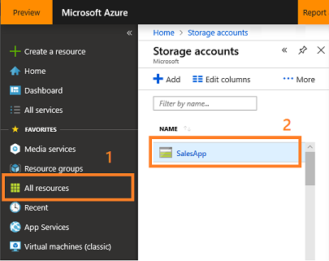
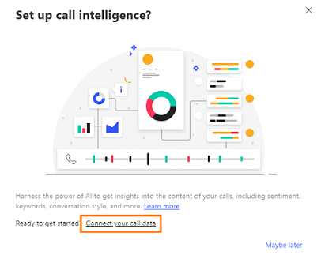
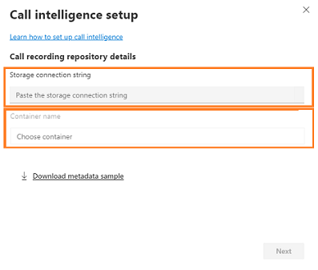

# Configure Call intelligence

Applies to Dynamics 365 for Sales, version 9.1.0 <br>

The call intelligence in [!INCLUDE[pn_dynamics_ai_sales](../includes/pn-dynamics-ai-sales.md)] assists the sales managers in your organization to get an overview of the call center and drill-down to get call statistics for individual sales reps. This helps the sales managers to change the shape of the business by giving smarter coaching and enhancing sales to generate revenue.

You must have administrative privileges to configure the call intelligence for your organization. To configure the call intelligence, perform the following steps:
1. Review the prerequisites. 
2. Create a Blob container on Azure.
3. Configure blob container and trackers with call intelligence.
4. Upload call recordings.

## Prerequisites
Verify the following requirements before configuring call intelligence for your organization:
1. You have access to [!INCLUDE[pn_dynamics_ai_sales](../includes/pn-dynamics-ai-sales.md)] app.
    If you do not have access, follow these steps:<br>
    a. Go to [Dynamics Sales AI](https://aka.ms/salesai) marketing page and select **Try Preview**.<br>
    b. Enter your work email address.<br>
    c. When the application recognizes the email, you must sign in using Azure Active Directory.<br> 
        [!INCLUDE[proc_more_information](../includes/proc-more-information.md)][Azure AD Connect user sign-in options](/azure/active-directory/hybrid/plan-connect-user-signin).
2. Create a V2 storage account with Azure subscription. [!INCLUDE[proc_more_information](../includes/proc-more-information.md)][Create a storage account](/azure/storage/common/storage-quickstart-create-account?tabs=portal#create-a-storage-account-1).

## Create call recording repository
Create a call recording repository (blob container) in an Azure storage account to upload the call recordings for Call intelligence to assess.
 
1. Log in to Azure dashboard.
2. On the navigation pane, select **All Resources** and open the desired storage account.
    > [!div class="mx-imgBorder"]
    > 
3. From **Blob services**, select **Blobs** > **+ Container**.
    > [!div class="mx-imgBorder"]
    > 
4. Enter the container information such as name and public access level.
5. Select **OK**.
    The container is created. [!INCLUDE[proc_more_information](../includes/proc-more-information.md)][Create a container](/azure/storage/blobs/storage-quickstart-blobs-portal#create-a-container).<br> 
6. From **Settings**, go to **Access Keys** and note the **Connection string** of the storage account. This connection string is used to connect call intelligence to your Azure storage account.
    > [!div class="mx-imgBorder"]
    > 

Now, you are ready to configure blob container and trackers for call intelligence. 

## Configure blob container and trackers for call intelligence 
Configuring the blob container that you have created helps us to fetch the call recording from your repository and process the audio file for call analytics. The analysis includes creating transcripts and provide insights for the call recordings.

Also, you should configure trackers, competitors, and competitor products that you would like to track in the calls. Trackers are the keywords that are relevant to you and your organization. Whenever the defined keywords, competitors, or competitor products are mentioned in a call, the call intelligence will gather the data and displays appropriately on the dashboard.

There are two ways to configure call intelligence: 
- During setting up to the app.
- After setting up to the app. 

### During setting the app 
1. Open [!INCLUDE[pn_dynamics_ai_sales](../includes/pn-dynamics-ai-sales.md)] app. 
2. When you are logging in for the first time, select your Dynamics 365 organization to connect organization data with the app.
3. After connecting your Dynamics 365 organization with the app, continue to configure call intelligence for the app. Select **Connect your call data**.
    > [!div class="mx-imgBorder"]
    > <br>
4. On **Call intelligence setup** page, enter call recording repository details - **Storage connection string** and **Container name** that you have configured in Azure.
    > [!div class="mx-imgBorder"]
    > <br>
5. (Optional) You can download the metadata file sample that is used to upload to the call recording repository in Azure along with the call recording file. <br>
6. Select **Next**and add **Custom trackers** and **Competitors** that you want to track during the calls.<br>
    > [!div class="mx-imgBorder"]
    > <br>
7. Select **Done**.<br>
The application takes few minutes to configure call intelligence and you can continue exploring the feature with demo data.

### After setting the app
1. Open [!INCLUDE[pn_dynamics_ai_sales](../includes/pn-dynamics-ai-sales.md)] app.
2. Select settings icon at the top-right of the page and then select **Settings**. 
    > [!div class="mx-imgBorder"]
    > 
3. On the **Settings** page, select **Call intelligence** and enter the information as required:
    - **Storage connection string:** Specifies the string that is generated while creating the blob storage account.
    - **Container name:** Specifies the name of the blob storage.
    - **Custom trackers:** Specifies the keywords to track during a call. For example, when a sales executive makes a sales call, you would like to track keywords such as pricing, budget, potential, and savings.
    - **Competitors:** Specifies names of your competitors or competitive products that may come up during a call with your customers.
    > [!div class="mx-imgBorder"]
    > 
4. Select **Save**.

The application takes few minutes to configure call intelligence and you can continue exploring the feature with demo data.
Now, you can upload call recordings to Azure for call intelligence to assess.

## Upload call recordings

You can upload the recording in audio formats such as mp3 and wav. Along with the audio format file you must upload the corresponding metadata file in JSON format.
> [!NOTE]
> You must have at least 10 call recording files in the call recording repository to process and display the data in call intelligence. 

Review the following requirements for audio and JSON files before you upload:
- The file names for audio and its corresponding JSON mnust be same. For examlple, if you name the audio file as **call-recording-10-dec-2018.wav**, the corresponding JSON file should be named as **call-recording-10-dec-2018.json**. 
- The file name cannot contain reserved characters such as **!*'();:@&=+$,/?%#[]"**.
- The length of the file name should be less than 260 characters.
- Verify that the JSON file parameters are properly configured. The JSON file contains the following parameters:
    |Parameter|Description|
    |---------|-----------|
    |id|Specifies the unique identification code of the call. Generate this code using the GUID generator.|
    |title|Specifies the title of the call.|
    |fileName|Specifies the name of the audio file.|
    |type|Specifies the type of audio format such as wma or mp3.|
    |callStartTime|Specifies the start time of the call in milliseconds and calculated based on the UNIX Epoch time. For example, when the call start time is **14 Dec 2018 12:39:56 GMT** then corresponding Epoch timestamp in milliseconds is **1544791196000**.|
    |callEndTime|Specifies the end time of the call in milliseconds and calculated based on the UNIX Epoch time. For example, when the call end time is **14 Dec 2018 13:39:56 GMT** then corresponding Epoch timestamp in milliseconds is **1544794796000**.|
    |callerPhoneNumber|(Optional) Specifies the phone number of the caller such as your sales rep.|
    |dialedPhoneNumber|(Optional) Specifies the phone number of the customer whom your sales rep contacted.|
    |agentId|Specifies the email address of your sales rep.|
    |agentFirstName|Specifies the first name of your sales rep.|
    |agentLastName|Specifies the last name of your sales rep.|
    |managerId|Specifies the email address of the manager to whom the sales rep reports.|
    |calltype|Specifies whether the call is inbound or outbound.|
    |language|(Optional) Specifies the language used in the call. Currently we are supporting en-us (English used in the United States) only.|
    |country|(Optional) Specifies from which country the call is originated.|
    |region|(Optional) Specifies from which region the call is originated such as NA (North America).|
    |provider|(Optional) Specifies the service provider of the call such as Skype.|
    |createdTimestamp|Specifies the time at which the audio file is created in milliseconds and calculated based on the UNIX Epoch time. For example, when the audio file is **14 Dec 2018 15:00:00 GMT** then corresponding Epoch timestamp in milliseconds is **1544779800000**.|
    |isAgentRecordingOnly|(Optional) Specifies the audio file contain only the voice of your sales rep. The value is specified in True or False. |
    |fileChannelType|(Optional) Specifies the call channel type such as stereo or mono.|
    |agentSystemUserId|(Optional) Specifies the unique identification code generated in Dynamics 365 for Sales admin center for the sales rep.|
    |queueId|(Optional) Specifies the unique identification code for the queue.|
    |queueName|(Optional) Specifies the name of queue in which the sales rep is on.|
    
    The following is an example of JSON file format:
    ```
    {
      "id": "cdd69838-2a41-4131-aab0-3f3c0b5ebc03",
      "title": "Sales call", 
      "fileName": "Sample.mp3", 
      "callStartTime": "1531863398000", 
      "callEndTime": "1531863998000", 
      "callerPhoneNumber": "YourCallerPhoneNumber", 
      "dialedPhoneNumber": "DialedPhoneNumber",
      "calltype": "outbound",
      "agentId": "YourAgentEmail@example.com",
      "agentFirstName": "Your First Name",
      "agentLastName": "Your Last Name",
      "managerId": "YourManagerEmail@example.com",
      "type": "audio/mp3",
      "language": "en-US",
      "country": "USA",
      "region": "USA",
      "provider": "Skype",
      "createdTimestamp": "1531863398000", 
      "isAgentRecordingOnly": "false",
      "fileChannelType": "TwoWay",
      "agentSystemUserId": "UserId",
      "queueId": "1122",
      "queueName": "name"
    }
    ```

### See also

[Analyze customer calls](../sales/call-intelligence.md)
