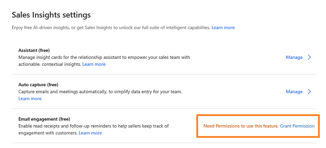

# Configure and enable email engagement

Enabling the email engagement helps the user in your organization to receive alerts and reminders that help build customer relationships.

> [!NOTE]
> If you enable email engagement, we strongly recommend that you also enable Assistant, because email engagement relies on some of its features.

> [!IMPORTANT]
> By enabling this feature, you consent to share data about your customers' email activity with an external system. Data imported from external systems into Dynamics 365 Sales Insights are subject to our privacy statement.

## Prerequisites

Verify the following prerequisites before enabling email engagement for your organization:

- To configure, enable free Sales Insights features. To learn more, see [Enable and configure free Sales Insights features](intro-admin-guide-sales-insights.md#enable-and-configure-free-sales-insights-features).
 
- To use followed email attachments, [!INCLUDE[pn_onedrive_for_business](../includes/pn-onedrive-for-business.md)] must be available to your Dynamics 365 Sales server. To learn more, see [Enable OneDrive for Business](/dynamics365/customer-engagement/admin/enable-onedrive-for-business)  

- To use followed email attachments, you must also enable document management for email in Dynamics 365 Sales. To learn more, see [Enable SharePoint document management for specific entities](/dynamics365/customer-engagement/admin/enable-sharepoint-document-management-specific-entities)  

- To enable delivery-time recommendations based on recipients' time zones, you must enable [!INCLUDE[pn_bing_maps](../includes/pn-bing-maps.md)] in Dynamics 365 Sales. To learn more, see [System Settings dialog box - General tab](/dynamics365/customer-engagement/admin/system-settings-dialog-box-general-tab)

## Enable email engagement

1.	Sign in to **Dynamics 365 Sales** and go to **Sales Hub** app.

2.	Go to **Change area** and select **Sales Insights settings**.

    > [!div class="mx-imgBorder"]
    > 

3. On the **Sales Insights settings** page, select **Grant Permissions** from the **Email engagement (fee)** section.

    > [!div class="mx-imgBorder"]
    >   

    a confirmation message is displayed in a tab. Close the tab and proceed to set up email engagement.

    > [!NOTE]
    > If you have already grant permissions, this step will be skipped. You don't have to grant permissions to Email engagement again. 

4. On the Email engagement section, select **Set up** and then select the toggle to enable. 

    > [!div class="mx-imgBorder"]
    >   

    Email engagement is enabled and ready to use in your organization. 

### See also

[Introduction to administer Sales Insights](../sales/intro-admin-guide-sales-insights.md)

[View message interactions with email engagement](email-engagement.md)