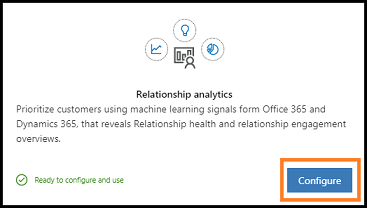
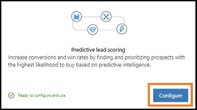
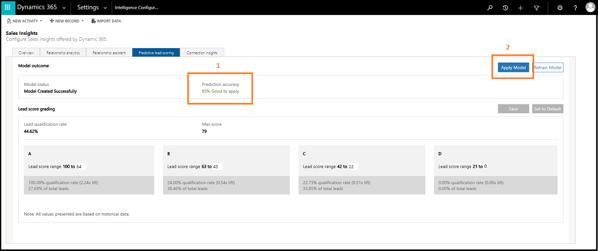
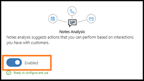
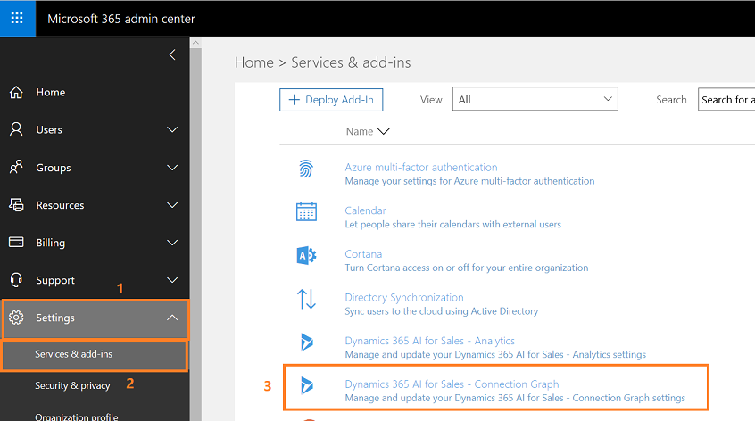
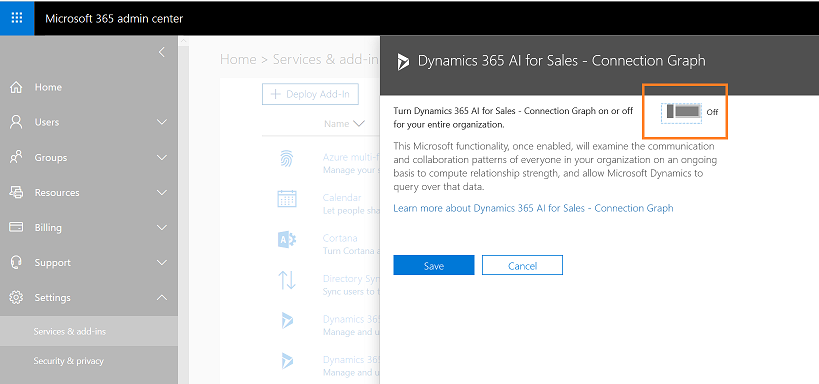
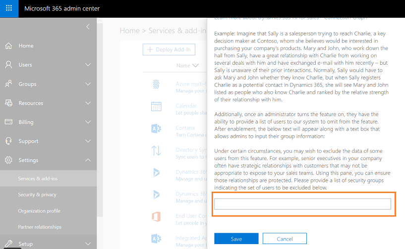
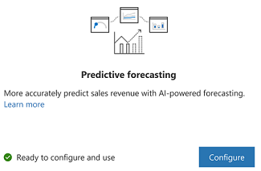
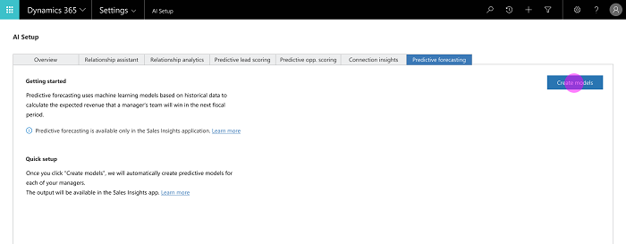
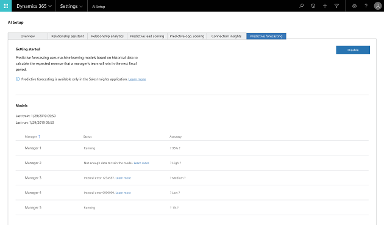

# Enable and configure Dynamics 365 Sales Inisghts capabilities for sellers

<!--Applies to [!INCLUDE[pn_dynamics_crm](../includes/pn-dynamics-crm.md)] (online), version 9.1.0-->

> [!IMPORTANT]
> - Dynamics 365 Sales Insights capabilities for sellers requires [!INCLUDE[pn-dyn-365-sales](../includes/pn-dyn-365-sales.md)] 9.1.0.35 and above. Support for higher versions will be available in future releases.
> - The feature **Who knows who** and exchange data for **Relationship analytics** are available only in North American (NAM) regions.

Enabling and configuring the [!INCLUDE[pn_dynamics_sales_insights](../includes/pn-dynamics-sales-insights.md)] features helps the user to effectively use the [!INCLUDE[pn_dynamics_sales_insights](../includes/pn-dynamics-sales-insights.md)]. The [!INCLUDE[pn_dynamics_sales_insights](../includes/pn-dynamics-sales-insights.md)] contains the following features:

- Relationship analytics
- Predictive lead scoring
- Predictive opportunity scoring
- Notes analysis
- Talking points
- Who knows whom
- Predictive forecasting  

## GDPR

To learn about [!INCLUDE[pn_dynamics_sales_insights](../includes/pn-dynamics-sales-insights.md)] related **General Data Protection Regulation (GDPR)**, see [Dynamics 365 Sales Insights and GDPR](embedded-intelligence-gdpr.md).

## Prerequisites

Review the following requirements before you enable and configure the [!INCLUDE[pn_dynamics_sales_insights](../includes/pn-dynamics-sales-insights.md)] feature:

- You must purchase a **Dynamics 365 Sales Insights** license to use [!INCLUDE[pn_dynamics_sales_insights](../includes/pn-dynamics-sales-insights.md)] features.
- You must be a [!INCLUDE[pn-dyn-365-sales](../includes/pn-dyn-365-sales.md)] administrator.
- Exchange email server is configured, and mailbox is enabled using **Email Configurations** in Settings. [!INCLUDE[proc_more_information](../includes/proc-more-information.md)] [System Settings dialog box - Email tab](/dynamics365/customer-engagement/admin/system-settings-dialog-box-email-tab).
- If you want to use LinkedIn data for Relationship analytics, verify that the LinkedIn solution is installed in [!INCLUDE[pn-dyn-365-sales](../includes/pn-dyn-365-sales.md)] and write back from LinkedIn Sales navigator is enabled.

## Enable Dynamics 365 Sales Insights features

[!INCLUDE[pn_dynamics_sales_insights](../includes/pn-dynamics-sales-insights.md)] features are not available by default. You must enable these features by selecting an organization. Follow these steps:

1. Go to **Settings** > **Sales AI**. 
1. On the **AI setup** page, select **Get it now**. 
    > [!div class="mx-imgBorder"]
    >  
1. On the **Sales Insights** installation page, carefully read and select the terms and conditions, and then select **Continue**. 
   The installation takes a few minutes to complete, and then the status appears in the status bar. 
    > [!div class="mx-imgBorder"]
    > 
   
    Status of installation is displayed. When complete, you're ready to configure [!INCLUDE[pn_dynamics_sales_insights](../includes/pn-dynamics-sales-insights.md)] features.
    
    > [!div class="mx-imgBorder"]
    > 

## Configure Relationship analytics

Relationship analytics provides graphical representation of KPIs and activity histories for any contact, opportunity, lead or account to the users. To configure Relationship analytics, follow these steps:

1. Go to **Settings** > **Sales AI**. 
2. On the **Overview** tab, select **Configuration** from the **Relationship analytics** section. 
    > [!div class="mx-imgBorder"]
    > 

   > [!NOTE]
   > You can also select the **Relationship analytics** tab.

   The configuration page opens.
3. Read and accept the Relationship analytics terms and conditions, and then select **Begin Setup**.

    > [!div class="mx-imgBorder"]
    >  
4. On the **Relationship analytics** page, configure the parameters as described in the following table.

    |**Parameter**|**Description**|
    |-|-|
    |**Data Sources**|**CRM Activities:** If enabled, all historical data from [!INCLUDE[pn-dyn-365-sales](../includes/pn-dyn-365-sales.md)] is ingested for computation in Relationship analytics. **LinkedIn:** If enabled, the data from LinkedIn will be ingested for KPI and health computation. By default, the option is enabled when LinkedIn is installed in [!INCLUDE[pn-dyn-365-sales](../includes/pn-dyn-365-sales.md)].  **Note**: This option is not available if LinkedIn is not installed in [!INCLUDE[pn-dyn-365-sales](../includes/pn-dyn-365-sales.md)]. **Exchange Data:** If enabled, 30 days of data from Exchange is ingested for KPI and health computation. Exchange connector ingests three days of data per day until the last 30 days of data is complete.|
    |**Relationship Health Score**|Businesses place different emphasis on the type of communication used with customers. You can modify the importance of activities of different types as they contribute to the relationship health score.|
    |**Communications Frequency**|Businesses have varying sales cycles and different expected levels of communications with customers. A longer expected communications frequency reduces the expectation of more recent frequent communications in the health score. A shorter expected communications frequency increases the expectation of more recent frequent communications in the health score.|
    > [!div class="mx-imgBorder"]
    >  
5. Select **Save**. 
   Relationship analytics is configured and ready to use in your organization.

Enable the **Dynamics 365 Sales Insights – Analytics** option in the admin center to collect valuable information regarding communications, such as emails and meetings for users in your organization from Exchange server. This data is used in analytics features for salespeople and sales managers. When you enable this, the **Exchange Data** option on the relationship analytics configuration page is automatically selected.  

To enable Dynamics 365 Sales Insights – Analytics, follow these steps: 

1. Go to the **Admin** center. 
    > [!div class="mx-imgBorder"]
    >  

2. Select **Settings** > **Services & add-ins** > **Dynamics 365 Sales Insights – Analytics**. 
    > [!div class="mx-imgBorder"]
    >  

3. Read the description and configure the Dynamics 365 Sales Insights – Analytics settings as **on** and select **Save**. 
    > [!div class="mx-imgBorder"]
    >  

    Now you can connect to the Exchange server to collect data.

> [!NOTE]
> For more information about Relationship analytics and how it can help your users, see [View customer activity history](../sales/relationship-analytics.md).

## Configure Predictive lead scoring

Predictive lead scoring helps users to focus on revenue generation efforts by providing scores to prioritize efforts on quality leads. To configure Predictive lead scoring, follow these steps:

1. Go to **Settings** > **Sales AI**. 
2. On the **Overview** tab, select **Configuration** from the **Predictive lead scoring** section.
    > [!div class="mx-imgBorder"]
    >  

   > [!NOTE]
   > You can also select the **Predictive lead scoring** tab.

   The configuration page opens.
3. Select **Create Model**.
    > [!div class="mx-imgBorder"]
    >  

   Creating a model takes a few minutes. You will see the progress on the screen. 
1. Verify that the **Prediction Accuracy** score from **Model Outcome** matches your organizational requirements and select **Apply Model**.
    > [!div class="mx-imgBorder"]
    >  
  
    The prediction lead scoring is applied in your organization and users can see the lead scoring in their views under the **Lead Score** column. 
1. (Optional) If you are not satisfied with the **Prediction Accuracy** score, select **Retrain Model** and apply. 
   
   > [!NOTE]
   > We recommend that you train the model once the data is refreshed in your organization for better prediction accuracy scoring.
   
1. If you want to configure the lead score range, enter a minimum value of the range in the **Lead Scoring Range**. 

   When you change lead score range for a grade, the preceding grade's maximum range value changes automatically depending on the changed minimum grade value. For example, when you change the minimum range value score for **Grade A** to 51, the maximum lead score range for **Grade B** changes to 50.
   
    > [!div class="mx-imgBorder"]
    >  
1. Save and apply the model. 
   The predictive lead scoring is configured and ready to use in your organization.

> [!NOTE]
> For more information about Predictive lead scoring and how it can help your users, see [Convert leads into opportunities](../sales/work-predictive-lead-scoring.md).

## Configure Predictive opportunity scoring

Predictive opportunity scoring helps users to focus on revenue generation efforts by providing scores to prioritize efforts on quality opportunities. To configure Predictive opportunity scoring, follow these steps:

1. Go to **Settings** > **Sales AI**. 
1. On the **Overview** tab, select **Configuration** from the **Predictive opportunity scoring** section.

    > [!div class="mx-imgBorder"]
    > 

   > [!NOTE]
   > You can also select the **Predictive opportunity scoring** tab.

   The configuration page opens.
1. Select **Create Model**.

    > [!div class="mx-imgBorder"]
    > 

   Creating a model takes few minutes. You will see the progress on the screen. 
1. Verify that the **Prediction Accuracy** score from **Model Outcome** matches your organizational requirements and select **Apply Model**.

    > [!div class="mx-imgBorder"]
    >  
    The prediction opportunity scoring is applied in your organization and users can see the opportunity scoring in their views under the **Opportunity Score** column. 
1. (Optional) If you are not satisfied with the **Prediction Accuracy** score, select **Retrain Model** and apply. 
   > [!NOTE]
   > We recommend that you train the model once the data is refreshed in your organization for better prediction accuracy scoring.
1. If you want to configure the opportunity score range, enter a minimum value of the range in the Opportunity Scoring Range. 

   When you change the opportunity score range for a grade, the preceding grade's maximum range value changes automatically depending on the changed minimum grade value. For example, when you change a minimum range value score for **Grade A** to 70, the maximum opportunity score range for **Grade B** changes to 69. 
   > [!div class="mx-imgBorder"]
   >  
1. Save and apply the model. 
   The predictive opportunity scoring is configured and ready to use in your organization.

> [!NOTE]
> For more information about Predictive opportunity scoring and how it can help your users, see [Convert opportunities into deals](../sales/work-predictive-opportunity-scoring.md).

## Configure Notes analysis

To help users with intelligent auto-suggestions when they enter notes regarding a recent meeting or discussion with a customer in [!INCLUDE[pn-dyn-365-sales](../includes/pn-dyn-365-sales.md)], enable Notes analysis.

1. Go to **Settings** > **Sales AI**. 
2. After you enable the [!INCLUDE[pn_dynamics_sales_insights](../includes/pn-dynamics-sales-insights.md)] features, select the toggle button to enable **Notes analysis**.

    > [!div class="mx-imgBorder"]
    > 

> [!NOTE]
> For more information about Notes analysis and how it can help your users, see [How Notes analysis assists you with intelligent suggestion](notes-analysis.md).

## Configure Talking points

The Talking points feature is available under the Connection insights configuration page. This feature helps users in your organization to quickly establish communications with customers.

1. Go to **Settings** > **Sales AI**. 
2. On the **Overview** tab, select **Configuration** from **Connection insights** section.
    > [!div class="mx-imgBorder"]
    > 

   > [!NOTE]
   > You can also select the **Connection insights** tab.
  
   The configuration page opens. 
3. On the **Talking points** section, select **Turn on Talking points for your organization**. 
    The categories are automatically selected. 
    > [!div class="mx-imgBorder"]
    > 
        
    > [!NOTE]
    > You can select only the categories that meet your organizational requirements.
4. Select **Save**. 
    The Talking points feature is configured and ready to use in your organization.
    
> [!NOTE]
> For more information about Talking points, see [Know conversation starters for your customers](../sales/talking-points.md).

## Configure Who knows whom

The Who knows whom feature is available under the Connection insights configuration page. This feature help users to quickly identify colleagues within their organization who can introduce them to leads or contacts.

1. Go to **Settings** > **Sales AI**. 
2. On the **Overview** tab, select **Configuration** from the **Connection insights** section.
    > [!div class="mx-imgBorder"]
    > 

   > [!NOTE]
   > You can also select the **Connection insights** tab.
  
   The configuration page opens.
3. On the **Who knows whom** section, select **Turn on Who Knows Whom for your organization**. 
    > [!div class="mx-imgBorder"]
    > 
        
4. Optionally, you can select the **Email template** according to your organizational requirements. By default, an out-of-the-box email template will be selected.
5. Select **Save**. 
   The Who knows whom feature is configured and ready to use in your organization. 

After you enable the Who knows whom feature in your organization, verify that the connection graph is enabled in the admin center. This allows [!INCLUDE[pn-dyn-365-sales](../includes/pn-dyn-365-sales.md)] to collect the communication and collaboration details of users from Exchange server. 
> [!NOTE]
> Contact your Office 365 administrator to enable the Dynamics 365 Sales Insights connection graph if you don't have sufficient privileges to enable. 
 
To configure the Dynamics 365 Sales Insights connection graph, follow these steps: 

1. Go to the **Admin** center. 
    > [!div class="mx-imgBorder"]
    >  
2. Select **Settings** > **Services & add-ins** > **Dynamics 365 Sales Insights – Connection Graph**. 
    > [!div class="mx-imgBorder"]
    >  
3. Read the description and configure the Dynamics 365 Sales Insights – Connection Graph settings as **on**. 
    > [!div class="mx-imgBorder"]
    >  
4. (Optional) If you don't want to collect information on a group of users in your organization, add the group ID in the text box.  
    > [!div class="mx-imgBorder"]
    >  
5. Select **Save**.

> [!NOTE]
> For more information about Who knows whom, see [Get introduced to lead](../sales/who-knows-whom.md)

## Preview: Configure Predictive forecasting 

Predictive forecast helps sales managers make timely decisions in generating revenue by viewing the predictive forecast report. The report displays the predictive forecasting revenue against the actual revenue that is generated based on the historical opportunities. 

### Prerequisites 

Review the following prerequisites before enabling Predictive forecasting:

- [!INCLUDE[pn_dynamics_sales_insights](../includes/pn-dynamics-sales-insights.md)] is enabled. To learn more, see [Enable Dynamics 365 Sales Insights features](#enable-dynamics-365-sales-insights-features).
- [!INCLUDE[pn_dynamics_sales_insights](../includes/pn-dynamics-sales-insights.md)] app is configured for your organization. To learn more, see [Unlock sales potential with Dynamics 365 Sales Insights](../sales/dynamics365-sales-insights-app.md).
- The organization has at least 36 weeks of historical opportunities. This helps in generating a model to display the predictive forecasting in the [!INCLUDE[pn_dynamics_sales_insights](../includes/pn-dynamics-sales-insights.md)] app. However, we recommend you have two years of historical opportunities data for increased prediction accuracy.
- The fiscal period is configured as monthly or quarterly for your organization. To learn more, see [Work with fiscal year settings](/dynamics365/customer-engagement/admin/work-fiscal-year-settings). Predictive forecasting will not work if the fiscal period is defined for half-yearly or yearly.
- Verify that the proper manager hierarchy is defined for you, and that sales reps or individuals are added to it. To learn more, see [Set up manager and position hierarchies](/dynamics365/customer-engagement/admin/hierarchy-security#set-up-manager-and-position-hierarchies).

### Set up Predictive forecasting

1.	Go to **Settings** > **Sales AI**. 
2.	On the **Overview** tab, select **Configuration** from the **Predictive forecasting** section. 
    > [!div class="mx-imgBorder"]
    > 

    The configuration page opens. 
3. Select **Create model**. 
    > [!div class="mx-imgBorder"]
    > 

    The feature will take approximately 24 hours to create a model and display data for managers. The model will be retrained every seven days to project a better prediction accuracy. 
    The Predictive forecasting feature creates a model for each manager who is an active member in the Sales Insights app in your organization and displays as a list with the status of the model. 
    > [!div class="mx-imgBorder"]
    > 

    The Predictive forecasting model is created and ready to use in your organization.
    
### Troubleshooting

**Inernal error occurs while creating the model**

This error may occur due to insufficient data in your organization for Predictive Forecasting to generate a model. Verify that you have sufficient opportunities data in your organization and regenerate the model. If the error presists contact Microsoft support.

> [!NOTE]
> For more information about Predictive forecasting, see [Predictive forecast](../sales/d365-ai-business-performance.md#preview-predictive-forecast).

<!--
### (Optional) Uninstall the Sales insights add-on

If you don't want to use the Sales insights add-on features for your organization, you can uninstall them. You need to uninstall each feature individually. To uninstall these features:

1.	Go to **Settings** > **Customization** > **Solutions**.

    A list of solutions that are installed in your organization is displayed.
2. Select **RelationshipAnalytics**, and then select **Delete**. 
   > [!div class="mx-imgBorder"]
   >   
3. A confirmation message is displayed. Select **OK**. 

   Relationship analytics is uninstalled from your organization. 
4. Similarly, repeat step 2 and 3 for **PredictiveLeadScoring** and **SalesInsightsAddOn**.

    > [!NOTE]
    > If you want to install the Sales insights add-on in the future, make sure that you uninstall the **SalesInsightsAddOn** package after uninstalling Relationship analytics and Predictive lead scoring.
-->

## Privacy notice  

For specific privacy information about Dynamics 365 Sales Insights capabilities for sellers, see [Privacy notice](privacy-notice-seller.md).

### See also

- [Opt out of relationship analytics (GDPR)](optout-relationship-analytics-gdpr.md)
- [GDPR for Sales insights add-on](embedded-intelligence-gdpr.md)
- [View and export KPI data (GDPR)](view-export-KPI-data-gdpr.md)
- [Retrieve insights data using msdyn_RetrieveTypeValuesFromDCI action](retrieve-insights-data-msdyn-RetrieveTypeValuesFromDCI.md)
