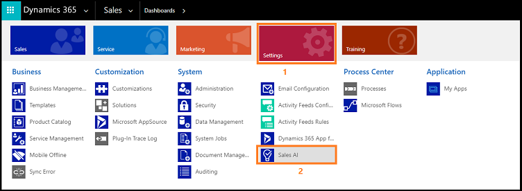
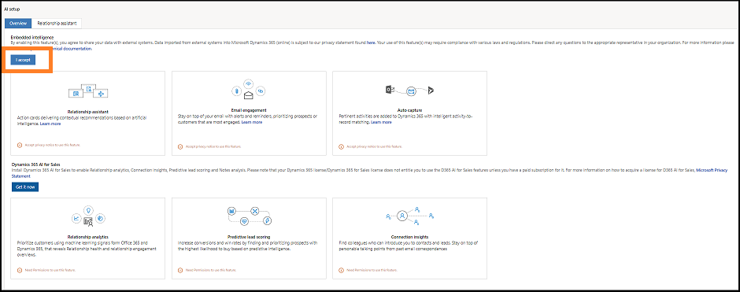
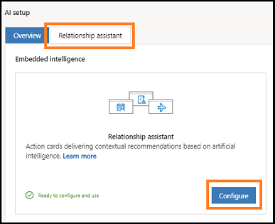
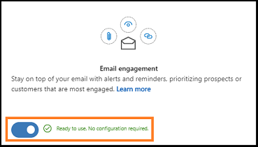
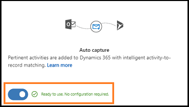

# Configure and enable embedded intelligence

Applies to Dynamics 365 (online), version 9.0.2

   

## Requirements and prerequisites  
There are some feature restrictions depending on which versions of [!INCLUDE[pn_dynamics_crm](../includes/pn-dynamics-crm.md)] and [!INCLUDE[pn_Microsoft_Exchange](../includes/pn-microsoft-exchange.md)] you're running, as detailed in the following table.  

|Product version|Available embedded intelligence features|
|--|--|
| [!INCLUDE[pn_crm_8_2_0_online](../includes/pn-crm-8-2-0-online.md)] with [!INCLUDE[pn_Microsoft_Exchange_Online](../includes/pn-microsoft-exchange-online.md)] | <ul><li>Relationship assistant</li> <li>Email engagement</li> <li>Auto capture</li></ul>|
| [!INCLUDE[pn_crm_8_2_0_online](../includes/pn-crm-8-2-0-online.md)] with [!INCLUDE[pn_Microsoft_Exchange](../includes/pn-microsoft-exchange.md)] (on-premises) | <ul><li>Relationship assistant (not including cards for [!INCLUDE[pn_Exchange](../includes/pn-exchange.md)])</li> <li>Email engagement</li></ul>|
|[!INCLUDE[pn_crm_8_2_0_op_subsequent](../includes/pn-crm-8-2-0-op-subsequent.md)]| <ul><li>Only Relationship assistant is available, and only its <em>base cards</em> are supported. [!INCLUDE[proc_more_information](../includes/proc-more-information.md)] [Action cards reference](action-cards-reference.md)</li> <li>No features or action cards are available for [!INCLUDE[pn_Exchange](../includes/pn-exchange.md)], so your [!INCLUDE[pn_Exchange](../includes/pn-exchange.md)] version isn't important.</li></ul> |

## How to enable embedded intelligence 
As a [!INCLUDE[pn_dynamics_crm](../includes/pn-dynamics-crm.md)] administrator, you can enable embedded intelligence for your organization to:
- Enable and configure features such as Relationship assistant, Email engagement, and Auto capture.  
- Install Sales insights add-on for preview. 

> [!IMPORTANT]
> Embedded intelligence provides features that track behavior and collect information about contacts. Make sure you understand the related privacy issues that these features raise and enable the features only if you're certain that they don't violate any privacy policies already in place in your organization. Always take steps to protect the privacy of your contacts. 

To enable the embedded intelligence:

1. Go to **Settings** > **Intelligence Configuration**. 
  
2. On the **Overview** tab, select **I Accept** to accept the privacy statement for **Embedded intelligence**. 
  

Embedded intelligence is enabled for your organization and you can configure features such as Relationship assistant, Email engagement, and Auto capture.

>[!NOTE]
> After you accept privacy notes of all embedded intelligence features, they're available on a single settings page, which provides a tab for each feature.

## Enable and configure Relationship assistant

To enable cards such as task due today, custom activity due today, and email due today to users in your organization, you can configure Relationship assistant. 
Also, you can enable notes analysis that helps users to take actions on highlighted text on cards.

> [!IMPORTANT]
> By enabling this feature, you consent to share data about your customers' email activity with an external system. Data imported from external systems into [!INCLUDE[pn_dynamics_crm](../includes/pn-dynamics-crm.md)] are subject to our privacy statement.

For complete details about each available action card, including details about the configuration settings available for each of them and other details, see [Action cards reference](action-cards-reference.md).  

### Prerequisites
Assign user privileges to give access to the Relationship assistant features. The privileges required to access embedded intelligence features are automatically enabled for all out-of-the-box security roles, but they're initially disabled for all custom roles. If you enable any embedded intelligence features, you must check the settings listed in the following table to help ensure that your users can access those features, and to help ensure that other features don't stop working because of privilege cascades related to these features.

|Privilege| Security role tab |Description and requirements|
|--|--|--|
|**Action Card**| **Core Records**  |Gives the ability to view and interact with action cards that are generated by Relationship assistant. **Warning:** If Relationship assistant is enabled, all users *must* have a role with read access for this privilege. Because of cascading, users without this privilege will lose access to many [!INCLUDE[pn_dynamics_crm](../includes/pn-dynamics-crm.md)] features when Relationship assistant is enabled.|
| **Action Card User Settings** | **Core Records**  | Gives the ability to view and change user preferences for action cards that are generated by Relationship assistant. **Warning:** If Relationship assistant is enabled, all users *must* have a role with read access for this privilege. Because of cascading, users without this privilege will lose access to many [!INCLUDE[pn_dynamics_crm](../includes/pn-dynamics-crm.md)] features when Relationship assistant is enabled. |

[!INCLUDE[proc_more_information](../includes/proc-more-information.md)] [Security roles and privileges](/dynamics365/customer-engagement/admin/security-roles-privileges)  

### How to configure Relationship assistant

1. Go to **Settings** > **Intelligence Configuration**.
2. To open the Relationship assistant configuration page, select **Configure** on the **Relationship assistant** tile or select the **Relationship assistant** tab. 
         
3. Configure which cards to use in your organization and fine tune their behavior. Work with these settings as follows:
   - Cards are categorized by type, such as **Base** and **Advanced**.
   - Enable or disable specific action cards as needed by using the check boxes provided for each card.
   - Some cards have extra configuration settings that modify their behavior. These settings are provided to the right of the check box for only the relevant cards. 
     
   4.  To enable notes analysis, select **Turn on Notes Analysis for your organization** check box under **Notes Analysis** tile.
   <!-- add image -->
4. On top of the page, select **Save** to save your settings.  

Users can also set their own personal preferences for their action cards. They can't add cards that you disable here, but they can disable cards that you have enabled if they don't find them useful. They can also change the configuration settings for those cards that have them, though your settings will be the defaults. [!INCLUDE[proc_more_information](../includes/proc-more-information.md)] [Relationship assistant](relationship-assistant.md)

## Enable Email engagement
Enabling the Email engagement helps the user in your organization to receive alerts and reminders that help build customer relationships.
> [!NOTE]
> If you enable Email engagement, we strongly recommend that you also enable Relationship assistant, because Email engagement relies on some of its features.
> 
> [!IMPORTANT]
> By enabling this feature, you consent to share data about your customers' email activity with an external system. Data imported from external systems into  [!INCLUDE[pn_dynamics_crm](../includes/pn-dynamics-crm.md)] are subject to our privacy statement.

### Prerequisites
Verify the following prerequisites before enabling Email engagement for your organization:
- To use followed email attachments, [!INCLUDE[pn_onedrive_for_business](../includes/pn-onedrive-for-business.md)] must be available to your [!INCLUDE[pn_dynamics_crm](../includes/pn-dynamics-crm.md)] server. [!INCLUDE[proc_more_information](../includes/proc-more-information.md)] [Enable OneDrive for Business](/dynamics365/customer-engagement/admin/enable-onedrive-for-business.md)  
- To use followed email attachments, you must also enable document management for email in [!INCLUDE[pn_dynamics_crm](../includes/pn-dynamics-crm.md)]. [!INCLUDE[proc_more_information](../includes/proc-more-information.md)] [Enable SharePoint document management for specific entities](/dynamics365/customer-engagement/admin/enable-sharepoint-document-management-specific-entities.md)  
- To enable delivery-time recommendations based on recipients' time zones, you must enable [!INCLUDE[pn_bing_maps](../includes/pn-bing-maps.md)] in [!INCLUDE[pn_dynamics_crm](../includes/pn-dynamics-crm.md)]. [!INCLUDE[proc_more_information](../includes/proc-more-information.md)] [System Settings dialog box - General tab](/dynamics365/customer-engagement/admin/system-settings-dialog-box-general-tab.md)  

### How to enable Email engagement

1.  Go to **Settings** > **Intelligence Configuration**.
2.  Select **Grant Permissions**.  
    > [!NOTE]
    > If the Sales insights add-on is installed using Intelligence Configuration, this step will be skipped. You don't have to grant permissions to Email engagement. 

    Email engagement is enabled and ready to use in your organization.  

    > [!NOTE]
    > To enable or disable **Email engagement**, use the **Enable** toggle key. 
    >   

## Enable Auto capture

 To help users in your organization to automatically add relative activities of their customers to [!INCLUDE[pn_dynamics_crm](../includes/pn-dynamics-crm.md)], enable Auto capture.

> [!IMPORTANT]
> By enabling this feature, you consent to share data about your customers' email activity with an external system. Data imported from external systems into  [!INCLUDE[pn_dynamics_crm](../includes/pn-dynamics-crm.md)] are subject to our privacy statement.

### Prerequisites

Verify the following prerequisites before enabling Auto capture for your organization: 
- You must use [!INCLUDE[pn_Microsoft_Exchange_Online](../includes/pn-microsoft-exchange-online.md)] as your email server. 
- Users must use the web client for [!INCLUDE[pn_crm_online_shortest](../includes/pn-crm-online-shortest.md)] (other front ends aren't supported).  
- For each user that requires access to this feature, you must approve their email address to allow queries against [!INCLUDE[pn_Exchange](../includes/pn-exchange.md)] (requires tenant-level admin privileges). [!INCLUDE[proc_more_information](../includes/proc-more-information.md)] [Approve email](/dynamics365/customer-engagement/admin/connect-exchange-online#approve-email) 
- To track incoming email messages, you must set up server-side synchronization. [!INCLUDE[proc_more_information](../includes/proc-more-information.md)] [Set up server-side synchronization of email, appointments, contacts, and tasks](/dynamics365/customer-engagement/admin/set-up-server-side-synchronization-of-email-appointments-contacts-and-tasks)  

### How to enable Auto capture
After you accept the privacy statement for embedded intelligence, Auto capture is enabled by default. If it's not enabled, select the toggle button to enable Auto capture. 

>[!NOTE]
> For more information about Auto capture and how it can help your users, see [Auto capture](auto-capture.md)

### See also

-  [Guide customer communications](relationship-assistant.md)
-  [View message interactions](email-engagement.md)
-  [Display emails](auto-capture.md)