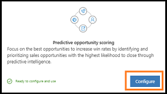
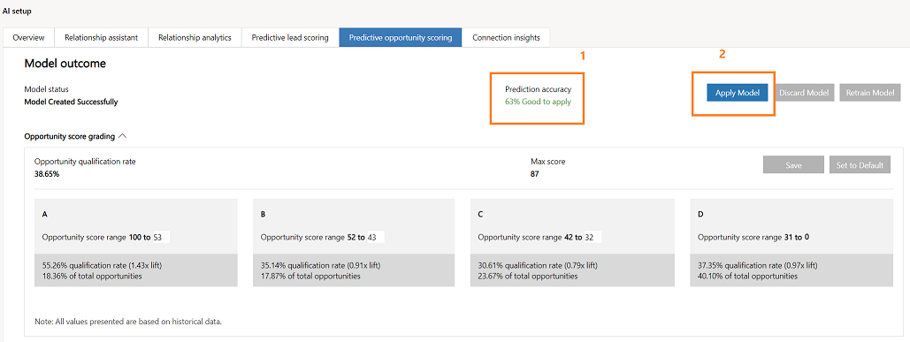

# Preview feature: Enable and configure [!INCLUDE[pn_dynamics_crm](../includes/pn-dynamics-crm.md)] AI for Sales

Applies to [!INCLUDE[pn_dynamics_crm](../includes/pn-dynamics-crm.md)] (online), version 9.0.2

Enabling and configuring the [!INCLUDE[pn_dynamics_crm](../includes/pn-dynamics-crm.md)] AI for Sales features helps the user to effectively use the [!INCLUDE[pn_dynamics_crm](../includes/pn-dynamics-crm.md)] AI for Sales app. The [!INCLUDE[pn_dynamics_crm](../includes/pn-dynamics-crm.md)] AI for Sales contains the following features:

- Relationship analytics
- Predictive lead scoring
- Predictive opportunity scoring
- Notes analysis
- Connection insights

## GDPR

To know about [!INCLUDE[pn_dynamics_crm](../includes/pn-dynamics-crm.md)] AI for Sales related **General Data Protection Regulation (GDPR)**, see [Embedded Intelligence and GDPR](embedded-intelligence-gdpr.md).

## Prerequisites

Review the following requirements before you enable and configure [!INCLUDE[pn_dynamics_crm](../includes/pn-dynamics-crm.md)] AI for Sales feature:

- You must be a [!INCLUDE[pn_dynamics_crm](../includes/pn-dynamics-crm.md)] administrator.
- You must enable **Embedded intelligence**. [!INCLUDE[proc_more_information](../includes/proc-more-information.md)] [How to enable embedded intelligence](configure-enable-embedded-intelligence.md#how-to-enable-embedded-intelligence).
- Exchange email server is configured, and mailbox is enabled using **Email Configurations** in Settings. [!INCLUDE[proc_more_information](../includes/proc-more-information.md)] [System Settings dialog box - Email tab](/dynamics365/customer-engagement/admin/system-settings-dialog-box-email-tab).
- If you want to use LinkedIn data for Relationship analytics, verity that LinkedIn solution is installed in [!INCLUDE[pn_dynamics_crm](../includes/pn-dynamics-crm.md)] and write back from LinkedIn Sales navigator is enabled.

## Enable [!INCLUDE[pn_dynamics_crm](../includes/pn-dynamics-crm.md)] AI for Sales features

[!INCLUDE[pn_dynamics_crm](../includes/pn-dynamics-crm.md)] AI for Sales features are not available by default. You must enable these features by selecting an organization. Follow these steps:

1. On the **AI setup** page, select **Get it now**. 
    
2. On the **Sales Insights** installation page, carefully read and select the terms and conditions, and then select **Continue**. 
   The installation takes a few minutes to complete, and then the status appears in the status bar. 
    
   Status of installation is displayed. When complete, you're ready to configure [!INCLUDE[pn_dynamics_crm](../includes/pn-dynamics-crm.md)] AI for Sales features.

## Configure Relationship analytics

Relationship analytics provides graphical representation of KPIs and activity histories for any contact, opportunity, lead or account to the users. To configure Relationship analytics, follow these steps:

1. Go to **Settings** > **Setup AI**. 
2. On the **Overview** tab, select **Configuration** from **Relationship analytics** section. 
    
   > [!NOTE]
   > You can also select **Relationship analytics** tab.

   The configuration page opens.
3. Read and accept the Relationship analytics terms and conditions, and then select **Begin Setup**. 
    
4. On the **Relationship analytics** page, configure the parameters as described in the following table.

    |**Parameter**|**Description**|
    |-|-|
    |**Data Sources**|**CRM Activities:** If enabled, all historical data from [!INCLUDE[pn_dynamics_crm](../includes/pn-dynamics-crm.md)] is ingested for computation in Relationship analytics. **LinkedIn:** If enabled, the data from LinkedIn will be ingested for KPI and health computation. by default, the option is enabled when LinkedIn is installed in [!INCLUDE[pn_dynamics_crm](../includes/pn-dynamics-crm.md)]. Note: This option is not available if LinkedIn is not installed in [!INCLUDE[pn_dynamics_crm](../includes/pn-dynamics-crm.md)]. **Exchange Data:** If enabled, 30 days of data from Exchange is ingested for KPI and health computation. Exchange connector ingests three days of data per day until the last 30 days of data is complete.|
    |**Relationship Health Score**|Businesses place different emphasis on the type of communication used with customers. You can modify the importance of activities of different types as they contribute to the relationship health score.|
    |**Communications Frequency**|Businesses have varying sales cycles and different expected levels of communications with customers. A longer expected communications frequency reduces the expectation of more recent frequent communications in the health score. A shorter expected communications frequency increases the expectation of more recent frequent communications in the health score.| 
    
5. Select **Save**. 
   Relationship analytics is configured and ready to use in your organization.

## Configure Predictive lead scoring

Predictive lead scoring provides helps users to focus on revenue generation efforts by providing score to prioritize efforts on quality leads. To configure Predictive lead scoring, follow these steps:

1. Go to **Settings** > **Setup AI**. 
2. On the **Overview** tab, select **Configuration** from **Predictive lead scoring** section. 
    
   > [!NOTE]
   > You can also select **Predictive lead scoring** tab.

   The configuration page opens.
3. Select **Create Model**. 
    
   Creating a model takes few minutes and you can see progress on the screen. 
4. Verify that the **Prediction Accuracy** score from **Model Outcome** matches your organizational requirements and select **Apply Model**. 
    
   The prediction lead scoring is applied in your organization and users can see the lead scoring in their views under **Lead Score** column. 
5. (Optional) If you are not satisfied with the **Prediction Accuracy** score, select **Retrain Model** and apply. 
   > [!NOTE]
   > We recommend you to train the model once the data is refreshed in our organization for better prediction accuracy scoring.
6. If you want to configure the lead score range, enter minimum value of the range in the Lead Scoring Range. 
   When you change lead score range for a grade, the preceding grade's maximum range value changes automatically depending on the changed minimum grade value. For example, when you change minimum range value score for **Grade A** to 51, the maximum lead score range for Grade B changes to 50. 
    
7. Save and apply the model. 
   The predictive lead scoring is configured and ready to use in your organization.

## Configure Predictive opportunity scoring

Predictive opportunity scoring provides helps users to focus on revenue generation efforts by providing score to prioritize efforts on quality opportunities. To configure Predictive opportunity scoring, follow these steps:

1. Go to **Settings** > **Setup AI**. 
2. On the **Overview** tab, select **Configuration** from **Predictive opportunity scoring** section. 
     <!--image should be added-->
   > [!NOTE]
   > You can also select **Predictive opportunity scoring** tab.

   The configuration page opens.
3. Select **Create Model**. 
    <!--image should be added-->
   Creating a model takes few minutes and you can see progress on the screen. 
4. Verify that the **Prediction Accuracy** score from **Model Outcome** matches your organizational requirements and select **Apply Model**. 
    <!--image should be added-->
   The prediction opportunity scoring is applied in your organization and users can see the opportunity scoring in their views under **Lead Score** column. 
5. (Optional) If you are not satisfied with the **Prediction Accuracy** score, select **Retrain Model** and apply. 
   > [!NOTE]
   > We recommend you to train the model once the data is refreshed in our organization for better prediction accuracy scoring.
6. If you want to configure the opportunity score range, enter minimum value of the range in the Opportunity Scoring Range. 
   When you change opportunity score range for a grade, the preceding grade's maximum range value changes automatically depending on the changed minimum grade value. For example, when you change minimum range value score for **Grade A** to 51, the maximum opportunity score range for Grade B changes to 50. 
    <!--image should be added-->
7. Save and apply the model. 
   The predictive opportunity scoring is configured and ready to use in your organization.

## Configure Notes analysis

To help users with intelligent auto suggestions when they enter notes regarding a recent meeting or discussion with customer in [!INCLUDE[pn_dynamics_crm](../includes/pn-dynamics-crm.md)], enable Notes analysis.

1. Go to **Settings** > **Setup AI**. 
2. After you enable [!INCLUDE[pn_dynamics_crm](../includes/pn-dynamics-crm.md)] AI for Sales features, **Notes analysis** is enabled by default. If it's not enabled, select the toggle button to enable **Notes analysis**. 
    <!--image should be added-->

## Configure Connection insights

Connection insights contains the Icebreakes and Who known whom features. These features help users in your organization to quickly establish communications with customers.

1. Go to **Settings** > **Setup AI**. 
2. On the **Overview** tab, select **Configuration** from **Connection insights** section. 
    <!--image should be added--> 
   > [!NOTE]
   > You can also select **Relationship analytics** tab.
  
   The configuration page opens.
3. To configure Who knows whom and Icebreakers, perform the following steps:
   -  **Who knows whom** 
        a. On the **Who knows whom** section, select **Turn on Who Knows Whom for your organization**. 
        <!--Image should be included-->
        b. Optionally, you can select the **Email template** according to your organizational requirements. By default, an out-of-the-box email template will be selected.
        c. Select **Save**. 
        The Who Knows Whom is configured and ready to use in your organization. 
    -  **Icebreakers** 
        a. On the **Icebreakers** section, select **Turn on Icebreakers for your organization**. 
        The categories are automatically selected. 
        <!--Image should be included-->
        > [!NOTE]
        > You can select only the categories that meets your organizational requirements.

        b. Select **Save**. 
        The Icebreakers is configured and ready to use in your organization.

<!--
### (Optional) Uninstall the Sales insights add-on

If you don't want to use the Sales insights add-on features for your organization, you can uninstall them. You need to uninstall each feature individual individually. To uninstall these features:
1.	Go to **Settings** > **Customization** > **Solutions**.
    A list of solutions that are installed in your organization is displayed.
2. Select **RelationshipAnalytics**, and then select **Delete**. 
     
3. A confirmation message is displayed. Select **OK**. 
   The Relation analytics is uninstalled from your organization. 
4. Similarly, repeat step 2 and 3 for **PredictiveLeadScoring** and **SalesInsightsAddOn**.

    > [!NOTE]
    > If you want to install Sales insights add-on in future, makesure that you uninstall the **SalesInsightsAddOn** package too after uninstalling Relationship analytics and Predictive lead scoring.
-->

## Enable Exchange Data

Enabling Exchange Data allows [!INCLUDE[pn_dynamics_crm](../includes/pn-dynamics-crm.md)] to collect valuable information regarding communications, such as emails and meetings for users in your organization from Exchange. To collect this information, you must provide privileges to connect to exchange server through Admin center.

1. Go to **Admin** center. 
     

2. Select **Settings** > **Services & add-ins** > **Dynamics Customer Insights Preview**. 
     

3. Configure the Dynamics Customer Insights Preview to **on** and select **Save**. 
     

    Now you can connect to exchange server to collect data.

### See also

- [Get insights on opportunities, activities, and leads of customers](sales-insights-addon.md)
- [Opt out of relationship analytics (GDPR)](optout-relationship-analytics-gdpr.md)