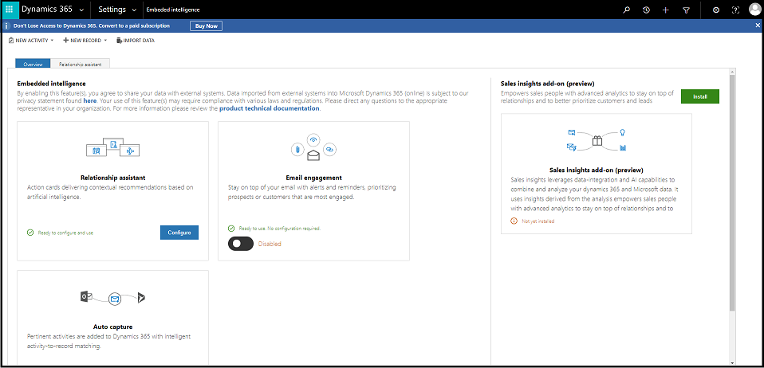
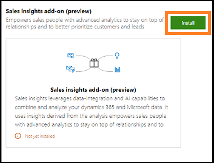
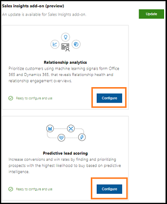
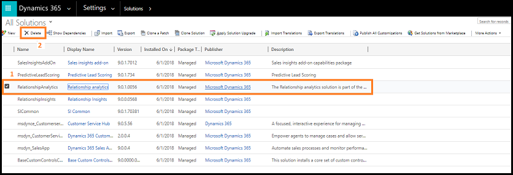
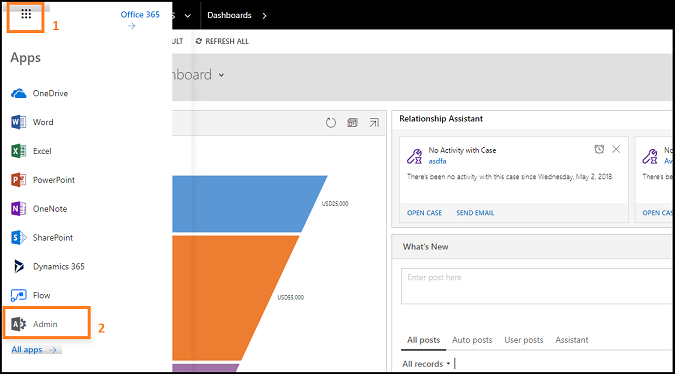
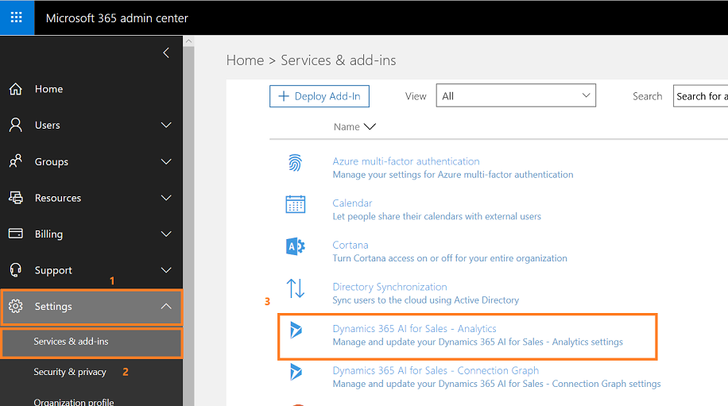
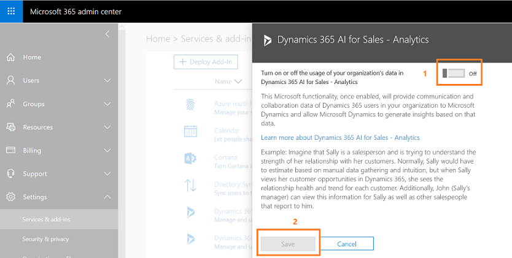

# Preview feature: Install and configure the Sales insights add-on

Applies to Dynamics 365 (online), version 9.0.2

The Sales insights add-on contains Relationship analytics and predictive lead scoring features. These feature isn't available by default. To use this feature, you need to install the Sales insights add-on.  
> [!NOTE]
> To install this feature, you must be a [!INCLUDE[pn_dynamics_crm](../includes/pn-dynamics-crm.md)] administrator.

To understand how Relationship analytics and predictive lead scoring works are used, see [Relationship analytics](relationship-analytics.md) and [Predictive Lead Scoring](work-predictive-lead-scoring.md). 
To know about Sales insights add-on related **General Data Protection Regulation (GDPR)**, see [Embedded Intelligence and GDPR](embedded-intelligence-gdpr.md).

To install and configure Relationship analytics and Predictive lead scoring:
1. [Install the Sales insights add-on](#install-the-sales-insights-add-on).
2. [Configure Relationship analytics](#configure-the-sales-insights-add-on).
3. [(Optional) Uninstall the Sales insights add-on](#optional-uninstall-the-sales-insights-add-on).

### Install the Sales insights add-on 
1.	Go to **Settings** > **Intelligence Configuration**. 
       
      
    > [!NOTE]
    > If you're using embedded intelligence for the first time, enable the features. [!INCLUDE[proc_more_information](../includes/proc-more-information.md)] [How to enable embedded intelligence](#How-to-enable-embedded-intelligence). 
2.  On the **Sales insights add-on** tile, select **Install**.  
      
      
3.	On the **Sales Insights** installation page, carefully read and select the terms and conditions, and then select **Continue**.  
    The installation takes a few minutes to complete, and then the status appears in the status bar. 
      
Now you're ready to configure Relationship analytics and Predictive Lead Scoring.

### Configure the Sales insights add-on

After you install the Sales insights add-on, perform the following steps to configure Relationship analytics and Predictive lead scoring according to the requirements of your organization.

1. On the **Sales insights add-on** installation page, select **Go to Configuration**. 
-OR-   
You can also select **Configuration** on the **Relationship analytics** or **Predective lead scoring** tile, which is on the embedded intelligence **Overview** tab. This option is available only after you install the Sales insights add-on. 
  
The configuration page opens.
2. To configure [Relationship analytics](#RelationshipAnalytics) and [Predictive lead scoring](#PredictiveLeadScoring), perform the following steps: 
**Relationship analytics:** 
   a. Read and accept the Relationship analytics terms and conditions, and then select **Begin Setup**.  
        
   b. On the **Relationship analytics** page, configure the parameters as described in the following table.
      |**Parameter**|**Description**|  
      |---------------------|----------------------------------------------|
      |**Data Sources**|**CRM Activities:** If enabled, all historical data from Dynamics 365 is ingested for computation in Relationship analytics. **Exchange Data:** If enabled, 30 days of data from Exchange is ingested for KPI and health computation. Exchange connector ingests three days of data per day until the last 30 days of data is complete.|  
      |**Relationship Health Score**|Businesses place different emphasis on the type of communication used with customers. You can modify the importance of activities of different types as they contribute to the relationship health score.|  
      |**Communications Frequency**|Businesses have varying sales cycles and different expected levels of communications with customers. A longer expected communications frequency reduces the expectation of more recent frequent communications in the health score. A shorter expected communications frequency increases the expectation of more recent frequent communications in the health score.| 
        
   c. Select **Save**. 
      Relationship analytics is configured and ready to use in your organization.  
**Predictive lead scoring:** 
   a. On the Predictive lead scoring page, select **Create Model**. 
        
      Creating a model takes few minutes and you can see progress on the screen. 
   b. Verify that the **Prediction Accuracy** score from **Model Outcome** matches your organizational requirements and select **Apply Model**. 
      
      The prediction lead scoring is applied in your organization and users can see the lead scoring in their views under **Lead Score** column.  
   c. (Optional) If you are not satisfied with the **Prediction Accuracy** score, select **Retrain Model** and apply. 
   
    > [!NOTE]
    > We recommend you to train the model once the data is refreshed in our organization for better prediction accuracy scoring.
   
   d. If you want to configure the lead score range, enter minimum value of the range in the Lead Scoring Range.
      When you change lead score range for a grade, the preceding grade's maximum range value changes automatically depending on the changed minimum grade value. For example, when you change minimum range value score for **Grade A** to 51, the maximum lead score range for Grade B changes to 50.
      
   e. Save and apply the model.  
    The predictive lead scoring is configured and ready to use in your organization.

### (Optional) Uninstall the Sales insights add-on

If you don't want to use the Sales insights add-on features for your organization, you can uninstall them. You need to uninstall each feature individual individually. To uninstall these features:
1.	Go to **Settings** > **Customization** > **Solutions**.
    A list of solutions that are installed in your organization is displayed.
2. Select **RelationshipAnalytics**, and then select **Delete**. 
     
3. A confirmation message is displayed. Select **OK**. 
   The Relation analytics is uninstalled from your organization. 
4. Similarly, repeat step 2 and 3 for **PredictiveLeadScoring** and **SalesInsightsAddOn**.

    > [!NOTE]
    > If you want to install Sales insights add-on in future, makesure that you uninstall the **SalesInsightsAddOn** package too after uninstalling Relationship analytics and Predictive lead scoring.

## Enable Exchange Data   

Enabling Exchange Data allows [!INCLUDE[pn_dynamics_crm](../includes/pn-dynamics-crm.md)] to collect valuable information regarding communications, such as emails and meetings for users in your organization from Exchange. To collect this information, you must provide privileges to connect to exchange server through Admin center.

1.  Go to **Admin** center.    
    

3.  Select **Settings** > **Services & add-ins** > **Dynamics Customer Insights Preview**.
    

4.  Configure the Dynamics Customer Insights Preview to **on** and select **Save**. 
    

    Now you can connect to exchange server to collect data.

### See also

-  [Get insights on opportunities, activities, and leads of customers](sales-insights-addon.md)
-  [Opt out of relationship analytics (GDPR)](optout-relationship-analytics-gdpr.md)