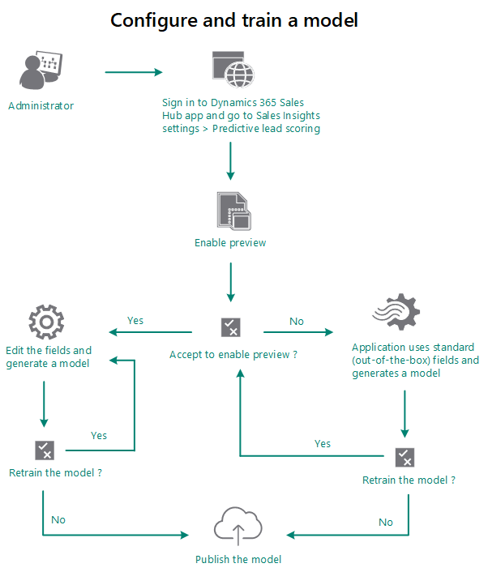
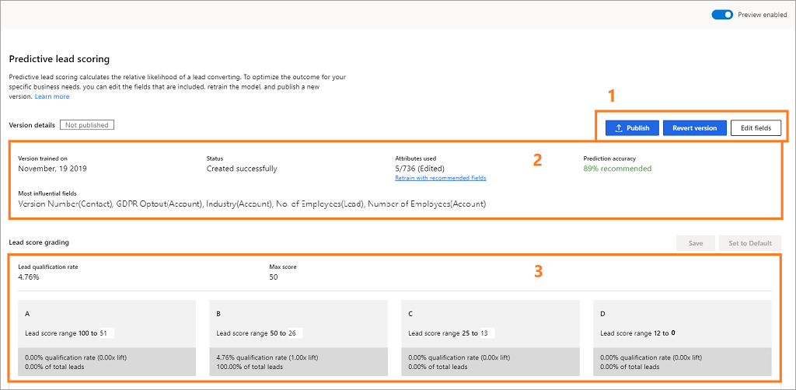
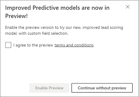

# Configure Predictive lead scoring

Predictive lead scoring helps users to focus on revenue generation efforts by providing scores for the leads based on which users can prioritize their leads. As an administrator, when you configure the predictive lead scoring feature, the system uses standard (out-of-the-box) fields related to leads to generate a model with a score. Using this score, users can do the following:
 
- Identify quality leads and convert them into opportunities.
 
- Spend time on leads that have low scores, and convert them into possible opportunities.

The enhanced predictive lead scoring lets you add custom fields to generate a model for predictive lead scoring that is accurate. The custom fields could be specific to your organization so that you can decide the impact of the outcome. The feature is available as a preview, and you must enable the preview to configure the enhanced model.

The following illustration explains how you can configure the predictive lead scoring:

> [!div class="mx-imgBorder"]
> 

Before we configure the predictive lead scoring, let's under the configuration page after a model is generated.

## Understand configuration page

when a model is generated, the configuration page displays as shown in the following screen shot:

> [!div class="mx-imgBorder"]
> 

| Number | Feature | Description |
|--------|---------|-------------|
|1|Actions you can perform on the model|- **Publish**: The **Publish** button allows you to publish a model to your organization. When published, users in your organization can see **My Open Leads Scored** system view and lead score widget on lead forms. When a model is published this option gets disabled and becomes active only when you retrain or edit the model. - **Revert version**: The Revert version button allows you to return the model to the previous version when the retrained model is not satisfactory or not at an acceptable level of your organization's requirements. This option is available only when you retrain a model.  - **Edit fields**: The **Edit fields** button allows you to update or add the fields that are affecting the prediction accuracy score. To learn more, see [Retrain the model](#retrain-a-model) |
|2|version details|- **Version trained on**: This parameter displays a date that lets you know when the model was last trained. - **Status**: This parameter lets you know if the trained model is created successfully, created with errors, or failed. Depending on the status you can take further steps to resolve the errors and retrain the model. - **Attributes used**: This parameter lets you know the number of attributes (fields) used from the available list to generate the prediction accuracy score for the model. You can select the **Retrain with recommended fields** option to retrain the model with standard (out-of-the-box) attributes if the outcome of the trained model is not satisfactory.  - **Prediction accuracy**: This parameter displays the percentage of the model's accuracy in predicting the leads that could convert into opportunities.  - **Most influential fields**: This parameter displays the top five attributes (fields) that are most affecting the outcome of the prediction accuracy score. |
|3|Lead score grading|- **Lead qualification rate**: .  - **Max score**: .  - **Grading**: When a model is published, the leads that are in your organization's pipeline are graded according to the range defined in this section. Each lead in the pipeline is graded as A, B, C, or D according to the lead score that a lead has and this score is influenced by the attributes that we selected while creating the model. Leads that are graded as A has more chance of converting into opportunities and D being the least. You can configure the range for the grading according to your organizational requirements. When you change lead score range for a grade, the preceding grade's maximum range value changes automatically depending on the changed minimum grade value. For example, when you change the minimum range value score for **Grade A** to 51, the maximum lead score range for **Grade B** changes to 50. |

## Create system default model 

This model is generated based on the standard attributes (fields) that are chosen by the application.  

1. Verify that advanced Sales Insights features are enabled. To learn more, see [Enable and configure advanced Sales Insights features](intro-admin-guide-sales-insights.md#enable-and-configure-advanced-sales-insights-features) 

2.	Go to **Change area** and select **Sales Insights settings**.

    > [!div class="mx-imgBorder"]
    > 

3.  On the sitemap, select **Lead scoring** under **Predictive models**.

    > [!TIP]
    > Alternatively, in the **Sales Insights settings** page, select **Set up** from the **Predictive lead scoring** section to go to configuration page.

    The **predictive lead scoring** configuration page displays.

    > [!div class="mx-imgBorder"]
    > 

4. Select **Get started** and a pop up dialog displays to enable the preview.

    > [!div class="mx-imgBorder"]
    > 

5. Select **Continue without preview**. The application starts generating a model and a notification is displayed on the screen.

    > [!div class="mx-imgBorder"]
    > 

6. After the model is generated, a confirmation notification displays that displays prediction accuracy score and top five fields that are influencing the score. Select **Publish** or **View details**. 

    > [!div class="mx-imgBorder"]
    > 

    - **Publish**: Select **Publish** if the score's accuracy is at an acceptable level as per your organization's standard.

    - **View details**: Select **View details** if the score's accuracy is not at an acceptable level. You can review the details of the model and edit the fields to improve the score's accuracy. To learn more, see [Retrain the model](#retrain-a-model). 

To learn more about the configuration page, see [Understand configuration page](#understand-configuration-page)

## Create custom defined model

## Retrain a model

4. Select **Create Model**.

    > [!div class="mx-imgBorder"]
    > 

   Creating a model takes a few minutes. You will see the progress on the screen.

5. Verify that the **Prediction Accuracy** score matches your organizational requirements and select **Apply Model**.

    > [!div class="mx-imgBorder"]
    > 
  
    The prediction lead scoring is applied in your organization and users can see the lead scoring in their views under the **Lead Score** column.

6. (Optional) If you are not satisfied with the **Prediction Accuracy** score, select **Discard Model** to discard the current model. Select **Retrain Model** to create a updated model and then select **Apply**.
   
   > [!NOTE]
   > We recommend that you train the model once the data is refreshed in your organization for better prediction accuracy scoring.
   
7. If you want to configure the lead score range, enter a minimum value of the range in the **Lead score range**.

   When you change lead score range for a grade, the preceding grade's maximum range value changes automatically depending on the changed minimum grade value. For example, when you change the minimum range value score for **Grade A** to 51, the maximum lead score range for **Grade B** changes to 50.
   
    > [!div class="mx-imgBorder"]
    > 

8. Save and apply the model.

   The predictive lead scoring is configured and ready to use in your organization. The score refreshes every 24 hours. When you recreate a model, the application takes 24 hours to apply the new model.

### See also

[Convert leads into opportunities](../sales/work-predictive-lead-scoring.md)

[Enable and configure advanced Sales Insights features](intro-admin-guide-sales-insights.md#enable-and-configure-advanced-sales-insights-features)