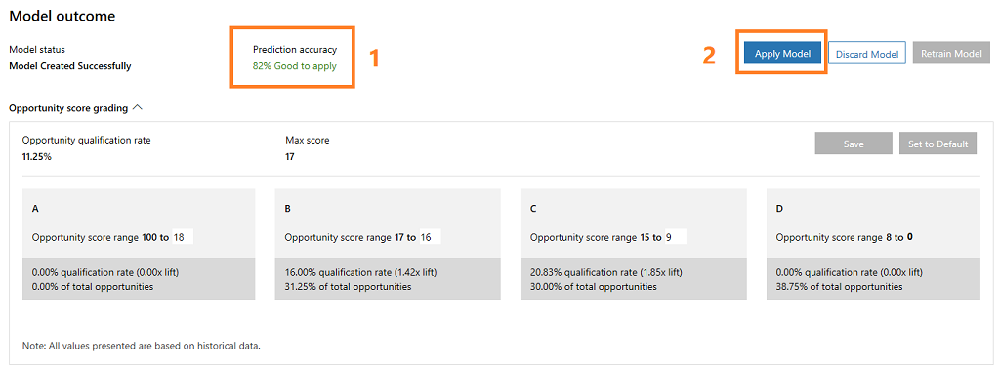

# Configure Predictive opportunity scoring

Predictive opportunity scoring helps users to focus on revenue generation efforts by providing scores to prioritize efforts on quality opportunities. To configure Predictive opportunity scoring, follow these steps:

1. Verify that advanced Sales Insights features are enabled. To learn more, see [Enable and configure advanced Sales Insights features](intro-admin-guide-sales-insights.md#enable-and-configure-advanced-sales-insights-features) 

2.	Go to **Change area** and select **Sales Insights settings**.

    > [!div class="mx-imgBorder"]
    > 

3.  On the sitemap, select **Opportunity scoring** under **Predictive models**.

    > [!TIP]
    > Alternatively, in the **Sales Insights settings** page, select **Set up** from the **Predictive opportunity scoring** section to go to configuration page.

    The **Getting started** page opens.

    > [!div class="mx-imgBorder"]
    > 

4. Select **Create Model**.

    > [!div class="mx-imgBorder"]
    > 

   Creating a model takes few minutes. You will see the progress on the screen.

5. Verify that the **Prediction Accuracy** score matches your organizational requirements and select **Apply Model**.

    > [!div class="mx-imgBorder"]
    > 

    The prediction opportunity scoring is applied in your organization and users can see the opportunity scoring in their views under the **Opportunity Score** column.

6. (Optional) If you are not satisfied with the **Prediction Accuracy** score, select **Discard Model** to discard the current model. Select **Retrain Model** to create a updated model and then select **Apply**.
   
   > [!NOTE]
   > We recommend that you train the model once the data is refreshed in your organization for better prediction accuracy scoring.

7. If you want to configure the opportunity score range, enter a minimum value of the range in the Opportunity Scoring Range.

   When you change the opportunity score range for a grade, the preceding grade's maximum range value changes automatically depending on the changed minimum grade value. For example, when you change a minimum range value score for **Grade A** to 70, the maximum opportunity score range for **Grade B** changes to 69.

   > [!div class="mx-imgBorder"]
   > 

8. Save and apply the model.

   The predictive opportunity scoring is configured and ready to use in your organization. The score refreshes every 24 hours. When you recreate a model, the application takes 24 hours to apply the new model.

### See also

[Convert opportunities into deals](../sales/work-predictive-opportunity-scoring.md)

[Enable and configure advanced Sales Insights features](intro-admin-guide-sales-insights.md#enable-and-configure-advanced-sales-insights-features)