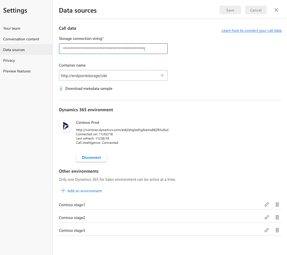
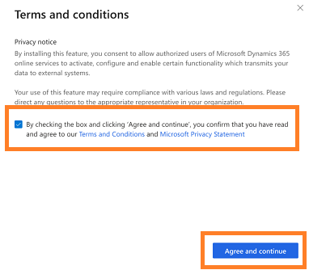
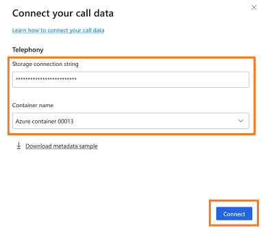

# Connect to Dynamics 365 environment

The **Data sources** section helps you to disconnect or connect a Dynamics 365 for Sales environment with your Sales Insights application. If you have multiple environments in your organization and want to activate another environment to display data in the application, use this section. 

At a time, you can have only one active Dynamics 365 environment that is connected to the application. When you activate an environment, the existing environment will automatically deactivate, and the new environment’s data will be displayed on the application. Also, you must add tracked keywords and competitors as well as provide permission to access the data to the added environment.

As an administrator, you must configure the Dynamics 365 for Sales environment to connect to the Sales Insights application.

1.	Review the prerequisites. To learn more, see [Prerequisites to configure Sales Insights application](prereq-sales-insights-app.md).

2.	Open the **Dynamics 365 Sales Insights** application. 

3.	Select the **Settings** icon on the top-right of the page and then select **Settings**.

    

4.	On the **Settings** page, select **Data source**. 

    
 
5.	In the **Dynamics 365 environment** section, select **+ Add an environment**.

    
 
6.	In the **Connect your data** dialog box, select your Dynamics 365 for Sales environment to connect with the application.

    

    The application now detects your environment.

7.	In the **Terms and conditions** dialog box, accept the terms and conditions, and select **Agree and continue**.

    
 
    The application takes few minutes to connect your data with the application, and a progress dialog box is displayed.

    
 
8.	In the **Create an application user** dialog box, select **Grant permissions** to create an application user.

    
 
    > [!NOTE]
    > If you have already added this environment, the step to grant permissions for the application to access the data will be skipped.

9.	In the **Connect your call data** dialog box, enter the **Storage connection string** and **Container name**, and then select **Connect**. To learn more on how to get the **Storage connection string** and **Container name** values, see [Configure conversation intelligence to connect call data](configure-conversation-intelligence-call-data.md).

    
 
10.	In the **Keyword and competitor tracking** dialog box, add the keywords and competitors that you want to track on calls. You can update these keywords and trackers later when your organization requires a change. To learn more, see [Configure keywords and competitors to track](configure-keywords-competitors.md).

    
   > [!NOTE]
   > You can skip adding the keywords and competitors and add them later, when required.

11.	Select **Finish** to complete the setup of the **Sales Insights** application for your organization. The status message will be displayed on the top of the page.

    
  
Now, your Sales Insights application is ready with the data of the added environment.

### See also

- [Introduction to administer Sales Insights application](intro-admin-guide-sales-insights-app.md)

- [Prerequisites to configure Sales Insights application](prereq-sales-insights-app.md)
