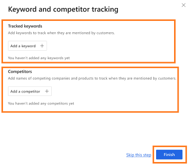

# Connect to Dynamics 365 environment

The **Data sources** section helps you to disconnect or connect a Dynamics 365 for Sales environment with your Sales Insights application. If you have multiple environments in your organization and want to activate another environment to display data in application, use this section. 

At a time, you can have only one active Dynamics 365 environment that is connected to the application. When you activate an environment, the existing environment will automatically deactivates, and the new environment’s data will be displayed on the application. Also, you must add tracked keywords, competitors, and provide permission to access the data to the added environment.

As an administrator you must configure the Dynamics 365 for Sales environment to connect to the Sales Insights application.

1.	Review the perquisites. To learn more, see [Prerequisites to setup Sales Insights application](prereq-sales-insights-app.md).

2.	Open **Dynamics 365 Sales Insights** application. 

3.	Select the **Settings** icon on the top-right of the page and then select **Settings**.

    > [!div class="mx-imgBorder"]
    > 

4.	On the **Settings** page, select **Data source**. 

    > [!div class="mx-imgBorder"]
    > 
 
5.	On the **Dynamics 365 environment** section, select **+ Add an environment**.

    > [!div class="mx-imgBorder"]
    > 
 
6.	On the **Connect your data** dialog box, select your Dynamics 365 for Sales environment to connect with the application.

    > [!div class="mx-imgBorder"]
    > 

    The application detects your environment.

7.	On the **Terms and conditions** dialog box, accept the terms and conditions and select **Agree and continue**.

    > [!div class="mx-imgBorder"]
    > 
 
    The application takes few minutes to connect your data with application and progress dialog box is displayed.

    > [!div class="mx-imgBorder"]
    > 
 
8.	On the **Create an application user** dialog box, select **Grant permissions** to create application user.

    > [!div class="mx-imgBorder"]
    > 
 
    > [!NOTE]
    > If you have already added this environment, this step to grant permissions for application to access the data will be skipped.

9.	On the **Connect your call data** dialog box, enter the **Storage connection string** and **Container name** and select **Connect**. To learn more on how to get the **Storage connection string** and **Container name** values, see [Configure conversation intelligence to connect call data](configure-conversation-intelligence-call-data.md).

    > [!div class="mx-imgBorder"]
    > 
 
10.	On the **Keyword and competitor tracking** dialog box, add the keywords and competitors that you want to track on the call. You can update these keywords and trackers later when your organization requires a change. To learn more, see [Configure keywords and competitors in Conversation content](configure-keywords-competitors.md).

    > [!NOTE]
    > You can also skip adding the keywords and competitors and add them later when required.

    > [!div class="mx-imgBorder"]
    > 
 
 
11.	Select **Finish** to complete the set-up of Sales Insights application for your organization.
    
    The status message will be displayed on the top of the page.

    > [!div class="mx-imgBorder"]
    > 
  
Now, your Sales Insights application is ready with the data of the added environment.

### See also

