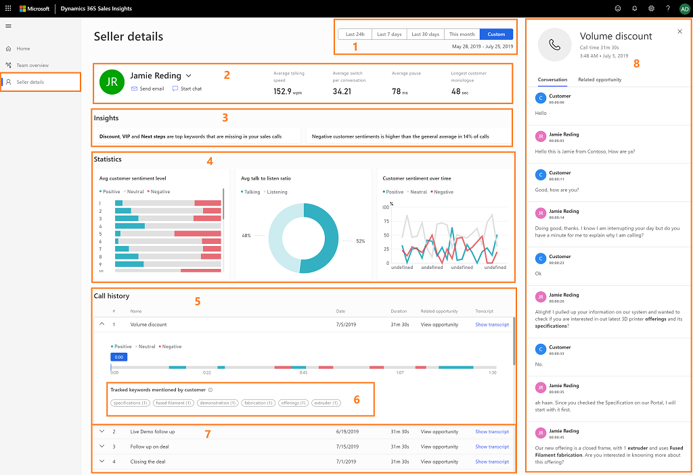
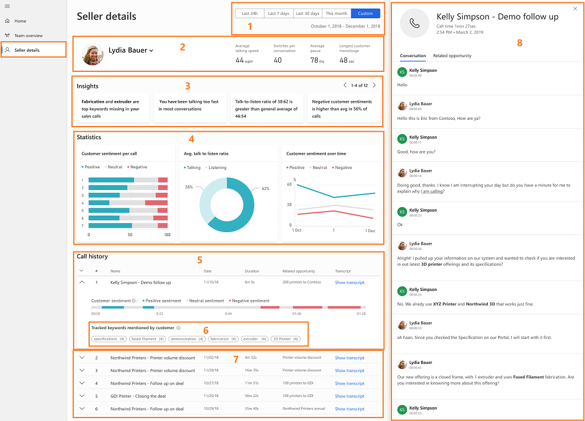

# Analyze customer calls to improve sales

Applies to [!INCLUDE[pn-crm-online](../includes/pn-crm-online.md)] version 9.1.0.

Sales calls are one of the most important part of your business as these calls help you to change the shape of your business by improving sales and generating revenue. The information you see on the **Seller details** page varies according to your role (sales manager or seller). To view the **Seller details** page, sign in to  **Dynamics 365 Sales Insights** application and select **Seller details**.

## Seller details page for sales managers

As a sales manager, the **Seller details** page helps you to analyze the overall behavior of a seller during the customer calls. Using this analysis, you can identifying coaching scenarios for a seller to increase sales wins and productivity gains for the business. With **Seller details** page, you can:

- Identify keywords that customers has used during calls.

- Identify competitor names that customers bring up during calls.

- Identify potential seller who might need coaching.

- Drill down into the seller view and analyze the data such as conversational KPIs, insights, and customer sentiment generated by sellers.

- Analyze call transcripts and identify the areas where sellers need coaching.

-	Comment on call transcripts and share with sellers.

- You can provide coaching comments to sales reps through emails.

The following image is an example of how the seller page is displayed for sales managers:

> [!div class="mx-imgBorder"]
> 

Let's look at the KPIs and insights in detail:

|KPI/Insights|Description|
|------------|-----------|
|**1. Date filter**|Select a timeline for which you want to view the data.|
|**2. Basic information**|Select a seller from the drop-down list to view that seller's information such as insights, statistics, and call history. With this information, you can assess seller's behavior and identify areas where the seller requires coaching.   You can send an email and chat with the seller instantly to provide coaching inputs or gather information as required. Select the email icon to send an email and select the chat icon to chat with the seller.   This insights also displays the basic information of the seller such as average talking speed, switch per conversations, average pause, and longest customer monologue.|
|**3. Insights**|Displays what’s happening with the seller and the latest trends such as customer sentiments and keywords that are trending.|
|**4. Statistics** |•	**Average customer sentiment level:** Displays the customer sentiments (positive, negative, and neutral) for each call that the seller handled. •	**Average talk to listen ratio:** Displays the average talk and listen ratio of the seller during calls with a customer. •  **Sentiment over time:** Displays how the three customer sentiments (positive, negative, and neutral) are behaving and spanning across the specified timeframe for the seller.|
|**5. Call history**|Displays the sentiments and keywords across the call. Open a specific call and view the keywords and sentiments across the timeline of the call, go to a moment, and look at the call transcript. Select **Show transcript** to view the conversation transcript.|
|**6. Tracked Keywords mentioned by customers**|Displays the defined keywords that customers used most during conversations with the seller. Selecting a defined keyword highlights the timeline of the conversation where it is mentioned.|
|**7. Calls**|Displays the list of calls handled by the seller. Select the call to display the transcript and timeline. |
|**8. Transcript**|Provides a written record of the call. You can review the transcript and leave a comment on how the sellers could handle the situation better. On a selected timeline, select **Add comment** to provide necessary inputs to the seller and then select **Save**.  The bolded text in the transcript are the brands, tracked keywords, and competitors mentioned in the conversation.|

## Seller details page for sellers

As a seller, the **Seller details** page helps you to analyze your overall behavior during the customer calls. Using this analysis, you can identifying coaching scenarios to increase your sales wins and productivity gains for the business. With **Seller details** page, you can:

- Identify keywords that customers has used during calls.

- Identify competitor names that customers bring up during calls.

- Analyze call transcripts and identify the areas where you need coaching.

-	View comments on call transcripts that managers or coaches share.

The following image is an example of how the seller page is displayed for sellers:

> [!div class="mx-imgBorder"]
> 

Let's look at the KPIs and insights in detail:

|KPI/Insights|Description|
|------------|-----------|
|**1. Date filter**|Select a timeline for which you want to view the data.|
|**2. Basic information**|Displays your basic information such as average talking speed, switch per conversations, average pause, and longest customer monologue.|
|**3. Insights**|Displays what’s happening with you and the latest trends such as customer sentiments and keywords that are trending.|
|**4. Statistics** |•	**Average customer sentiment level:** Displays the customer sentiments (positive, negative, and neutral) for each call that you have handled. •	**Average talk to listen ratio:** Displays the average talk and listen ratio of you during calls with a customer. •  **Sentiment over time:** Displays how the three customer sentiments (positive, negative, and neutral) are behaving and spanning across the specified timeframe for you.|
|**5. Call history**|Displays list of calls. Open a specific call and view the keywords and sentiments across the timeline of the call, go to a moment, and look at the call transcript. Select **Show transcript** to view the conversation transcript.|
|**6. Tracked Keywords mentioned by customers**|Displays the defined keywords that the customer used most during the conversation. Selecting a defined keyword highlights the timeline of the conversation on where it is mentioned.|
|**7. Calls**|Displays the list of calls handled by you. Select the call to display the transcript and timeline. |
|**8. Transcript**|Provides a written record of the call. You can review the transcript and comments that are posted by your manager or coach on the timeline. You can provide replies to the comments appropriately. On a selected timeline, select **Add comment** to provide necessary replies or self-comments, and then select **Save**.  The bolded text in the transcript are the brands, tracked keywords, and competitors mentioned in the conversation.|

### See also

- [Overview of Sales Insights applications](dynamics365-sales-insights-app.md)

- [First-run set up experience](fre-setup-sales-insight-app.md)

- [Connect to Dynamics 365 for Sales environment](connect-dynamics365-sales-environment.md)
