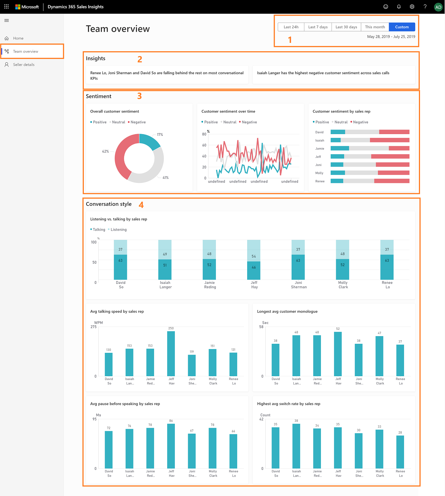

# Analyze overall team's behavior on customer calls

Applies to [!INCLUDE[pn-crm-online](../includes/pn-crm-online.md)] version 9.1.0.

Sales calls are one of the most important part of your business as these calls help you to change the shape of your business by improving sales and generating revenue. The **Teams overview** page helps the sales managers analyze the overall behavior of their team during customer calls. This helps in identifying coaching scenarios for the team to increase sales wins and productivity gains for the business.

As a sales manager, these KPIs and insights help you to: 

- Assess overall customer sentiments and sentiment trends.
  
- Assess your team's contributions toward customer sentiment.

- Gain insight into what’s going on with your team.

- Analyze your team's conversational style.

To view the **Teams overview** page, sign in to  **Dynamics 365 Sales Insights** application, and select **Teams overview**. 

|KPI/Insights|Description|
|------------|-----------|
|**1. Date filter**|Provides a timeline for which you want to view the data of your team.|
|**2. Insights**|Displays what’s happening in your team and the latest trends, such as sales reps who are scoring high in customer satisfaction as well as those who might need coaching based on the customer sentiments they are generating and keywords that are trending.|
|**3. Sentiment**|• **Overall customer sentiment:** Specifies the customer sentiment in percentage—positive, negative, or neutral. •	**Customer sentiment over time:** Displays how the three customer sentiments (positive, negative, and neutral) are spanning across the specified timeframe.  •	**Customer sentiment by sales rep:** Specifies how each of your sales reps contributed toward generating the overall customer sentiment. Also, shows which sales rep has the highest or lowest contributions.|
|**4. Conversation style**|• **Listening vs. talking by sales rep:** Specifies the average listen and talk ratio of sales reps in conversations with customers. •	**Average talking speed by sales rep:** Displays the average number of words used per minute by sales reps. • **Longest average customer monologue:** Displays the length of speech without a break by the customer with a sales rep in seconds; this is a signal that sales reps are asking good questions and showing understanding of customer needs. • **Average pause before speaking by sales rep:** Displays how many milliseconds the sales rep paused before responding to customer queries; this is a signal of patience by the sales rep.  • **Highest average switch rate:** Displays the average switches between a sales rep and customer in a conversation; this is a sign of engagement during conversations.|

### See also

- [Overview of Sales Insights applications](dynamics365-sales-insights-app.md)

- [First-run set up experience](fre-setup-sales-insight-app.md)

- [Connect to Dynamics 365 for Sales environment](connect-dynamics365-sales-environment.md)